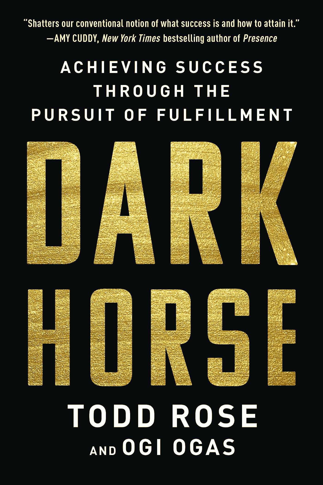

# 关于实现目标，你的教授没有告诉你的是

> 原文：<https://medium.datadriveninvestor.com/what-your-professor-didnt-tell-you-about-reaching-your-goals-ff37ac49bc02?source=collection_archive---------17----------------------->

Photo by [Cole Keister](https://unsplash.com/@coleito?utm_source=medium&utm_medium=referral) on [Unsplash](https://unsplash.com?utm_source=medium&utm_medium=referral)

Harper Collins

哈佛大学的托德·罗斯又带着另一本必读的书回来了:*黑马:通过追求成就感获得成功*。书名《黑马》暗示了这样一个观点，即那些不走标准化职业道路的人可以和走标准化职业道路的人一样成功。

这对任何从事金融职业或管理自己资金的人来说都很重要。简单来说，这本书会告诉你一个重要的道理。作为一个独特的个体，做对自己有益的事情，会比试图把自己硬塞进一个不合适但预先确定的角色，获得更多的成功。

罗斯最关心的话题是不适应标准化的职业世界。两年前，当他的书*平均水平的终结:我们如何在重视相同性的世界中成功*出版时，我发表了一篇热情洋溢的评论。

他和 Ogi Ogas 一起写的新书，给了我们很多没有走上通往荣耀的老路的人的例子。

# 少有人走的路

一个常见职业路径的例子可能包括首先去耶鲁大学学习文科，然后迅速去哈佛商学院，然后加入一家著名的华尔街银行，如高盛或摩根士丹利。或者其他人可能去斯坦福大学，然后利用他们的关系获得硅谷风险资本家资助的科技创业公司。

如果可以的话，走这两条职业道路都没有错。但如今，这两者都不算新奇。这些途径还包括做一些已经变得相当“标准化”的事情，这个词是作者不断提到的。

正如 Rose 和 Ogas 指出的那样，现实是这样的道路并不适合每个人。作者写道:

> *黑马也会考虑他们的经济现实。如果你正在抚养两个年幼的孩子，而将所有积蓄投资于自己创业的一个合理结果是，如果失败，你将没有任何可靠的手段来支持你的孩子，你应该考虑其他机会。无论您是否采用标准化思维，这都是一个谨慎的建议。*

简单地说，在上面的例子中，当你有其他主要义务的时候，把你一生的积蓄押在创业上是没有意义的。

# Unrisky 路线

作者还驳斥了走自己的路有风险的观点。不一定要像他们说的那样:

> 在标准化思维中，风险是由几率决定的。但在黑马思维模式中，风险是由适合度决定的。

换句话说，当黑马找到像手一样适合特制手套的机会时，风险就会降低。

Rose 和 Ogas 继续这一主题，指出黑马评估他们自己的技能、激情和天赋如何适合所选的角色。通过仔细选择他们决定追求的机会，他们降低了失败的风险，增加了成功的机会。

《黑马》是一本看似简单的书，对于那些觉得生活不仅仅是适应一个不舒服和不稳定的职业角色的人来说，非常值得一读。

*这是 2019 年 3 月 31 日 Forbes.com**上首次出现的* [*的一个故事的剪辑版。*](https://www.forbes.com/sites/simonconstable/2019/03/31/what-your-professor-didnt-tell-you-about-reaching-your-goals/#2cb27cdf4a10)