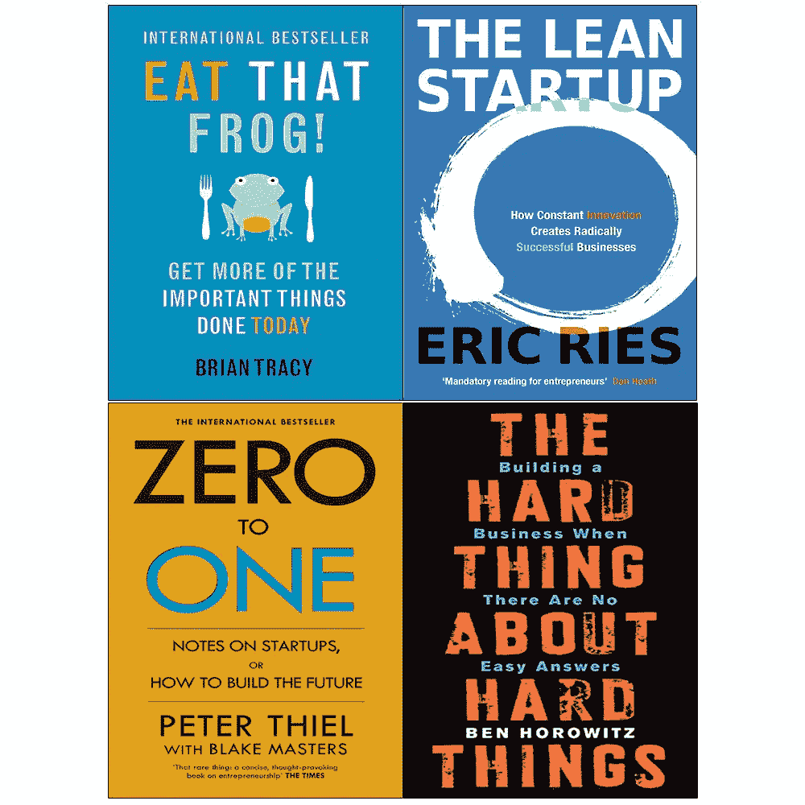

# 创业、COVID 和“硬东西”

> 原文：<https://medium.datadriveninvestor.com/whats-a-startup-cf1481d0d350?source=collection_archive---------17----------------------->

什么是创业？

“初创公司是一个人类机构，旨在极端不确定的条件下提供新产品或服务。”

埃里克·里斯

最后两个字极其重要。创业公司总是处于“极端不确定性”之下。

过去几天，我们听到了很多反对意见，因为初创公司在艰难时期解雇了这么多人。人们将 X 公司与 Y 公司进行比较，并举例说明 X 公司没有裁员，但 Y 公司却用风投资金解雇了许多人。

但是，老实说，我们雇佣人们作为企业家，是为了让他们走上这条路吗？我们真的会雇人在特定时间解雇他们吗？

不。我自己就是一个，也见过很多其他真正成功的人，没有人想让任何员工带着对失败的信任和热情加入他们。

很多人会认为风投资金让我们这么做。不，抱歉，我的朋友，你不了解这一行。

初创公司发展迅速，有时会非常疲惫，但这是增长速度、创新和市场主导地位。

 [## 现金为王，比我们想象的更强大|数据驱动的投资者

### 2020 年 3 月 12 日，在川普总统宣布新冠肺炎进入国家紧急状态的前夕，纽约时报报道…

www.datadriveninvestor.com](https://www.datadriveninvestor.com/2020/03/26/cash-is-king-more-potent-than-we-think/) 

你认为，如果 Swiggy 在 5 年内只专注于班加罗尔，我们中的任何人都很难在各自的城市建立类似的食品配送服务吗？正是创新、增长速度、市场主导地位以及出色的执行力使他们成为该领域的领导者。

COVID 不可预测。唯一预测到这一点的是比尔·盖茨，可能是在 2015 年的一次 ted 演讲中。可悲的是，它暴露了在初创企业工作的一些负面影响和无数正面影响。

但是，这些公司和更多的新企业家将崛起，我们将再次大量招聘，所有裁员的公司将在未来积极招聘(手指交叉)。

让我们不要利用这个机会抨击企业家或初创企业。让我们帮助人们找到一份新工作，一份收入来源，并摆脱这种消极情绪。

对于正在加入或正在创业公司工作或愿意工作的人，我强烈推荐《关于难的事情的难的事情》。

本·霍洛维茨(Ben Horowitz)的这篇文章有时被描述为创业者必读的一本书，但我觉得所有在初创企业工作的员工都应该读一读。这将大大拓宽我们对创始人的看法。他们经历的战斗，放弃世界级人才的困境和痛苦，无法告诉世界但必须采取行动的情况。

然后，也许作为一名员工，我们会知道风险回报等式，也知道创业不仅仅是学习、高薪、豪华办公室和员工持股计划。这是一个“极端不确定性”的机构，它有能力改变很多事情，甚至可能改变世界，但你无法确保每次都站在正确的一边。

PS:还有，我上一家公司在 2019 年初带着 40 人的团队完全关闭了在班加罗尔的运营，所以我知道在另一边是什么感觉。