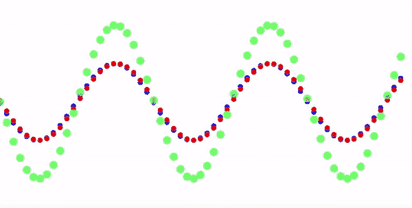

# 量子态和叠加态快速介绍

> 原文：<https://medium.datadriveninvestor.com/whats-in-a-qubit-5328be414322?source=collection_archive---------9----------------------->

Quantum Circuit by Author

量子计算是一个新兴领域，有可能重新定义技术进步的上层梯队。你是一个在如此广阔的学习领域中寻找令人兴奋的职业的学生吗？在这篇文章中，我将教你入门量子计算所需的基础知识，我们将涵盖量子力学中的必要概念，如量子态和叠加态。

粒子-波二象性和叠加通常是量子力学入门的起点。让我们从量子这个词的含义开始。量程是允许的或离散的数量。例如，如果一种软饮料的价格为 5 美元，而你有 24 美元，那么你可以购买的软饮料的量子(量子的复数)是 4。因为剩下的 4 美元不够买一整杯饮料，所以你有没有钱买 4/5 的饮料并不重要，没有商店会以 4/5 的价格卖给你 4/5 的饮料。这是一个大家都熟悉的简单想法。然而，事情变得不确定的地方是我们所说的量子力学，购买汽水和电子有什么关系？

电子和其他小粒子似乎既像粒子(质量可以撞击物体的小球体)又像波。波的部分很有趣，因为这意味着粒子可以像光波一样干涉和衍射！

Principle of superposition Gif by Author

波的作用之一是干涉，这是叠加原理。在上面的 Gif 中，绿色波是红色波和蓝色波的总和，当红色波和蓝色波完全重叠时，绿色最大。也就是说，绿色波有其最高的峰值，当红色和绿色完全不同步一分钟时，它们相加为零，绿色波是一条平坦的线。这对粒子-波二象性很重要，因为这种行为可以被粒子所采用。一个粒子可以表示为几个波的和！这种代表粒子的波称为波函数，波函数代表粒子的性质，例如位置。在量子力学中，我们不说我们确切地知道一个电子的位置，我们说一个电子处于一些允许位置的叠加中。也就是说，其他组成波构成了电子的波函数。

例如，如果我们用波函数来表示一个硬币的翻转，那会是什么样子呢？假设我们抛一枚硬币并盖上它，不看硬币，我们可以猜测它大约有一半的时间是正面或反面。波函数会说，硬币一半时间是正面，一半时间是反面。有盖硬币的量子态看起来会像…

The state of a Coinflip by Author

正面和反面的允许状态代表了我们在抛硬币后发现硬币的状态。它们用特殊的括号正式书写，物理学家称之为 brake 符号。允许或不允许的状态描述了量子力学的另一个重要部分，称为**量子化。**还记得我们购买汽水的例子吗？当我们有 24 美元时，在与汽水供应商交易后，我们可能会有以下情况，我们购买 1 瓶汽水、2 瓶汽水、3 瓶汽水或 4 瓶汽水。这些可能的交易结果来自于我们有多少钱，如果我们有购买一定数量汽水的概率，那么我们甚至可以写一个波函数来代表汽水的购买！这是因为在交易完成之前，我们知道结果将是 4 个状态中的一个，这 4 个状态是可能的，因为我们对金钱和汽水价格有限制。

results by Author

其中 a、b、c 和 d 是每笔 soda 交易的概率。将这一切结合在一起…

在量子力学中，粒子具有类似波动的行为，可以在其他态的叠加态中发现。这些量子态由看到某一状态的可能性的概率分布来表示。一个量子系统的约束(例如花钱和汽水的价格)导致量子化，并描述了我们系统允许的量子态。

这个帖子是对更多量子计算帖子的介绍。请密切关注更多精彩内容！请务必在[媒体](https://medium.com/@abdulahamer97)上关注我以阅读我写的东西，在 [Linkedin](https://www.linkedin.com/in/abdulah-amer/) 上关注我以提供给我一份工作，在 [Github](https://github.com/AbdulahAmer) 上关注我以查看我写的一些代码，并在 [Quora](https://www.quora.com/profile/Abdulah-Amer) 上关注我以问我一些问题！