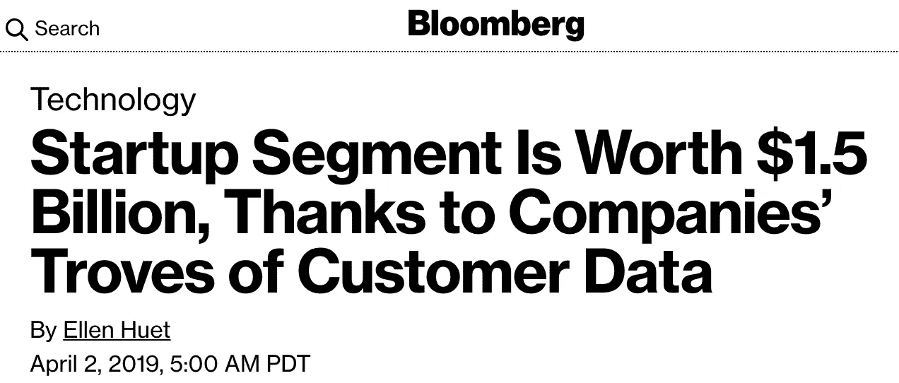
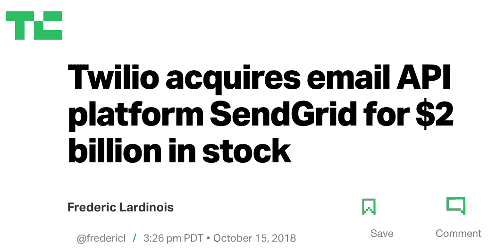
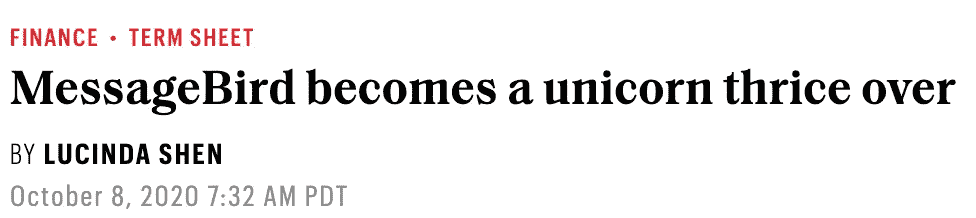
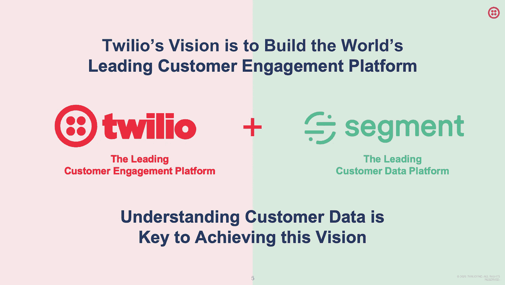
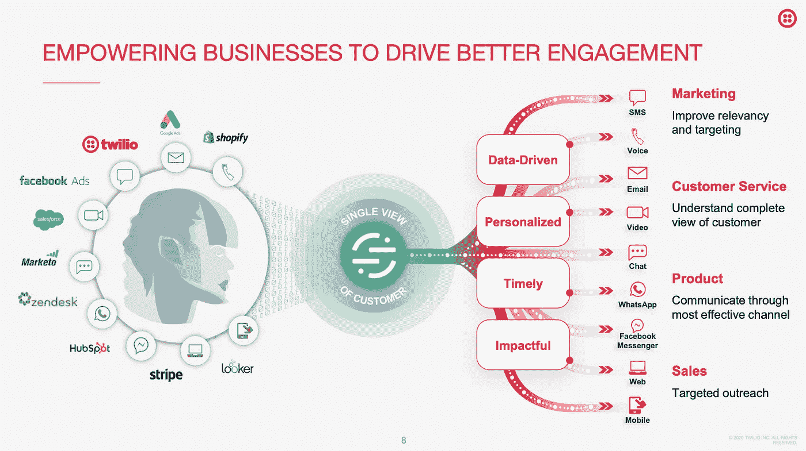
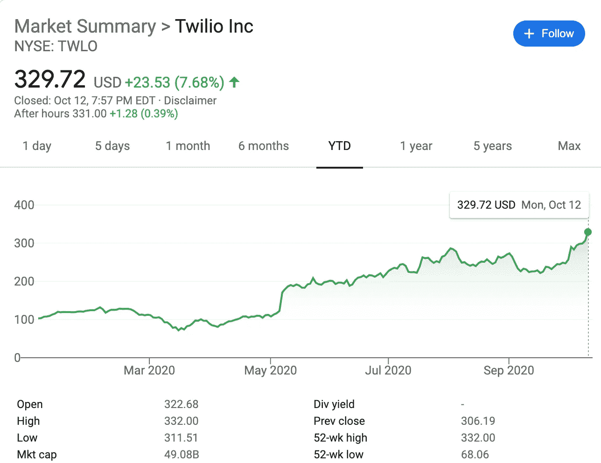
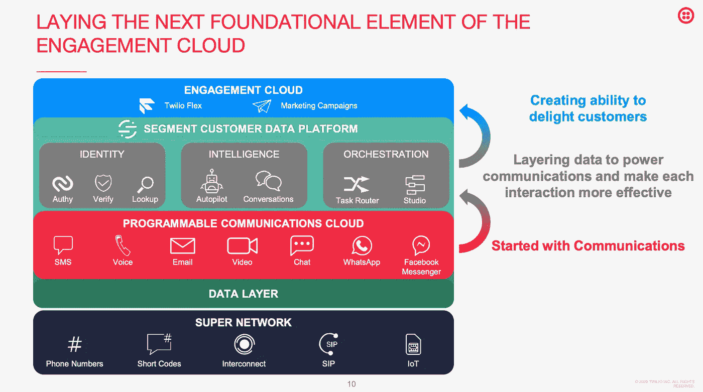

# Twilio 以 32 亿美元收购 Segment 有什么好处？

> 原文：<https://medium.datadriveninvestor.com/whats-in-it-for-twilio-on-its-3-2-billion-acquisition-of-segment-23f8f4cd7f1c?source=collection_archive---------3----------------------->

今天早些时候(2020 年 10 月 12 日)，基于 API 的通信平台巨头 Twilio 正式宣布，将以 32 亿美元的全部股票收购客户数据平台初创部门。市场对这一消息的反应相当积极，推动 Twilio 的股价上涨了 7.7%，使 Twilio 的市值达到惊人的 490 亿美元。

Segment 成立于 2011 年，是一家总部位于旧金山的初创公司，致力于通过客户数据基础设施提供无缝体验来颠覆传统 CRM。它已经从 Thrive Capital、Sapphire Ventures、Accel & GV 等公司筹集了总计 2.84 亿美元的资金。在 2019 年 4 月进行新一轮融资以深化其核心数据基础设施平台，更重要的是，推动其全球扩张后，该公司最近的估值为 15 亿美元。据估计，到 2020 年底，该部门的年度经常性收入可能达到 1 亿美元，超过 75%的非 GAAP 毛利润来自 2 万多名客户的订阅收入。

以 32 亿美元收购 Segment 是 Twilio 迄今为止最大的 M&A 交易，超过了 2018 年 MailChimp 的主要竞争对手、以 API 为中心的电子邮件平台 SendGrid 的 20 亿美元全股票私有化。Twilio 联合创始人兼首席执行官杰夫·劳森(Jeff Lawson)表示:“这是一个千载难逢的机会，可以将两个领先的以开发人员为中心的通信平台结合起来，为所有寻求转变客户参与方式的公司创建一个无可争议的首选平台。

# **全球比赛**

10 月 9 日星期五,《福布斯》首次披露了收购 Twilio 部门的消息，仅一天后(美国时间), Twilio 的竞争对手 MessageBird 筹集了由 Spark Capital 牵头的 2 亿美元大型 C 轮融资，对这家荷兰公司的估值为 30 亿美元。

MessageBird 于 2016 年在阿姆斯特丹成立，一直是 Twilio 的国际主要竞争对手，与早期来自旧金山的 Stripe 相比，它很像荷兰的金融科技巨星 Adyen。因此，Twilio 收购 Segment 也将有助于其加强全球立足点，与拥有新鲜干粉的 MessageBird 竞争。

# **长远眼光**

除了争夺全球市场份额，合并后的新公司更重要的协同作用来自于更好地实现 Twilio 建立世界领先的客户参与平台的愿景。“了解客户数据是实现这一愿景的关键”，正如演示中所强调的那样。

从本质上讲，细分市场能够为 Twilio 带来的是客户的全面单一视角。Segment 独特的数据基础设施将能够支持 Twilio 的客户沟通平台，因此我们不再需要因为缺乏客户洞察而遭受客户参与流程中断的痛苦。

 [## 金融科技的全球趋势|数据驱动的投资者

### 各国可能已经封锁了边境，以减轻新冠肺炎疫情，但当地和国际贸易必须去…

www.datadriveninvestor.com](https://www.datadriveninvestor.com/2020/04/28/global-trends-in-fintech-technology/) 

客户将不再需要浪费时间在商家端的不同部门之间来回奔波，并重复描述客户与商家的购买或服务历史。另一方面，商家受益于与客户更好的互动洞察，因此可以更有效地进行有针对性的销售和营销，提供更个性化和更有影响力的客户体验。

Twilio 联合创始人兼首席执行官杰夫·劳森(Jeff Lawson)表示:“在我们建立这个客户参与平台的过程中，Twilio 一直缺少的一点就是对最终用户本身的了解。“我们为通信提供动力，但我们实际上并不知道客户是谁。”

与此同时，此次收购是利用 Twilio 最近炒作的市值的一个明智的战略举措。COVID19 危机让许多 SaaS 公司的估值飙升，包括 Twilio，其股价自疫情爆发以来已上涨逾 3 倍。无论最近的 SaaS 估值炒作是泡沫还是基于长期愿景，Twilio 用其高估值股票收购战略资产绝对是明智的。正如我在上一篇文章中讨论金融科技中类似的估值炒作一样，Twilio 的例子展示了当前形势下的最优策略。

# **战略优势和潜力**

正如 Twilio 首席执行官杰夫·劳森(Jeff Lawson)所描述的那样，Twilio 愿景的战略思想听起来很像直接面向消费者(DTC)如何扰乱了传统的销售渠道结构。过去，品牌依赖批发经纪人或地区代理，他们推动销售和营销，但品牌不知道谁是最终客户。

有了电子商务带来的数据，单个品牌现在对客户的品味、偏好和个性有了更好的了解，这有助于更好地建立品牌形象。因此，我们看到了一批强大的 DTC 品牌，如 Warby Parker、Bonobos、Allbirds 和 Peloton。甚至像耐克这样的大公司也把建立他们自己的 DTC 式会员关系放在高度优先的位置，以更好地了解和接触他们的顾客。

电子商务的兴起后来导致了金融科技的兴起，因为电子商务平台和单个 DTC 品牌都在寻求更好的桌面和移动端支付体验。因此，易贝、亚马逊和阿里巴巴等大型平台已经建立了内部金融科技功能——有些后来发展得太大，因此不得不剥离，如 PayPal 和蚂蚁集团，其他则与现在的金融科技巨头建立了强大的合作伙伴关系，如与 Stripe 合作的 Shopify、与 Adyen 合作的易贝和 BigCommerce，以及(可以说)被 Square 收购的 Weebly。

除了处理支付，金融科技公司还是电子商务公司更好地分析顾客的强大数据源，以便他们能够迭代营销和销售策略。

然而，到目前为止，大多数围绕电子商务和金融科技的创新都只围绕着**售前**部分(营销)或**售中**部分(支付)，但在**售后**部分，或购物者生命周期部分却没有多少进展。这可能是 Twilio 的战略优势。

对于任何一个品牌的财务成功来说，LTV 都是终极巅峰，而 CAC 就像是必要的恶魔。提高**售前**和**售中**流程的效率肯定有助于通过降低营销成本和最大限度地减少非自愿流失(由笨拙的支付流程造成)来优化 CAC。有足够多的服务提供商或合作伙伴，任何品牌都可以找到很好的可操作的见解。

尽管如此，在处理现有的客户参与或售后服务方面，大多数人仍然将它外包给呼叫中心，这些呼叫中心对待他们的尊贵客户很差，或者一些更好的呼叫中心开始使用 Twilio 和 MessageBird，但缺乏良好的数据和洞察力来有效地最大化 LTV。因此，配备了来自细分市场的客户数据基础设施，新的 Twilio 有潜力成为品牌的最终 LTV 引擎。

# **前方机遇**

Twilio 现在唯一缺少的是一个金融科技部门，这样它就可以超越其战略据点**售后**进入**销售**。至于**售前**，Segment 的大部分数据基础设施已经可以帮助改善 Twilio 在营销方面的产品提供，因此 Twilio 现在真正需要的是一种金融科技产品，以封闭整个销售环路和客户生命周期。

同样，MessageBird 要想占据上风，新筹集的 2 亿美元可以部分用于寻找金融科技收购目标，尽管大多数现有收购目标的价格都超出了可承受的价格范围。

另一方面，随着一些支付金融科技公司探索利用财务数据(销售时)来推动更有效的营销(售前)的想法，那些受益于最近估值飙升的公司也有可能获得类似于 Twilio 或 MessageBird 的客户参与平台(售后)。Adyen 肯定更接近 MessageBird，因为它们的总部都在阿姆斯特丹，但 Adyen 坚信有机增长，在其近 14 年的生命中从未收购过一个公司。Twilio 的庞大规模使其成为任何支付公司的强大收购目标，甚至是 PayPal 或蚂蚁集团。

无论潜在的交易看起来如何，也无论是谁，我们可以肯定的一点是，那些从 COVID 驱动的估值飙升中受益的人需要利用这个机会，将传言转化为长期战略价值。

## 访问专家视图— [订阅 DDI 英特尔](https://datadriveninvestor.com/ddi-intel)