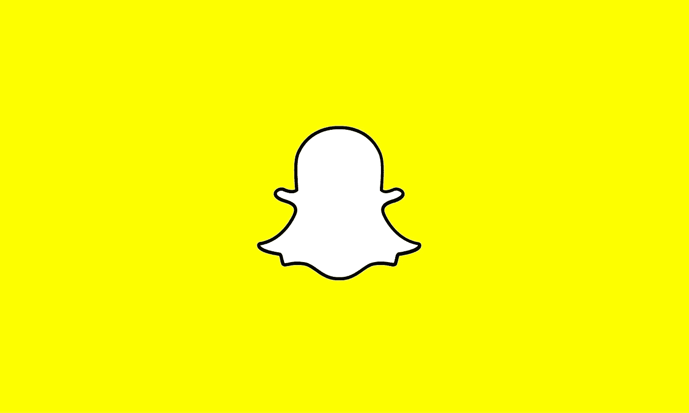
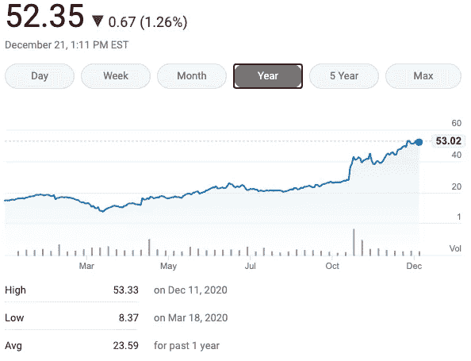

# Snapchat 的未来会怎样？

> 原文：<https://medium.datadriveninvestor.com/whats-in-store-for-the-future-of-snapchat-28cc002fa34b?source=collection_archive---------20----------------------->

## 该公司正在走一条不寻常的道路，这条道路可能会带来回报

Image by [M. H.](https://pixabay.com/users/mih83-464187/?utm_source=link-attribution&utm_medium=referral&utm_campaign=image&utm_content=1360003) from [Pixabay](https://pixabay.com/?utm_source=link-attribution&utm_medium=referral&utm_campaign=image&utm_content=1360003)

注意力经济正在发生重大变化，这是一个自由开放的市场，有时以数字形式类似于过去的蛮荒西部。就我个人而言，我一直是 Snapchat 的粉丝。即使有新的竞争对手出现，Snap 保持其吸引年轻用户的能力向我表明，Snapchat 将会赢得它，并可能会存在很长一段时间——它的股价也证明了这一点。

Snapchat 和其他社交媒体公司一样，很好地经受住了疫情的考验。今年，它的用户群大幅增长，从去年的 2.1 亿用户增长到今年第三季度末的 2.49 亿用户。在 Benzinga[进行的一项调查中，54%的投资者似乎认为，到 2022 年，Snap 的增长将超过 Pinterest](https://www.msn.com/en-us/money/news/will-snap-or-pinterest-stock-grow-more-by-2022/ar-BB1c5eez) ，这是一个完全不同的竞争对手。最重要的是，Snap 似乎有保持增强现实技术前沿的诀窍。

据 [Marketbeat](https://www.marketbeat.com/stocks/NYSE/SNAP/) 报道，“2020 年 3 月 11 日，当冠状病毒(新冠肺炎)根据世界卫生组织(世卫组织)达到疫情状态时，Snap 的股票交易价格为 10.81 美元。自那以来，SNAP 股票已经上涨了 386.6%，目前交易价为 52.60 美元。”

Source: Bing

虽然我真的不喜欢听起来像一个推销广告演员，但等等，还有更多。Snapchat 和 Twitter 刚刚宣布将原生 Twitter 整合到 Snapchat 应用中。两家公司都认为这是一种通过嵌入更有效地将内容从一个应用程序转移到另一个应用程序的方法，而不是用户多年来一直依赖的笨拙的截图方法。

这个想法似乎很天才。用户将能够在 Twitter 内部点击一个公开发布的推文上的按钮，并导航到 Snapchat，与他们的朋友或在他们的故事提要中分享它。这是我一直在等待的便利，考虑到有多少内容来自 Twitter，这是有意义的。

 [## 另类投资——它们在后疫情时代的角色|数据驱动的投资者

### 全球疫情的经济影响继续波及全球各行各业。的…

www.datadriveninvestor.com](https://www.datadriveninvestor.com/2020/10/27/alternative-investments-their-role-in-the-post-pandemic-landscape/) 

Snapchat [在 12 月 18 日的一篇博客中说](https://forbusiness.snapchat.com/blog/snapchats-most-inspiring-ar-campaigns-of-2020)，这篇博客庆祝了 AR 技术在平台上的有趣使用:

> 今年，Snapchatters 和品牌比以往任何时候都更多地使用相机以新的、创造性的方式与世界各地的朋友和亲人联系。
> 
> AR 在创建这些联系和体验方面发挥了巨大的作用。世界各地的品牌和组织利用我们的技术，以前所未有的创新方式与 Snapchat 一代互动。

从支持种族平等和正义的“提高你的声音”活动，到通过增强现实试穿新化妆品或古驰鞋的能力，Snapchat 无疑在 lock 上拥有更年轻的用户群。

虽然年长用户可能会发现自己在使用亚马逊的 AR 功能将产品放在家里，在购买前进行试用，但年轻用户正在使用 Snapchat 作为发现自己身份的一种方式，这是一种真正强大的东西，并以一种比一些人可能认为的虚荣消费主义更深刻的方式抓住了我们。

虽然抖音正在成为一个竞争对手，但 Snapchat 仍然在美国青少年中占据主导地位，其 88%的用户群居住在美国，34%的青少年受访者表示 Snapchat 是他们最喜欢的平台，只有 29%的人表示抖音也是如此。

值得注意的是 Twitter (3%)和脸书(2%)的惨淡表现。似乎 Snap 和抖音，以及 Instagram，都将为 Zoomer 一代的注意力而战，而我们老一辈人仍在脸书争论政治，或向类似养老院的观众转发猫图片。

奇怪的是，在 Snap 和 Twitter 的交易中，Twitter 可能更需要 Snap，而不是 Snap 需要 Twitter，但没关系。而且这不是唯一的一笔交易，Snap 正在[与品牌达成交易](https://www.msn.com/en-us/tv/news/brat-tv-launches-multiple-shows-on-snapchat-discover-including-e2-80-98past-your-bedtime-e2-80-99-exclusive/ar-BB1c3i4F)，在平台上推出新节目，进一步巩固其对 Z 世代观众的控制。

还有最后一件重要的事情需要注意。随着讨论从美国刑法典中删除第 230 条，以使社交媒体公司对其用户发布的内容负责，以及讨论通过对脸书提起反垄断诉讼来“拆分大型科技公司”，Snap 似乎将在很大程度上避免后者，因为它是一个利基平台。

其他人都是偷 Snapchat 的创意，而不是反过来。

虽然市场上可能有更好的机会，但 Snap 是一个非常好的选择，看起来在未来一段时间内都是如此。我对 2021 年的 Snapchat 感觉很好。

## 获得专家视图— [订阅 DDI 英特尔](https://datadriveninvestor.com/ddi-intel)