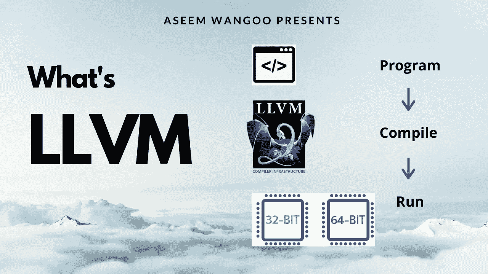
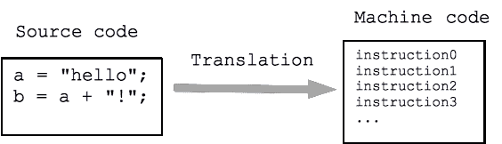
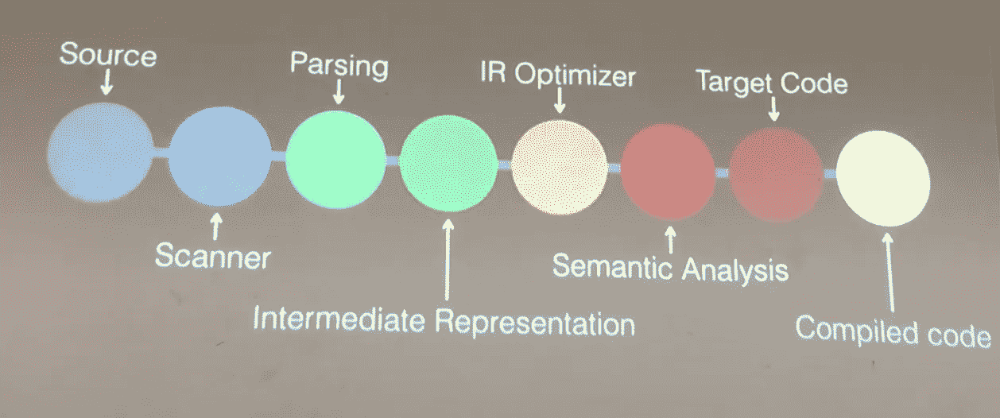
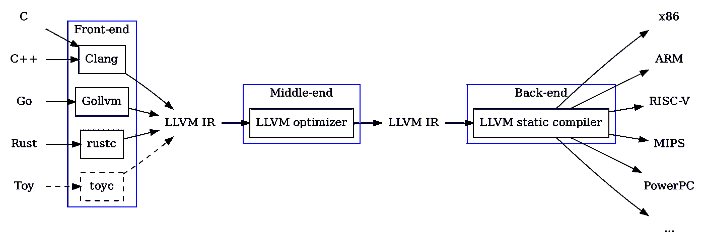
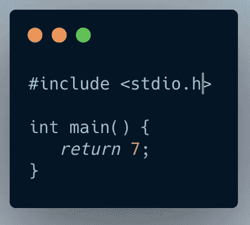

# LLVM 是什么？

> 原文：<https://medium.datadriveninvestor.com/whats-llvm-4c0c3ed43a72?source=collection_archive---------4----------------------->

> LLVM 是什么？揭秘 LLVM

> LLVM 到底是什么？嗯…

此处:【https://flatteredwithflutter.com/what-is-llvm/ 文章

## 先决条件:

本文不需要任何关于 LLVM 的知识。按照自己的节奏阅读:)



What’s LLVM

根据[官方网站](https://llvm.org/):

> LLVM 是模块化的、可重用的编译器和工具链技术的集合。“LLVM”不是一个缩写词；这是项目的全称。

让我们看下面的图表，



Human readable to Machine readable

我们用自己选择的语言编写源代码。这段代码是人类可读的，但是运行它的机器不理解它。这就是我们编译的原因，编译将源代码转换成机器能够理解的东西。

## 编译器方法

当我们编译我们的源程序时，涉及到不同的阶段，(源代码、扫描程序、解析等)。).传统的编译器将所有这些步骤作为一个整体结构。



Modern Compilers

现代编译器所做的是，将编译任务委托给一组不同的组件(如上图所示)。

**这是什么意思？**

不同的团队可以专注于他们擅长的任务。例如，一个擅长解析的团队可以专注于它并使它变得更好。

## **输入 LLVM**


Chris Lattner

> **克里斯·拉特纳**是 LLVM 和相关项目如 Clang 编译器和 **Swift** 编程语言的主要作者。[在此恢复](http://www.nondot.org/sabre/Resume.html)

LLVM 以**中间表示(LLVM IR)** 和 **IR 优化器而闻名。**在程序编译过程中，源语言被转换成这个 **IR，**，输出最终在目标架构(x86，ARM 等)上运行。)



Compilers Overview

*   **前端**:将源语言编译成 IR。
*   **中端**:优化 IR。
*   **后端**:将 IR 编译成机器码。

## **什么是 LLVM IR？**

LLVM IR 是

*   一种独立于平台的汇编语言。
*   强类型

(例如，`i32`是 32 位整数，`i32**`是指向 32 位整数的指针)

*   拥有无限的 **SSA(静态单赋值)**寄存器机器指令集。

SSA:每个变量只被赋值一次，用%字符命名。

*   类似 RISC 的低级虚拟指令集。

LLVM IR 有 3 种常见的表示形式

*   人类可读的 LLVM 程序集(。ll 文件)
*   位代码二进制表示(。bc 文件)
*   C++类

特别是，LLVM IR 是明确指定的，并且是优化器的唯一接口。这个属性意味着，为 LLVM 编写前端所需要知道的就是 LLVM IR 是什么，它是如何工作的，以及它所期望的不变量。

## 编程示例

让我们看一个简单的 C 代码，



C Code

如果我们使用下面的代码将这段代码编译成 LLVM

```
clang -S -emit-llvm -O3 hello_world.c
```

或者在网上(见下面的链接)，我们得到

```
// LLVM IR**define** *i32* @main() #0 {
  **ret** *i32* 7              *; Return an integer value of 7*
}
```

按顺序执行的指令序列是一个基本块。基本块必须以终止符结束。

> 注意:你不能跳到一个基本块的中间

LLVM 中定义了一些终止符指令:

*   `[ret](https://llvm.org/docs/LangRef.html#ret-instruction)`
*   `[br](https://llvm.org/docs/LangRef.html#br-instruction)`
*   `[switch](https://llvm.org/docs/LangRef.html#switch-instruction)`还有其他人

全局标识符(函数、全局变量)以`'@'`字符开始

> [LLVM 语言指南](https://llvm.org/docs/LangRef.html#overview)

在线编程的链接:

 [## 在您的浏览器中试用 ELLCC！

### 编辑描述

ellcc.org](http://ellcc.org/demo/index.cgi) [](https://www.datadriveninvestor.com/2020/12/16/technology-addiction-is-it-real/) [## 技术成瘾-是真的吗？数据驱动的投资者

### 通知铃声响起。你很想检查一下。你拿起手机检查了一下。“哇...再来一个喜欢的…

www.datadriveninvestor.com](https://www.datadriveninvestor.com/2020/12/16/technology-addiction-is-it-real/) [](https://godbolt.org/) [## 编译器资源管理器

### 编译器资源管理器是一个交互式在线编译器，显示编译后的 C++，Rust，Go(和许多…

godbolt.org](https://godbolt.org/) 

## φφ

有时，您希望选择从上一个基本块中执行的值。

```
SYNTAX FOR phi<result> = phi <ty> [ <val0>, <label0>], ...
```

使用 phi:

```
**Loop:**       *; Infinite loop that counts from 0 on up...*
  %indvar = **phi** **i32** [ 0, %LoopHeader ], [ %nextindvar, %Loop ]
  %nextindvar = **add** **i32** %indvar, 1
  **br** **label** %Loop
```

这基本上是说，如果我们来自基本块**循环头**，则取值 **0、**，或者如果我们来自**循环**块**，则取值**下一个变量**。**

运行时，‘`phi`’指令逻辑上采用当前程序块之前执行的程序块的值。

更多详情请点击此处

Phi instruction

## LLVM 红外优化

大多数优化遵循简单的三部分结构:

*   寻找要转换的模式。
*   验证转换是否安全/正确。
*   进行转换，更新代码。

最简单的优化是算术恒等式上的模式匹配，对于任何整数`X`，

*   `X-X`为 0
*   `X-0`是`X`
*   `(X*2)-X`是`X`

```
// LLVM IR REPRESENATION
⋮    ⋮    ⋮
%example1 = sub i32 %a, %a
⋮    ⋮    ⋮
%example2 = sub i32 %b, 0
⋮    ⋮    ⋮
%tmp = mul i32 %c, 2
%example3 = sub i32 %tmp, %c
⋮    ⋮    ⋮// LLVM IR OPTIMIZATION
// X - 0 -> X
if (match(Op1, m_Zero()))
  return Op0;

// X - X -> 0
if (Op0 == Op1)
  return Constant::getNullValue(Op0->getType());

// (X*2) - X -> X
if (match(Op0, m_Mul(m_Specific(Op1), m_ConstantInt<2>())))
  return Op1;
```

[*此处引用 LLVM 语言。*](https://llvm.org/docs/LangRef.html#id310)

## 不同语言的 LLVM

没有编译器的编程语言是不完整的。许多语言使用 LLVM 来产生它们的编译器，因为 LLVM 去除了许多额外的任务。

*   [Emscripten](https://github.com/kripken/emscripten) 项目获取 LLVM IR 代码并将其转换为 JavaScript，允许任何具有 LLVM 后端的语言导出可以在浏览器上运行的代码。
*   Nvidia 为 Nvidia CUDA 编译器使用了 LLVM，这让语言增加了对 CUDA 的本地支持。

许多语言和语言运行时都支持 LLVM，包括 [C#/。NET/Mono](https://github.com/Microsoft/LLVMSharp) ， [Rust](https://crates.io/crates/llvm-sys) ， [Haskell](https://hackage.haskell.org/package/llvm) ， [OCAML](https://opam.ocaml.org/packages/llvm/) ， [Node.js](https://www.npmjs.com/package/llvm-node) ， [Go](https://llvm.org/svn/llvm-project/llgo/trunk/README.TXT) ，以及 [Python](https://github.com/numba/llvmlite) 。

## LLVM 的未来——MLIR

正如我们所知，LLVM 并不支持每一种语言，但是 LLVM 越来越多的使用正在吸引新的语言使用它。

> 介绍 **MLIR(多级中间代表)**

MLIR 是现代优化编译器的灵活基础设施。这意味着它由一个中间表示(IR)规范和一个对该表示执行转换的工具包组成。

MLIR 深受 LLVM 的影响，并从它那里重用了许多伟大的思想。它还支持特定于硬件的操作。

[*幻灯片在此。*](https://docs.google.com/presentation/d/11-VjSNNNJoRhPlLxFgvtb909it1WNdxTnQFipryfAPU/edit#slide=id.g7d334b12e5_0_4)

*网站****:***[***https://flatteredwithflutter.com/what-is-llvm/***](https://flatteredwithflutter.com/what-is-llvm/)

*Github****:*T5[T7*https://github.com/aseemwangoo*T10](https://github.com/aseemwangoo)**

*旋舞网站****:***[***https://web.flatteredwithflutter.com/#/***](https://web.flatteredwithflutter.com/#/)


## 访问专家视图— [订阅 DDI 英特尔](https://datadriveninvestor.com/ddi-intel)