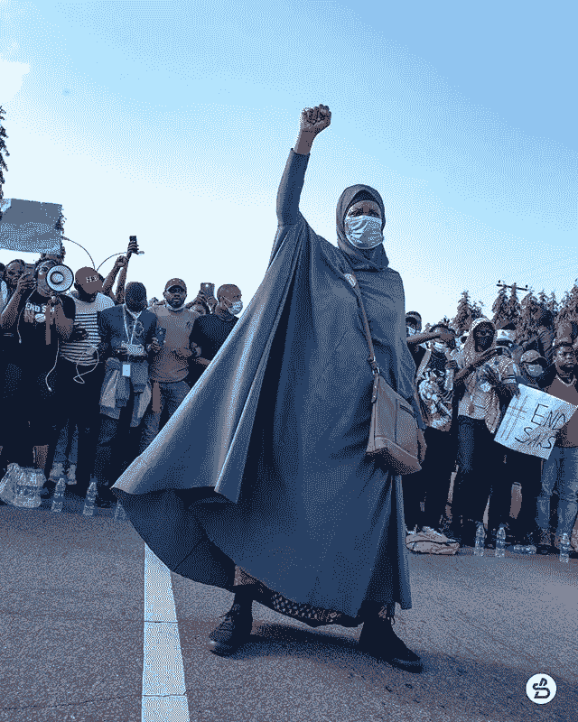

# 在#运动中我的位置是什么？

> 原文：<https://medium.datadriveninvestor.com/whats-my-place-during-the-movements-3e2c280a2b04?source=collection_archive---------16----------------------->

Photo by @shoeboxing of @aishayesufu

美国总统选举正在进行。2020 年多事之秋。在过去的几个月里，我被新冠肺炎、#BlackLivesMatter 运动、接着是#EndSars 运动、然后是刚果的贩卖人口轰炸。我要么投入，要么太投入，然后太累了，跟不上运动。我变得麻木了。不是全部。在运动的高峰期，我在不同的点上感受到了恐惧、悲伤、困惑和愤怒。

现在，我们面临着一场将影响世界的选举。然而，通过这件事，我想知道我是否需要投入并关注我周围发生的事情。我能闭上眼睛假装这些事情可以忽略吗？马丁·路德·金博士会怎么做？耶稣会怎么做？我能怎么做呢？我意识到，最后两个问题是最重要的问题。

如何解决当前的世界状况？

1.  知识:与其在无知中受苦。研究、权衡、评估并听取双方的意见。了解基本事实并处理这些事实。有些警察平等地对待黑人。有黑人正在被杀害。政府有让黑人失败的制度。尼日利亚有军官无缘无故杀人。也有政客在做同样的事情。有年轻人诈骗人们，但他们有权利。有很多要知道的。
2.  过程:因为我们生活在一个微波社会，静坐已经越来越难。人们追随潮流，像换衣服一样转换忠诚度。人们似乎急于被倾听，而不是坐在数据前得出深思熟虑的结论。如果说的话不清楚或者没有事实根据，就没有必要让别人听到。当你很好地掌握事实时，花些时间来处理信息。与你亲近的人谈论你所学到的东西。让他们帮你处理。
3.  分清轻重缓急:即使世界似乎颠倒了，你仍然需要去工作，吃饭，休息，和朋友交流。你可以优先选择哪些平台来获取信息和分享你的观点(一两个就可以了)。我从 Instagram 上抽出时间来思考这些动作，并对它们做出反应，因为我宁愿有一个经过深思熟虑的回应。像选举一样，你可以决定明天找出结果，而不是今晚跟随趋势和预测。完成你今天的个人目标，没有人会因为明天发现信息而受到惩罚。
4.  做正确的事情:为正确的事情大声疾呼。支持正确的运动。你怎么知道什么是对的？圣经可以是一个很好的标准。我建议你按照圣经描述的方式坚持正义。在行动和言语上，选择正义。
5.  支持:小事很重要。上周，我的一些不同国籍的朋友得知了#终结运动。他们不知道发生了什么。那些没有反思他们对待黑人的方式的人已经和我进行了交谈，以拓宽他们的经验范围。我一定要去看看一个朋友，讨论一下拉各斯的枪击事件。检查那些直接受到正在发生的事情影响的人是要做的事情。找到富有同情心的方法，在提供服务或倾听时不要犹豫。

通过这个，记住对自己也要有同情心。

我的参考点是:

以赛亚书 1:17，

*学会行善；寻求正义，纠正压迫；为孤儿伸冤，为寡妇辨屈。*

箴言 31:8–9

*你当为哑巴开口，为一切困苦人伸冤。你当开口按公义判断，为困苦和穷乏人伸冤。*

感谢您阅读本文！请鼓掌分享！