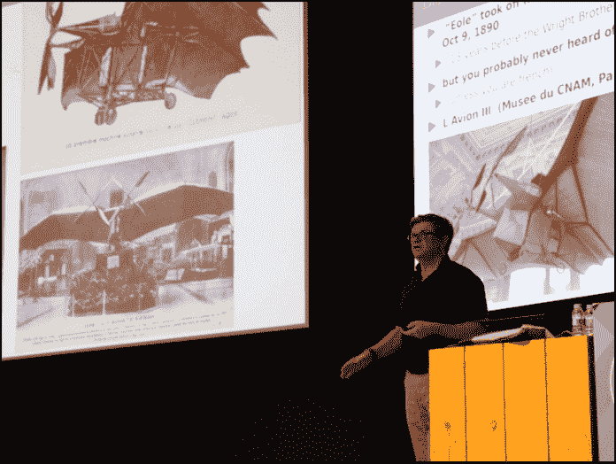
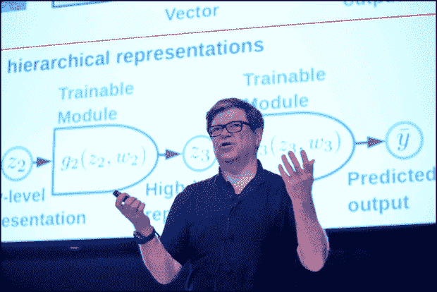
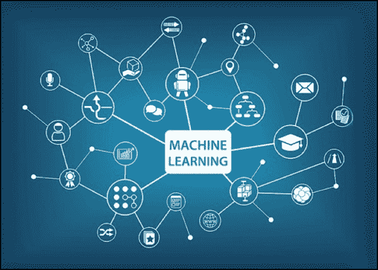
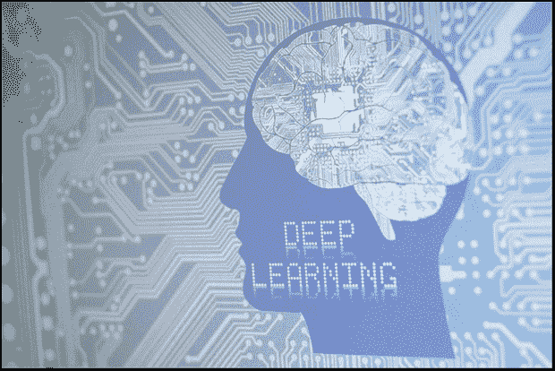
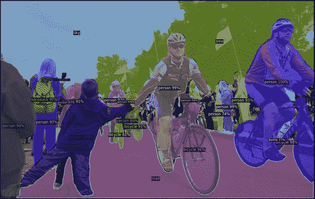
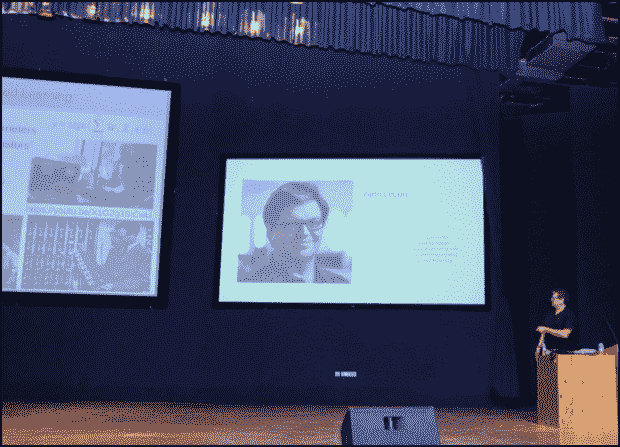

# AI 的下一步是什么？

> 原文：<https://medium.datadriveninvestor.com/whats-next-in-ai-data-driven-investor-f00ef1b2938f?source=collection_archive---------8----------------------->

> “我们的智力使我们成为人类，而人工智能是这种素质的延伸。”— Yann LeCun，纽约大学著名计算机科学家，脸书首席人工智能科学家，2018 年 ACM 图灵奖获得者

P *rof Yann LeCun* ，著名人工智能科学家和 *2018 年 ACM 图灵奖*获得者，在 ACM-India 年度活动上发表了一场发人深省的公开演讲，主题是[人工智能](https://www.datadriveninvestor.com/glossary/artificial-intelligence/)和自我[监督学习](https://www.datadriveninvestor.com/glossary/supervised-learning/)的快速发展和相互交织的领域。在开场白中，他提到他将谈论许多不同的事情，包括“一点历史，然后是关于深度学习的基本内容”。然后他会回答关于人工智能未来的问题，并讨论一些关于我们如何在更智能的机器方面取得进展的建议。

> 这篇文章是基于 LeCun 教授在他的公开演讲中分享的思想，是一次穿越人工智能的过去、现在和未来的旅程。虽然人工智能的巨大潜力也引起了人们的恐惧，但我们将把注意力集中在技术本身，以及它在按预期使用时的前景。

# 跨学科历史

LeCun 教授解释说，深度学习的根源不完全在于计算机科学，而更多的是过去被称为控制论的 T21，现在更多的是工程的一部分。它可以追溯到 20 世纪 40 年代，当时人们有了利用大脑作为灵感来启动该领域最早工作的想法。人们很快就明白，适应和学习的能力是生物系统的一个重要特征。同时，神经科学的大量工作表明，大脑的适应是通过改变神经元之间的连接来实现的。

“这导致了 20 世纪 50 年代*感知器*的发明。这是第一批能够运行简单任务的学习机器之一，在当时这是非常令人印象深刻的。它还具有巨大的影响，因为它为后来被称为*统计模式识别*的领域奠定了基础，后来变成了 [*机器学习*](https://www.datadriveninvestor.com/glossary/machine-learning/) 的标准模型，”他表示。

# 感知器——监督学习之路

*Image Source: Towards Data Science*

感知器是一种物理机器(电子系统)，而不是计算机上的程序。这很麻烦，很快人们意识到在计算机上模拟会更容易。正是这个事件奠定了 [*监督学习*](https://www.datadriveninvestor.com/glossary/supervised-learning/) 的基础——你可以从例子中训练一台机器，而不是显式地编程。假设你有一个系统，你可以把它想象成一个函数，它的输入输出关系是由旋钮所象征的参数来定义的。现在，你想训练它区分汽车和飞机的图像。当你展示一辆汽车，系统说它是一架飞机，你调整旋钮，使输出更接近你想要的。这一过程非常适合我们拥有大量数据的情况，例如语音、图像和面部识别，在图像中查找对象，为图片生成标题，或将内容从一种语言翻译成另一种语言。[监督学习](https://www.datadriveninvestor.com/glossary/supervised-learning/)形成了每天涌现的大量新应用的基础。

“更抽象地说，感知机产生的模式识别的标准模型是这样一个事实，即你通过提取器处理输入，提取器将提取输入的相关特征。这款经典型号的提取器是手工制作的。然后在它上面有一个分类器，它有那些可调整的参数，并且是系统中唯一可训练的部分。你用一个[训练集](https://www.datadriveninvestor.com/glossary/training-set/)来训练它，训练集由成对的输入和期望的输出组成。你通过计算你得到的输出和期望的输出之间的差异来衡量机器的性能，”他进一步阐述道。

# 深度学习在这一切中的作用是什么？

这是一个非常简单而强大的想法，不是将提取器从分类器中分离出来，只训练分类器，而是尝试端到端地训练整个系统。基本上，我们将建立和优化这个系统作为一个参数化模块的级联，每个模块都有可训练的参数。这样做的结果是，它将能够*学习自己的提取器*，并且不需要手工设计这个组件。但是，它需要比前一个场景更多的训练样本。

*Image Source: Forbes*

“现在，如果你是一个理论家，你可能会问这个问题，为什么我们需要所有这些层，因为你可以证明，有一些定理，你可以用两层来逼近任何你想要的函数。没有给出真正的理论公式，但是有很多直观的和经验的证据。你需要层次的原因是自然世界是由成分组成的——有一个描述这个世界的抽象的自然层次，”勒昆教授说。

*为什么会这样？*我们不知道。LeCun 教授认为这与*阿尔伯特·爱因斯坦*的名言相呼应——世界上最不可理解的事情就是它是可以理解的。世界之所以可以理解，是因为它的复合性。以宇宙为例，它的底层是构成原子的基本粒子，原子又构成分子、材料、物体等等。对于感知世界也是一样——如果你想识别图像，就有像素。这些像素组合起来形成有方向的边缘和轮廓，这些边缘和轮廓又形成图案，这些图案结合起来形成物体的一部分，最终，你就有了一个场景。如果你有更多的层，你会得到更好的功能更强大的表现。

深度学习是通过将参数化的模块组装成(可能是动态的)计算图来构建系统，并通过使用基于梯度的方法优化参数来训练它执行任务。很多人谈论这个领域的局限性，但大多数批评实际上是监督学习的局限性，而不是深度学习本身的局限性。

# 从生物学中汲取灵感

如果你想识别一幅图像，它是非常高维的输入——一对 100 乘以另一对 100。*那么，我们要如何构建多层神经网络呢？*

*Image Source: Harvard Brain Tour — Harvard University*

根据 LeCun 教授的说法，“这时来自生物学的灵感就来了。在 60 年代，神经科学领域的 *Hubel 和 Wiesel* 有一项经典的获得诺贝尔奖的工作，他们发现视觉皮层中的神经元关注局部感受野。因此，这些局部特征检测器被特定区域的特定模式激活。这些神经元存在于整个视野中。它暗示了一种我们可以复制的视觉模型计算。Hubel 和 Wiesel 的第二个发现是复杂细胞的概念。它是一个神经元，整合了前一层中几个检测器细胞的激活，并基本上汇集了它们的答案。这样做的目的是在他们的表现中建立一点变化。”

*Kunihiko Fukushima* (日本著名计算机科学家)早在 70-80 年代就有了建造这种架构的计算机模型的想法，他称之为神经*认知器*。由于他没有反向传播算法来训练它，他使用了各种无监督算法。几年后，LeCun 教授提出了利用非常相似的架构并用反向传播来训练它们的想法，这就是*卷积网络*的含义。在手写数字和字符识别之后，他很快意识到这样的系统也可以识别一组这样的数字，而不必事先将它们彼此分开(显式分割)。现在，它在所有可能的领域，即、行人检测、机器人和自动驾驶汽车等等。对卷积网络的视觉探索感兴趣的读者可能会喜欢格兰特·安德森的这篇文章。

# 深度学习革命

讲座继续向观众介绍由多伦多大学的 Geoffrey Everest Hinton 领导的科学家们的突破性研究，他们提出了一种在 GPU 上非常有效的卷积网络实现。他们能够运行一个非常大的卷积网络，并在拥有 130 万个样本的 *ImageNet* (图像数据集)上对其进行训练。很明显，当数据集庞大时，这些网络会努力工作，而这正是其他机器学习方法开始崩溃的地方。它将 ImageNet 上视觉系统的性能从 26%提高到 16%,开创了一场革命。

*Image Source: GitHub*

由于这些网络的众多用途，在工业中对它们有很大的兴趣。科技巨头，如谷歌、微软、脸书和其他公司，不断尝试寻找既高效又紧凑的内存占用架构，同时在 ImageNet 等数据集上也具有高性能。

“人工智能趋势的好处在于，许多研究都是公开进行的。所以，在脸书，我们倾向于开源几乎所有我们做的事情。这里最新的预训练图像识别系统叫做 [*Detectron2*](https://github.com/facebookresearch/detectron2) ，它集成了很多不同的方法。你可以下载并重新训练它，”勒昆教授说。

卷积网络也通过医学图像分析在人类福利中找到它们的用途。NYU 的一些科学家利用这些 3D 网络从 MRI 图像中分割股骨。MRI 图像是 3D 图像，一个人必须翻转切片才能完整查看。但是这个网络可以看到全部内容，效果更好，并且可以帮助那些想做臀部手术的医生。类似地，人们已经应用它来检测乳房 x 光照片中的乳腺癌(具有合理精确度的一组 2D 图像)。NYU 和脸书还合作致力于加速从核磁共振成像仪收集数据的过程，因此检查只需要五分钟左右，而不是躺在嘈杂的核磁共振成像仪上半个小时。它使用深度学习来做图像恢复。

ConvuNets 在许多领域都有应用，如物理、化学和环境科学，在许多其他领域中，ConvuNets 越来越受欢迎。实验物理学家现在利用它们作为他们所辨别的事物的现象学模型。比方说，你在太空中观察到的事物的统计特性通常很难从基本原理中建模。不过，你可以训练一个神经网络来进行一些预测，如加速求解偏微分方程，有效的气候建模，以及天体物理学和高能物理学的大量工作。

# 深度学习拯救生命

*Image Source: Gigabit Magazine*

深度学习是一项革新，彻底改变了计算机的感知和控制。如果做得更好，就能很好地发挥作用，拯救生命。例子包括部署自动紧急制动系统、医学图像分析、宇宙结构形成预测等。同样，拥有检测和过滤(压制/降级)网络内容(如仇恨言论、武器销售、暴力呼吁等)的声音系统也至关重要。

勒村教授还提出了 [*强化学习*](https://www.datadriveninvestor.com/glossary/reinforcement-learning/) 的话题，这是一个在过去几年突然流行起来的领域。这是一种想法，你不告诉机器正确的答案，而是使用适当的激励机制告诉它做的是好还是坏(在完成试验后)——对好的举措给予积极的“奖励”，对不好的举措给予消极的反馈。这种方法在游戏中被证明是非常成功的(例如，它是[机器人世界杯](https://www.robocup.org/)队的流行框架)，因为在那里你可以运行它数百万次。它在模拟中工作得很好，但在真实世界中工作得不太好，因为它需要不切实际的多次试验。

“这是一个我们需要找到答案的问题——如何让它在现实世界中发挥作用——这样我们才能在人工智能方面取得真正的进展。目前的深度学习方法仍然无法给我们提供具有常识的机器、智能个人助理、智能聊天机器人、家用机器人、敏捷灵巧的机器人和人工通用智能(AGI)，”他说。

# 三大挑战

社区需要解决三个问题。第一个是通过更少的尝试来学习。*自监督学习*的概念可以解决。它是学习代表世界，不是通过训练自己去做一个测试，而是通过观察。第二个问题是学习推理——如果我们需要机器在采取某个特定的行动之前对其进行思考，该怎么办？我们需要以与基于梯度的学习兼容的方式在深度学习中实现推理。第三个是学习计划复杂的行动顺序，这需要更多的考虑。

# 自我监督学习的魔力

动物和我们学习事物如此之快背后的原因是我们的观察。我们通过预测来学习世界的模型，这是智慧的本质。一种可能的方法是通过自我监督学习——从其他事物中预测所有事物。它意味着训练机器通过填空来预测缺失的信息。*为什么有用？因为，如果一个设备在预测未来会发生什么方面做得很好，它可能对世界的规则有很好的理解。*

*Image Source: Medium*

用 LeCun 教授的话说，“在过去一年半的时间里，自我监督学习在自然语言处理领域取得了令人难以置信的成功。它给了人们利用这种学习来识别图像和视频特征的想法。但是，在这种情况下，它提供了模糊的预测，因为系统无法准确预测接下来会发生什么。解决方案是基于能源的[潜在变量](https://www.datadriveninvestor.com/glossary/latent-variable/)模型，该模型允许系统做出多种预测。所有这一切让我想到，自我监督学习非常重要，因为在你向机器展示的每个训练样本中，你都在要求它预测很多东西。所以，你给了它大量的信息，它可以通过尝试做出这些预测来了解世界是如何运转的。通过使用这种形式的学习，你可以从试验中获得比监督学习和强化学习更多的信息。唯一的问题是它可能不可靠，因为世界上存在不确定性，我们需要解决这个问题。”

# **所以，人工智能的下一次革命不会被监督或加强，而很可能是自我监督！**

随着他对基于能量的模型的提议，带回家的信息是，自我监督学习是人工智能的未来，某种形式的无监督学习是人工智能的未来。它将允许我们训练大规模网络，因为数据将非常便宜，高维度，信息量大，并帮助我们学习低资源任务的分层特征。它还将允许我们确定世界的前进模式，并提出一些非常有效的控制系统。

*原载于 2020 年 4 月 9 日 https://www.datadriveninvestor.com***。**