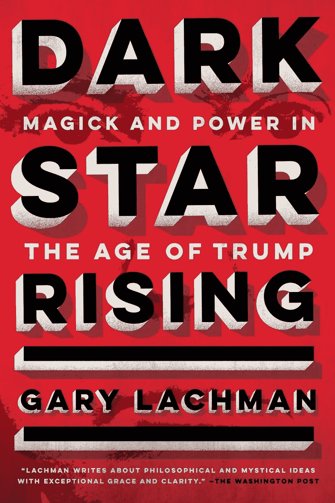

# 真正驱动白宫内部政治的是什么？

> 原文：<https://medium.datadriveninvestor.com/whats-really-driving-politics-inside-the-white-house-fa41aecaf716?source=collection_archive---------22----------------------->

一位作者说神秘的力量是问题的根源

Photo by [David Everett Strickler](https://unsplash.com/@mktgmantra?utm_source=unsplash&utm_medium=referral&utm_content=creditCopyText) on [Unsplash](https://unsplash.com/s/photos/white-house?utm_source=unsplash&utm_medium=referral&utm_content=creditCopyText)

“川普团队”内部到底发生了什么？

这是一些作家试图回答的问题，包括有争议的作家迈克尔·沃尔夫。更多的人无疑会再次尝试。

但很少有人会想到像作者加里·拉克曼一样去同样的地方冒险:神秘学。

作者是摇滚乐队 Blondie 的创始成员。从那以后，他一直忙于写一系列的书，包括正在讨论的这本书:*《黑暗之星崛起:特朗普时代的魔法和权力》*

 [## 保护主义、政治和经济动荡|数据驱动的投资者

### 美国股市昨日出现 400 多点的大幅反转，为未来的事情发出了警告信号。市场…

www.datadriveninvestor.com](https://www.datadriveninvestor.com/2018/06/28/protectionism-politics-economic-turmoil/) 

这是一本商业领袖应该读的书，因为它围绕着人们用脑力实现目标的方法。这就是所谓“新思想”的本质，自我完善的神秘实践。

TARCHER PERIGEE

从书名来看，很容易想象出路西法本人被召唤进椭圆形办公室的故事。每当提到神秘学时，这就是好莱坞的形象。

但这也是拉克曼为我们提供了出色服务的地方。这本书里没有召唤魔鬼，至少字面上没有。相反，他关注新思想，以及它在世界上的位置，不管是好是坏。

# 新思想

读者可能会发现揭示的一个领域是“新思维”如何符合美国人的心理，尤其是商业思维。以下面这段话为例:

> *积极思考、拥有“能行”的态度和“肯定的”人生观的重要性似乎和苹果派一样具有美国特色。罗纳德·里根(Ronald Reagan)就像积极思维的支持者特朗普(Trump)一样，也有一句类似的格言，他几乎在所有的演讲中都使用过，“没有什么是不可能的，”这句话在《神秘教义的古代文本》(Corpus Hermeticum)中不会出现。]*

换句话说，如果你能想象某事，你就能让它发生。这是“是的，我们能”的一个版本

这种态度在大量的美国自助文学中得到了体现，拉赫曼提到了其中一些，包括作家拿破仑·希尔(我以前写过他)。希尔最出名的可能是他的书《思考致富》;题目本身就概括了积极的创业精神和把事情做好的态度。其他被提及的著名人物还有精神领袖欧内斯特·霍姆斯、查尔斯·菲尔莫和诺曼·梁赫群·皮尔，后者写了《积极思考的力量》

作者还将积极思维的故事编织到它在政治和商业领域的应用中。如今，这两者有时难以区分。华盛顿特区的政治任命和私营部门之间顺畅的旋转门就是一个证明。

我们了解到的是，一些领导者坚持不懈地专注于他们的目标，并通过这样做来实现他们的愿望。想想书中的下面一行:

> “如果我们能够足够清晰地想象一个结果，足够持久地想象，有足够的信心和承诺，它就会实现。”

这句话里有很多东西，对于那些深感兴趣的人来说，值得一解。然而，一切皆有可能的想法是最重要的。当然，我们可能会忘记，这句话也提醒我们，没有奉献和坚持，就没有成就。面对不断的负面反馈，愿意坚持下去，并保持清醒的头脑，这往往是成功者与失败者的区别。简而言之，积极思考的咒语是关于精神韧性的。这对任何初露头角的商业领袖都是值得学习的。

# 现实世界的苏联聚会游戏就在眼前？

拉赫曼还讨论了类似方法的使用，但动机是从塑造商业世界转向重塑地缘政治格局。《地缘政治的基础》一书的作者亚历山大·杜金就是其中之一。他是拉克曼所描述的“十几岁的朋克苏联持不同政见者”，但现在是俄罗斯总统弗拉基米尔·普京的地缘政治顾问。正如我们所知，后者一直在玩一场现实世界的游戏，即苏联解体，或者让我们重新团结起来，但却是与各国联合。杜金的新思想形式的后果是俄罗斯吞并克里米亚，以及入侵乌克兰东部。

作者称杜金为俄罗斯近代史上“也许是最奇怪、最令人不安的人物”。尽管如此，杜金还是像成功的商业人士一样，坚持不懈地专注于自己的目标。根据这本书，他的目标是:一个俄罗斯超级国家。关键是，正如一把刀可以用来行善或作恶一样，“新思想”也可以。大部分时间。

# 青蛙作为神奇的象征

在这本书中，我们还了解到青蛙佩佩是如何成为一个所谓的 egregore，并作为一个所谓的另类右翼可以团结的仇恨象征，过上了自己的恶魔般的生活。这个卡通人物在 2005 年被创造出来，是一种可爱的懒鬼，但在总统候选人希拉里·克林顿将当时候选人唐纳德·特朗普的支持者称为“一篮子可怜虫”后，很快就演变成了充满仇恨的角色。政治右翼的回应是一张根据电影《敢死队》(The Expendables)改编的照片，照片中是特朗普、佩佩和其他人，而不是演员。

在某些方面，这个故事的这一部分甚至比俄罗斯的杜金作为地缘政治建筑师的那一部分更可怕。为什么？因为一旦一只白鹭像佩佩那样获得生命，它的创造者就无法阻止它，至少如果你相信拉赫曼的话。他写道，更糟糕的是，没有“好”的极端。

这本书在短短几页中涵盖了很多东西，因此可能是对自助领域鲜为人知的基础的有益介绍。出于同样的原因，任何熟悉该材料的人都可能想要更多。

这是 2018 年 5 月 21 日首次在 Forbes.com 上发表的一篇故事的编辑版本。