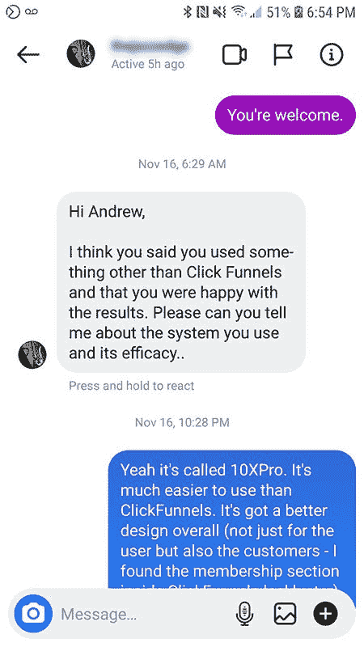
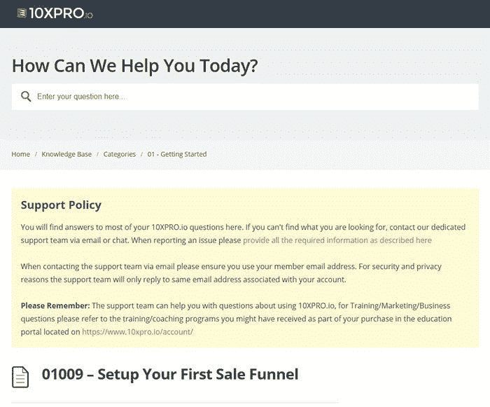
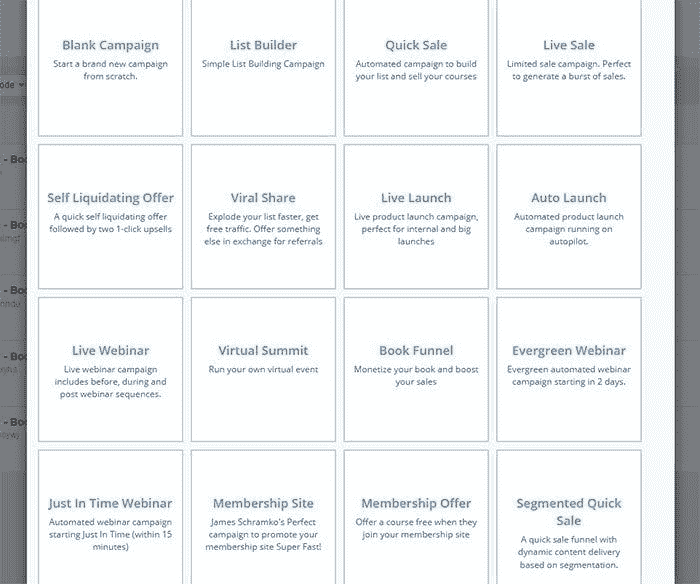
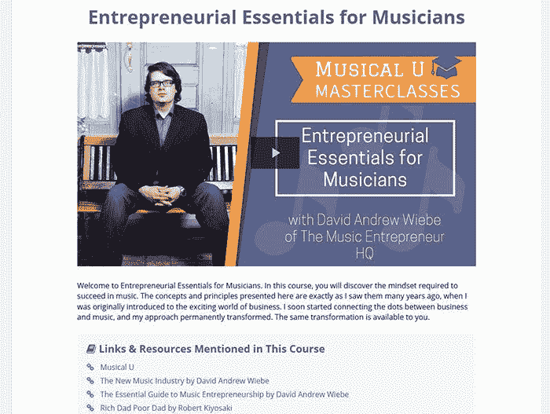
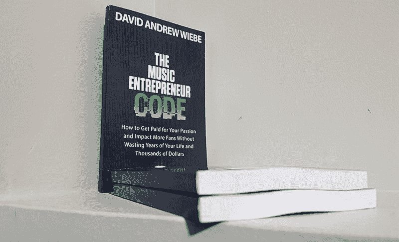

# 最好的漏斗建设者是什么？

> 原文：<https://medium.datadriveninvestor.com/whats-the-best-funnel-builder-86f0a1eabb52?source=collection_archive---------11----------------------->

这个问题最近出现在 Instagram 上:

这是一个很好的问题。如果一个人得了这种病，肯定会有其他人感到疑惑。

以下是我认为最好的漏斗建设者。

# 我最喜欢的漏斗建设者是 10XPro

你可能没听说过。但是我最喜欢的漏斗建造者是 [10XPro](https://gm293.isrefer.com/go/xiNZw9Q/a1740/) 。在这篇综述中，我将解释这是为什么。

10XPro 在某种程度上是这个领域的新人。但它显然是由了解作者、课程创建者、会员网站建设者以及任何想要建立渠道、网络研讨会、发布会或其他方式的人开发的。

如果你使用过其他的漏斗构建工具(比如点击漏斗)，那么你就能很好地理解它们的优缺点。我有使用 Builderall、Leadpages、click 漏斗和 CartFlows 的经验(我[在之前的一篇文章](https://davidandrewwiebe.com/do-musicians-still-need-a-wordpress-site/)中比较了其中的一些)。我甚至用各种工具搭建了漏斗(一般不推荐)。

如果您直接使用 10XPro，您可能会认为某些功能是理所当然的。但是如果你将它与其他东西进行比较，你会注意到一些明显的不同。

基本上，我要说的是，如果不了解其他平台固有的一些绊脚石，就很难理解 10XPro 的神奇之处。

尽管如此，我还是会分享一下我最喜欢 10XPro 的地方。让我们开始吧。

# 我最喜欢 10XPro 的什么

如果我要谈论你用 10XPro 得到的一切，我们会在这里呆一整天。因此，在这一部分，我将重点介绍我最喜欢 10XPro 的地方，以及它与其他漏斗构建器的不同之处。

## 这是有据可查的

回到很多年前，我同时使用活字和 WordPress 来写博客。

两个平台的主要区别之一是 WordPress 有更多的可用文档。也就是说，如果你在这个平台上遇到任何问题，使用 WordPress 比使用 Movable Type 更容易获得帮助。

10XPro 可能相对较新，但他们显然已经考虑清楚了这一点。这个平台是有据可查的。他们也提供了很大的支持。

有些术语可能需要一些时间来熟悉。但这对于任何漏斗制造者来说都是意料之中的事情。

## 它很容易使用

在 10XPro 中部署漏斗(或活动)基本上是在仪表板上的任何地方点击三次。

他们涵盖了所有常见的漏斗类型——List Builder、Live Launch、Live Webinar、Book 漏斗(我的最爱之一)、Evergreen Webinar 等等。

设计页面的方式与优雅主题的 Divi 主题(这是我最喜欢的 WordPress 主题之一)非常相似。ClickFunnels 也是如此，但它的效果并不好。使用 10XPro，你会少很多麻烦，你甚至不用担心一些会让人在点击漏斗中出错的技术细节。

## 它简单、简约且美观

虽然我很直率，但这是我能说的最好的方式:

点击漏斗对用户来说很好，但对客户来说就不那么好了。客户体验还有待改进，主要是在产品交付方面。我并不是说 ClickFunnels 不会这样做。我只是说它不太适合会员区。

10XPro 非常适合用户和客户。默认的模板和设计高度可用，并且易于定制。你可以让你的网站上的所有东西都运行起来，而不用没完没了地摆弄模板。

下面是我的一门课程的样子(只涉及最小的定制):

## 它是多功能的

点击漏斗旨在帮助你建立你的漏斗。不可否认，它在这一点上做得非常好！这就是为什么你不会直接听到我说它不好。

但它在建立会员网站甚至课程平台方面还有待改进。

使用 10XPro，您可以做任何您想做的事情。您可以:

*   用博客建立一个网站
*   只需点击几下鼠标即可创建漏斗(活动)
*   加载你所有的课程或会员的内容与杀手会员区
*   创建粉丝俱乐部或会员网站
*   建立一个社区论坛
*   还有更多

有了 10XPro，一切都构建在一个简单、优雅的解决方案中。因此，如果在任何时候你想扩张，或者你想扩大你的业务，你会感谢你选择了 10XPro。

# 10XPro 的缺点？

我能看到的唯一缺点是，有些人会认为它的成本过高。

我明白了。当然，还有更实惠的选择。问题是——你是想买一辆法拉利，把你需要的一切都放在一个地方，随时准备出发，还是想买一辆丰田，意识到它没有你需要的一切，并对你被迫采用的所有变通办法感到沮丧？

因为这个类比似乎完全适用于这里。

不要太哲学化，但是如果我们关注解决方案(我们想要的)而不是问题(我们不想要的)，那么覆盖软件的成本只是一个尽快达到收支平衡的问题。

你不需要很多顾客来实现每月收支平衡。根据产品的不同，你可能只需要一个月客户(例如，197 美元的课程相对来说比较常见)。

我知道建立任何东西的流量都需要时间。相信我。我在[音乐企业家总部](https://www.musicentrepreneurhq.com/)每月 800 次访问的旅程是一场斗争，除了之外[也有详细的记录。](https://www.stitcher.com/show/unconventional-life/episode/ep149-multitalented-how-to-fuse-your-business-and-artistic-passion-into-your-life-56510735)

但是你有像我这样的人愿意回答你所有的问题。也就是说，面对现实吧，形势对你很有利。

# 我可以使用另一个漏斗生成器吗？

是的。这里分享的一切都只是一个人的看法。你不需要听我说。

对我来说，一个优雅的解决方案不仅仅是强大的。也是比较好用的一个。这也是我喜欢 10XPro 的原因。

如果你对你的漏斗建立器满意，没有必要换。

如果你想探索其他的选择，非常欢迎。

你可以不用我用的漏斗生成器来构建有效的漏斗。不同的人用不同的笔画。

# 漏斗生成器，最终想法

当涉及到建立漏斗时，你使用的软件会有所不同。

有些构建器比其他的更难使用。这使得延迟不可避免，沮丧的可能性很大。

有些构建器不太容易定制。这会让你对你要传达的信息感到不确定，也不知道它是否会被理解。

一些构建器缺少功能。这可能会减缓您的业务增长，甚至会导致更大的开支(因为需要额外的软件)。

所以，好好选择。选择一些能让你快速启动并运行的东西，这样你就可以开始专注于最重要的部分——营销和销售！

10XPro 有 30 天的试用期，这是相当慷慨的，所以如果有疑问，就[拿它来试一试](https://gm293.isrefer.com/go/xiNZw9Q/a1740/)。

嘘…不要告诉任何人。只有很酷的孩子在谈论它。

[获取您的*音乐企业家守则*副本](https://www.amazon.com/gp/product/B0874PZ43Z/)。

*原载于 2020 年 11 月 24 日 https://davidandrewwiebe.com***。**