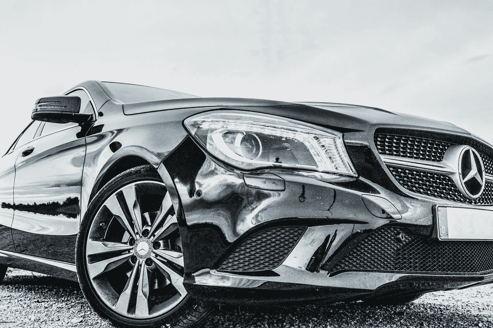
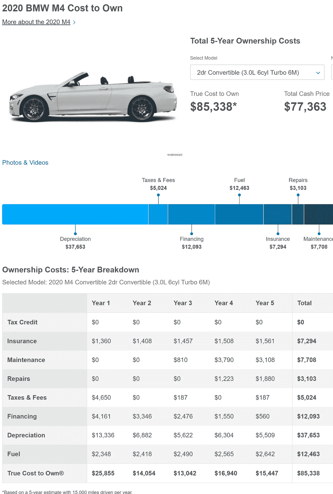
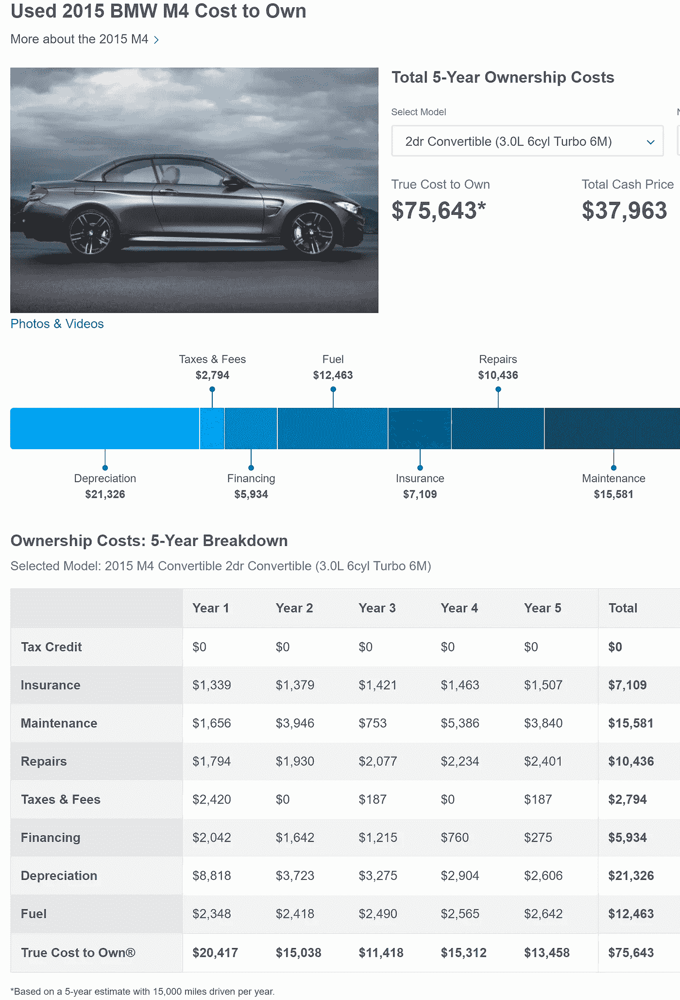
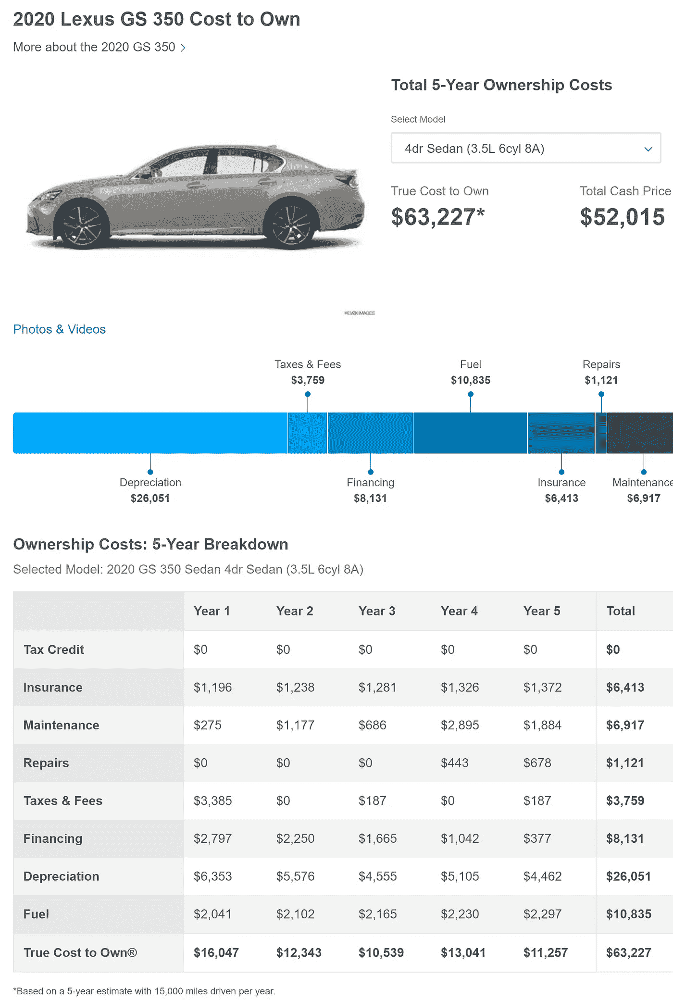
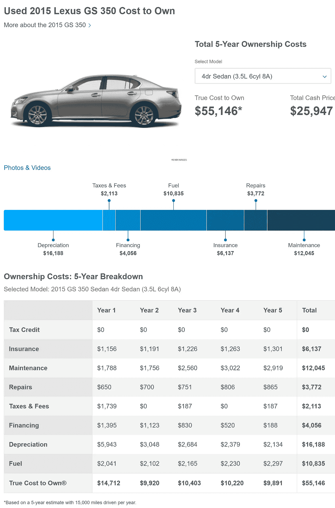
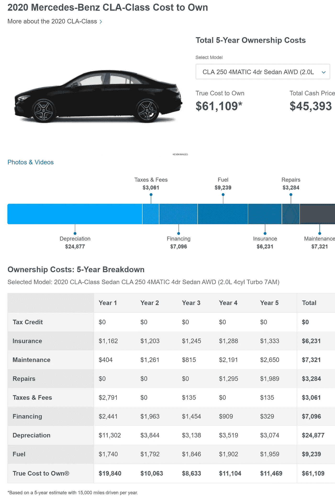
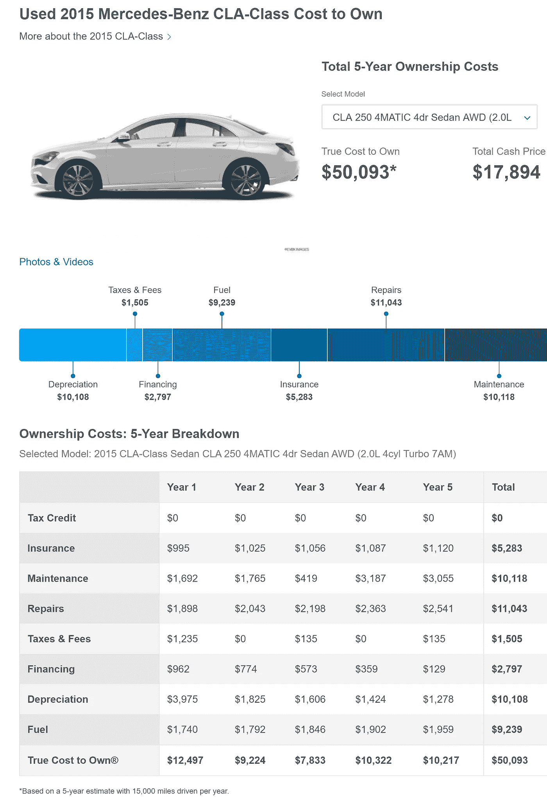

# 买一辆靠谱的豪车最好的方法是什么？

> 原文：<https://medium.datadriveninvestor.com/whats-the-best-way-to-buy-a-reliable-luxury-car-11c7353356d1?source=collection_archive---------1----------------------->

## 折旧对豪华车的影响比非豪华车大吗？

## 拥有的全部成本使得购买全新的豪华车成为一个令人惊讶的有竞争力的选择，如果你拥有它们足够长的时间…

Photo by [Philipp Katzenberger](https://unsplash.com/@fantasyflip?utm_source=unsplash&utm_medium=referral&utm_content=creditCopyText) on [Unsplash](https://unsplash.com/?utm_source=unsplash&utm_medium=referral&utm_content=creditCopyText)

随着新冠肺炎疫情的进行，写一篇关于购买豪华车的最佳方式的文章可能会显得很奇怪。然而，它有助于阅读(和写作！)励志故事，至少偶尔会有。

此外，由于当前的经济动荡，汽车制造商和经销商受到重创，如果你需要在不久的将来购买汽车，现在可能是你获得优惠的最佳机会！

 [## 5 个前所未有的新车激励措施，即使是正在进行的疫情，你也不应该忽视

### 当汽车制造商感到绝望时，可能是时候收购了

medium.com](https://medium.com/financial-strategy/5-unprecedented-new-car-incentives-you-shouldnt-ignore-even-with-the-ongoing-pandemic-3fe902691cc8) 

在深入研究数据(承蒙 Edmunds.com 的"[真实拥有成本](https://www.edmunds.com/tco.html)或" TCO ")并得出结论，购买一辆新的非豪华车并驾驶 10 年[可能比购买一辆 5 年前的车型并每 5 年更换一次更划算](https://medium.com/makingofamillionaire/why-buying-a-new-car-makes-more-sense-than-buying-used-daa988908df0)之后，[我在那里从](https://medium.com/@axelmeierhoefer/i-have-a-car-mainly-because-i-am-looking-for-an-experience-9e7e0ca4f79a)[Axel Meier hoefer](https://medium.com/u/81ca954c9fe4?source=post_page-----11c7353356d1--------------------------------)博士那里得到的一条评论让我开始思考……这是否也适用于豪华车？

 [## 为什么买新车比买二手车更有意义

### 许多专家会告诉你，购买二手车最有利于你的长期财务健康。这就是为什么他们(大部分)…

medium.com](https://medium.com/makingofamillionaire/why-buying-a-new-car-makes-more-sense-than-buying-used-daa988908df0) 

# 应该分析哪些车？

为了计算全部拥有成本，让我们首先决定我们要看哪些车。[根据美国新闻与世界报道](https://cars.usnews.com/cars-trucks/most-reliable-luxury-cars)，2020 年最可靠的 10 款豪华车是:

1.  宝马 5 系
2.  雷克萨斯 LC
3.  雷克萨斯 LS
4.  雷克萨斯 ES 混合动力车
5.  雷克萨斯 GS
6.  雷克萨斯 ES
7.  雷克萨斯是
8.  雷克萨斯 RC
9.  别克纳塔莉·霍勒
10.  梅赛德斯-奔驰 CLA

 [## 使用谷歌搜索趋势预测首次申请失业救济人数|数据驱动的投资者

### 几年来，我的重点一直是使用多种替代数据来预测宏观经济统计数据…

www.datadriveninvestor.com](https://www.datadriveninvestor.com/2020/03/25/using-google-search-trends-to-predict-initial-jobless-claims/) 

计算所有这些的成本超出了我们的范围，所以我们将分析三个例子。

*   考虑到迈耶霍弗博士对宝马敞篷车的偏爱，让我们用宝马的 M4 双门敞篷车 3.0L，6 缸，涡轮增压 6M 取代头把交椅 5 系。
*   接下来，第五名雷克萨斯 GS，选择 GS 350 四门轿车，3.5 升，6 缸，8A。
*   最后，让我们看看排名第十的奔驰 CLA，特别是 2020 CLA 250 门轿车，AWD，2.0 升，4 缸，涡轮增压 7AM(注意，我们使用的是 2020 年的数据，而不是《美国新闻与世界报道》中提到的 2019 年)。

# 折旧对豪华车的影响更大吗？

重复我原来的文章，新车有几个吸引力。

*   你可以订购一辆新车，配有你想要的所有选项或套装，很少有你不喜欢的。您还可以获得最新车型年刚刚推出的新功能，这些功能可能会提高安全性和/或油耗。例如，新的[混合动力 2021 年丰田王子 SUV](https://www.caranddriver.com/news/a32478468/2021-toyota-venza-revealed/) 承诺每加仑 40 英里，几乎是停产的汽油发动机车型每加仑 21 英里的两倍。
*   有了新车，你通常不必在修理厂浪费很多时间。虽然一辆新车可能是个蹩脚货，但大多数都不是，如果你不幸买了一辆，柠檬法则会帮助你。
*   你获得了包括在内的长期保修(对于许多汽车来说，这可能短至 36，000 英里，或者长至 100，000 英里)。只要保修到位，你就没有维修费用。此外，一些汽车制造商会在最初几年为你支付定期保养费用。

然而，你为这些优势付出的代价是更大幅度的贬值，以及更高的融资成本。

# 黑掉 Edmunds.com 的 TCO 以获得 10 年的拥有成本

Edmunds.com 的 TCO 涵盖了全部拥有成本，包括税费、折旧、融资、燃料、维护和五年的维修。

这些费用是按地区评估的，所以你在下面看到的是基于我的邮政编码。如果你想知道这种情况在你的邮政编码区会如何发展，只需使用 Edmunds 数据对你所在的地区进行以下分析。作为一个额外的好处，你可以选择你最喜欢的汽车型号，而不是局限于我碰巧在这里选择的那些。

使用 Edmunds 数据有两个限制。首先，它基于美国的经验是有限的，所以如果你在日本或欧洲，我们下面的结论可能不适用于你。

其次，Edmunds 的数据涵盖了 5 年的拥有期，这对于我在这里要做的事情来说是不够的。出于我的目的，我需要 10 年的拥有成本。

这意味着我们需要黑掉埃德蒙兹的数据。

具体来说，我挑选了 5 年前销售过的相同型号的汽车，并查阅了 Edmunds.com 对这些 2015 年型号的估计。

下面，我们将使用这些 5 年前的模型数据两次。

我们将按原样使用它们来评估购买 5 年的旧车并拥有它们 5 年的成本。

然后，我们将这些成本加到 5 年的成本中，以拥有一辆 2020 年的同型号新车。然而，由于在这种情况下，你已经拥有了 5 岁的汽车，我们将删除融资成本。

此外，由于我们不必向销售二手车的经销商支付额外费用，我们将在 2020 年车型的第五年和 2015 年车型的第二年之间插入折旧数据。

让我们看看这是如何为我们挑选的三辆车工作的。

# 宝马 M4 双门敞篷车 3.0 升，6 缸，涡轮增压 6M

购买一辆新的 2020 宝马 M4 双门敞篷车并保持 5 年的成本是 85，338 美元。

Edmunds.com 5-year True Cost to Own® a new 2020 BMW M4 2-door convertible.

购买一辆使用了 5 年的 M4 敞篷车并保存 5 年需要花费 75，643 美元。如上所述，除去融资成本并插入第一年的折旧，我们得到 65，507 美元。

Edmunds.com 5-year True Cost to Own® a used 2015 BMW M4 2-door convertible.

把这两项费用加在一起，我们总共有 150，845 美元。购买新车并保持 M4 敞篷车 10 年的平均费用为 15，085 美元/年。

让我们来看看这与购买一辆 5 年的 M4 敞篷车并在它 10 岁时卖掉它有什么不同…

因为在这种情况下，我们是在 5 年期买入，所以我们需要保持 Edmunds.com 的数字不变，即 75，643 美元。将此除以 5，我们得出每年 15，129 美元，这明显比购买新的并保留 10 年的选项高一点！

哇！让我目瞪口呆！

即使在我写作和计算的时候，我也预料到了不同的结果。

> 哇！让我目瞪口呆！即使在我写作和计算的时候，我也预料到了不同的结果。

让我们看看其他两位选手是否也是如此。

# **雷克萨斯 GS 350 四门轿车，3.5L，6 缸，8A**

购买一辆新的 2020 款雷克萨斯 GS 350 4 门轿车并保持 5 年的成本为 63，227 美元。

Edmunds.com 5-year True Cost to Own® a new 2020 Lexus GS 350 4-door sedan.

购买 5 年的旧型号并保存 5 年将花费 55，146 美元。如上所述进行同样的调整，我们得到 48，902 美元的第二个 5 年期的汽车，你买了新的。

Edmunds.com 5-year True Cost to Own® a used 2015 Lexus GS 350 4-door sedan.

将这两项成本加在一起，我们总共得到 112，129 美元，平均每年购买新车和保留汽车 10 年的费用为 11，213 美元。

购买一辆使用了 5 年的 GS 350 并在 5 年后出售会像宝马 M4 敞篷车一样更贵吗？

悬念…

同样，在这部分比较中，我们使用 Edmunds.com 成本，为 55，146 美元，5 年平均下来为 11，029 美元。这比购买新的并保存 10 年要便宜，但每月只需 15 美元。

让我们看看我们的第三位候选人是加入宝马还是雷克萨斯…

# **奔驰 CLA 250 门轿车，AWD，2.0 升，4 缸，涡轮增压 7AM**

购买和驾驶一辆新的 2020 款奔驰 CLA 250 的 5 年成本为 61，109 美元。

Edmunds.com 5-year True Cost to Own® a new 2020 Mercedes Benz CLA 250 sedan.

购买和拥有 5 年前的 CLA 版本的 5 年成本是 50，093 美元。如上调整，我们得到你已经拥有的汽车的第二个 5 年的拥有成本是 45，771 美元。

Edmunds.com 5-year True Cost to Own® a used 2015 Mercedes Benz CLA 250 sedan.

将这两项 5 年成本加在一起，我们总共得到 106，880 美元，平均每年为 10，688 美元，用于购买新的 CLA 并保留 10 年。

这与购买二手汽车并在 5 年后出售有何不同？

为此，我们将 50，093 美元除以 5，得到 10，019 美元。这比购买新的并保存 10 年要便宜 56 美元/月。

如果你更喜欢驾驶平均车龄为 5 年而不是 7.5 年的车，并且愿意每年多付 670 美元(大约高出 13.4%)，那就去买吧。否则，你可能想借用迈耶霍弗博士的剧本，买二手的。

# 即使对于豪华车来说，购买二手汽车在经济上也不是一件轻而易举的事情

总而言之，根据你选择的车，买一辆新的可靠的豪华车并保持 10 年可能每年花费 10，000 美元，15，000 美元，或者如果你买一辆超豪华车，花费更多。

然而，取决于你选择购买哪种特定的豪华车，如果购买新车并驾驶同一辆车 10 年最终比购买 5 年的老款并在 10 岁时更换它更便宜，不要感到震惊。

> 根据你选择的具体豪华车，如果买新车并开 10 年比买 5 年的旧车并在 10 岁时更换它更便宜，不要感到震惊。

# 警告

虽然上述方法是指示性的，但有一些警告。

*   由于汽车制造商会对他们的车型进行更改，即使他们不更改车型的名称，从 2025 年到 2030 年拥有 2020 款车型的 5 年成本也不会与 2020 年购买 2015 款车型并保留到 2025 年的成本完全相同。
*   像上面那样使用直接平均的拥有成本忽略了金钱的时间价值。
*   如果通货膨胀升温，它不会像我们在分析中实际假设的那样可以忽略不计。
*   如果你喜欢(并且知道如何)保养你自己的车，你的旧车保养和维修成本会显著下降，只剩下零件成本。因此，对你来说，买一辆 5 年的车，并保持 10 年甚至更长时间可能是一个更好的选择。
*   另一个值得探索的选择是购买一辆 2-3 年的车，并延长保修期。如果保修是由一个可靠的供应商提供的，并且不是非常昂贵，你可能会在修理费用增长到不可接受的程度之前，从汽车上获得更多的年数。

尽管如此，我们至少可以得出结论，在某些情况下，购买一辆可靠的豪华新车并驾驶 10 年，比购买一辆 5 年的旧车并在 10 岁时更换它，是更好的财务选择。

来自埃德蒙兹的数据显示，这是真实的，至少对于宝马 M4 敞篷，几乎是如此的雷克萨斯 GS 350。

# 底线

许多财经博客痛斥那些选择购买新车并在头几年遭受大幅贬值的人。然而，如果你继续驾驶新车足够长的时间，你的平均年成本会下降，有时甚至低于购买二手车的成本！

 [## 用 4 个简单的步骤省钱买新车

### 购买下一辆低于发票价格的新车的权威指南

medium.com](https://medium.com/makingofamillionaire/save-money-on-a-new-car-in-4-simple-steps-3ce92bd38328) 

可能有人会觉得，买豪车，不在乎多少钱。除了一定程度的财富之外，我确信这是真的(我想起了我父亲在 20 世纪 70 年代看到的一个广告牌，它站在一家游艇经销店的上方，宣称，“*如果你想知道价格，那不是给你的！*”)。

但是，很多开豪车的人还是非常在意成本的。他们是这篇文章最应该帮助的人。

# 关于作者

[Opher Ganel](mailto:opher@opherganel.com) 已经成功建立了几个小企业，包括一个支持 NASA 和政府承包商的咨询公司。他最近的冒险是为独立专业人士提供的[金融策略服务](https://www.opherganel.com/)。你可以在那里与他联系，或者关注他的媒体出版物[金融策略](https://medium.com/financial-strategy)。

# 放弃

*本文仅供参考，不应视为财务建议。在做出任何重大财务决定之前，你应该咨询财务专家。*