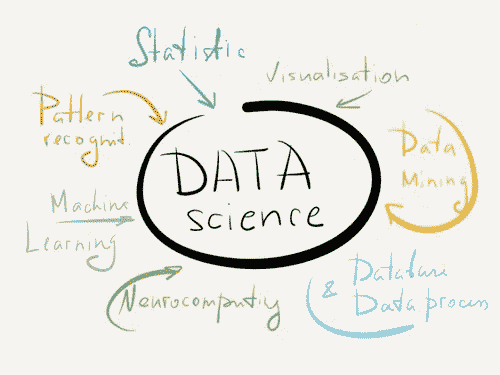

# 初学数据科学最好的方法是什么？

> 原文：<https://medium.datadriveninvestor.com/whats-the-best-way-to-learn-data-science-as-a-beginner-16d199ca1c9f?source=collection_archive---------14----------------------->

虽然在概率、测量、编程、ML 模型等方面的良好基础承担了成为一名优秀数据科学家的工作，但一名伟大的数据科学家的特点是她有能力影响各自领域的最终决策。

有些人说需要大约 3-8 个月的时间来恢复镇静数据科学，有些人说半年的训练和每周 4-5 小时的工作是你所需要的。尽管如此，我承认这取决于你的注意力、耐心和练习水平(FPP)。你的经验和教育背景同时吻合，正如人们真诚地说的那样，“坚定不移的心态最终总是会取得胜利”！

数据科学是关于将原始和定量信息提取到分类和教育数据中，目标是将其分解并保留记录。

 [## 成为数据科学家所需的 8 项技能|数据驱动型投资者

### 数字吓不倒你？没有什么比一张漂亮的 excel 表更令人满意的了？你会说几种语言…

www.datadriveninvestor.com](https://www.datadriveninvestor.com/2019/02/07/8-skills-you-need-to-become-a-data-scientist/) 

它融合了一些硬技能(比如学习 Python 和 SQL)和软技能(比如业务能力或关系能力)等等。如果你不擅长编程，但你仍然想成为数据科学家，那么我建议你学习 r。

[***学习 R 更接近你的数据科学梦想！！***](https://techvidvan.com/tutorials/r-tutorial/)

## 作为初学者，要精通这门科学，你必须掌握基本的重要语言。以下是每个数据分析师都应该知道的工具概要-

## 1.统计数据:

统计是分解真实数据的方法，类似于客户端搜索历史。

**1.1 描述性统计:**

它有助于理解数据。通过数字表示和图表对数据进行定量分析，可以恰当地描述数据。它包括正态分布、集中趋势、峰度和可变性。

**1.2 推断统计:**

如果你不能从中做出决定，数据就没有任何用处。通过一个更小的例子来推断人口应该是可能的。它结合的技术是中心极限定理，假设检验，方差分析和定量数据分析。

## 2.机器学习的数学:

机器学习假说是线性代数和微积分交叉的领域。有了正确的方法，通过数学的有效执行，这往往是非常愉快的！

## 3.编程知识:

把东西包起来就是编程知识。这些是数据科学的基本要素。

**1)高级的微软 Excel:**
Excel 由于其庞大的功能集，对于清理数据非常有用。Excel 是数据科学的完美基础工具。Microsoft Excel 通常用于数据分析、制作电子表格、感知和复杂计算。你可以在 Excel 中实现统计学的基本思想。

它将向您展示数据检查的要点以及如何与表格交互。它同样会通过它的可视化能力帮助你理解启发性的洞察力。

**2)Python:**
Python 是一种基于翻译器的语言，它逐行解释 Python 代码。它是众所周知的编程语言之一。它有从网络应用改进到数据科学的各种用途。

Python 通常被用作数据科学的编程语言，因为它有大量的库和包。Python 是开源的，这意味着您可以从数据科学工具的开发和执行中获得广泛的帮助。

[***关于 Python 编程你需要知道的一切！***](https://techvidvan.com/tutorials/python-tutorial/)

**3)R:**
R 正在定制创建用于分解大量数据的统计模型。r 是数据科学爱好者和专家数据科学家最主流的工具。r 被修改以创建用于分析大量数据的统计模型。

虽然 R 对于复杂的统计问题来说是一个极好的工具，但是它有一个学习和适应的期望过高的问题，这对于初学者来说很难。要成为一名熟练的数据科学家，学习 r 是绝对必要的。

**4)SQL:**
SQL 协助从数据库中恢复和操作数据。SQL 是数据科学所需的最重要的编程语言。它是一种数据库查询语言，这意味着它被用来从数据库中恢复数据。数据库是按表格中的行和段分类的数据集合。

SQL 是数据科学家用来恢复、操作和处理信息的工具。这种数据库被称为关系数据库。“关系”一词意味着数据是按表格的行和列来组织和排序的。

## 结论:

总而言之，我只需要声明，不管你是否读了 100 本书，但不准备将理论知识应用于数字，那么它就不包括尊重。

网上课程是可以获得的，你只需要自我激励，受到自己的启发，你就会明白在一段时间内你将如何选择学习它。