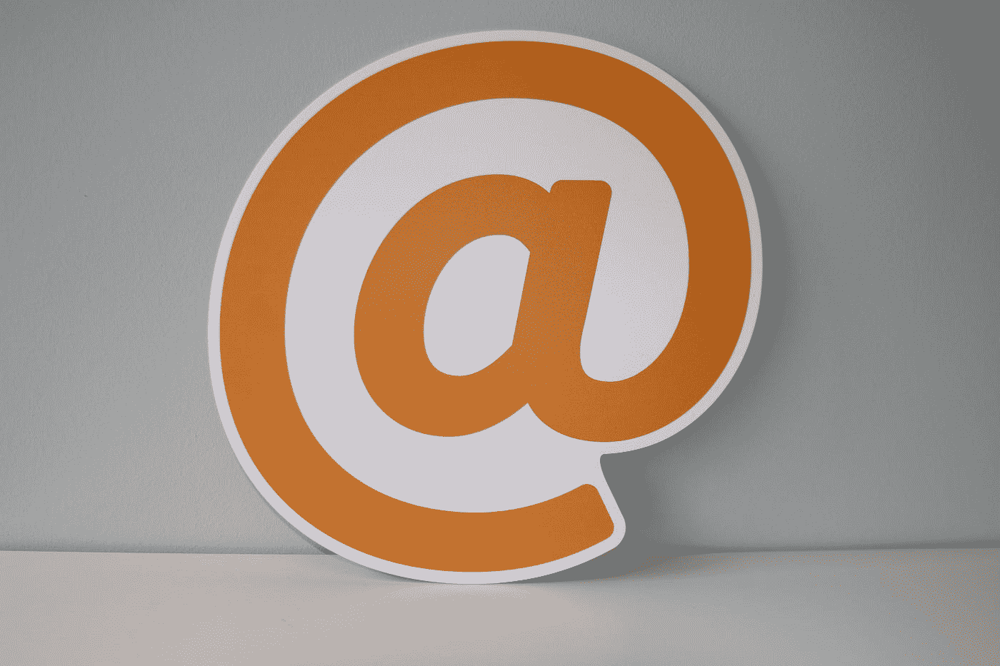

# 下一个建议是什么——建立你的邮件列表？

> 原文：<https://medium.datadriveninvestor.com/whats-the-next-advice-after-build-your-mailing-list-ddb39353f492?source=collection_archive---------18----------------------->

## 没有人过多谈论管理电子邮件列表

Photo by [Onlineprinters](https://unsplash.com/@onlineprinters?utm_source=medium&utm_medium=referral) on [Unsplash](https://unsplash.com?utm_source=medium&utm_medium=referral)

无论你走到哪里，你都会听到无数关于如何从第一天开始建立邮件列表的建议。我不能说这不是一个坏建议，因为建立一个这样的建议很重要，但是你很少听到的是之后该做什么，因为，老实说，大多数人(我曾经是人)在开始一个时事通讯后不知道该做什么。

扩大你的电子邮件列表很简单——销售线索磁铁、内容营销、广告等，但难的是让你的订户参与进来。首先，邮件列表不是每天更新你的博客或者每分钟删除你的课程链接。是的，这是一部分，但如果你不够投入，你的开放率将会下降。

我每天收到数百封电子邮件，但我只打开其中的 10%——我不太关注那些促销和烦人的电子邮件，而是阅读我觉得有吸引力的时事通讯。

如果你的邮件很无聊或者没有吸引人的主题，你的订阅者会停止打开你的邮件。当我写电子邮件时，我最擅长的是问自己是否喜欢阅读我写的东西，因为有时候，你写的东西可能会非常无聊——你知道这一点。

自从我开始写时事通讯，我已经尝试了很多事情。我在不同的时间调整了主题、合并标签、正文和行动号召，通过这篇文章，我会告诉你什么最适合我。顺便说一下，我的邮件列表仍然只有不到 1k 的订阅者，但是我平均有 45-60%的打开率。对于我花了大约三个月才开始构建的东西来说，这已经不错了。

# 电子邮件主题

你的邮件主题决定了你邮件列表的成败。我证实这一点的方式是，有一次，一份特定的时事通讯的打开率并不显著。我不断刷新，看看发生了什么事。我认为这与我的互联网有关，因为通常当我的时事通讯停止时，我喜欢刷新并看着数字增加——这一次没有行动——什么也没有改变。不管我有多清醒。

于是我换了个话题——内容不变，第二天再发，打开率更高了。我改变了什么？我对主题行进行了个性化处理，并添加了一个表情符号——请注意，我从来不用表情符号，但不知何故，它似乎吸引了人们的注意力。你也可以使用[标题分析工具](https://headlines.sharethrough.com/)——它们也有帮助。

# 身体

当我开始的时候，我曾经把我的电子邮件当成博客。我会继续写下去——内容没有个人故事，只有直接的事实。因为它太长了，我甚至自己看了都觉得无聊。

你怎么能指望作者觉得无聊的东西会引起读者的兴趣呢？我这样做了大约三次，我注意到写时事通讯对我来说并不那么令人兴奋。感觉像是另一篇博文，因为我没有添加个性。

甚至当我为客户创建电子邮件活动时，我仍然试图包含故事——尽管不是关于我，而是关于主题。所以我把这个策略添加到我的时事通讯中。

我会谈论我对某个特定话题的了解，给出有用的见解，并把它和故事结合起来。即使对我来说阅读也很有趣——我注意到更多的人花时间阅读它。

人们加入您的邮件列表，与您联系并获得真知灼见。当你用故事来包装你的信息时——无论是个人的还是其他的——你的名字会印在他们的脑海里。

Photo by [Toa Heftiba](https://unsplash.com/@heftiba?utm_source=medium&utm_medium=referral) on [Unsplash](https://unsplash.com?utm_source=medium&utm_medium=referral)

另一件神奇的事情是合并标签

合并标签让它看起来更像一个对话。当你把它们放在句子之间时，读者会感到惊喜，因为人们喜欢看到他们的名字。

不知何故，这些合并标签给你的读者一种错觉，好像你是专门为他们写的这封邮件——他们会因为你回来阅读你的更多内容而感激你。

# 行动呼吁

每周我都会试着弄清楚是否要给我的电子书或者我的最新帖子留一个链接。

我早些时候注意到，如果链接太多，我的订户并不总是关注它们。所以，我只需给他们中的任何一个留一个链接——它一直在工作。

你也不应该把呼吁行动视为一件坏事。我过去常常担心在我的帖子结尾加入行动号召。但我刚刚发现，我才是这样看待事情的人——人们不介意行动号召。但是要确保行动号召是针对一个单一的提议。

# 摘要

总结我所说的一切，用吸引人的标题抓住你的读者的注意力。您可以使用合并标签添加他们的名字或插入表情符号。此外，请随意使用标题分析器。

个性化您的内容。不要只关注你放弃的见解。用故事把它包起来。让他们通过你创作的内容看到你是谁。

用一个产品号召行动。您的行动号召甚至可以成为您的电子邮件注册页面的链接。让他们与朋友分享。这样，你不需要太多的努力就能获得新的订户——只需将你的行动号召混合起来。不要每次都用同样的东西。

最后一件事——*别无聊*

每周四我都会发我的新闻。如果你对写作有兴趣，你可以注册这个链接。