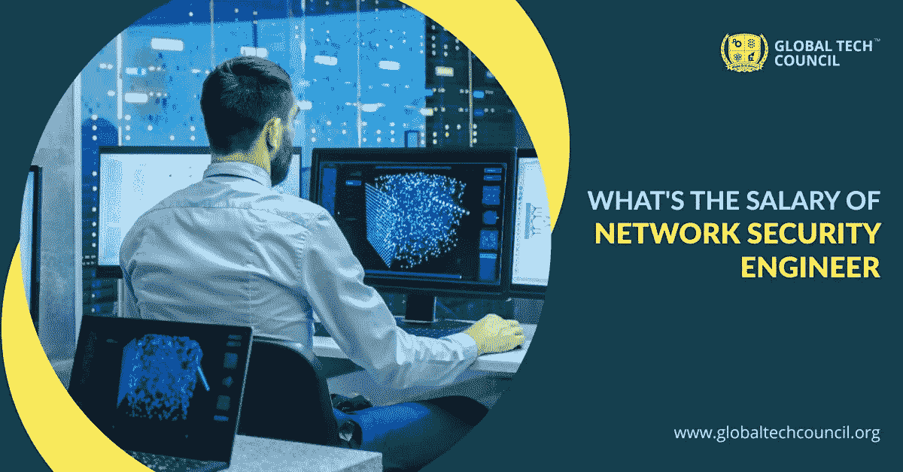

# 网络安全工程师工资多少？

> 原文：<https://medium.datadriveninvestor.com/whats-the-salary-of-a-network-security-engineer-c7426060d03e?source=collection_archive---------15----------------------->

安全技能仍然是最受欢迎的职业技能之一。随着越来越多的公司依赖数字平台进行业务运营，该系统拥有来自全球的海量数据。虽然公司为数字平台上的数据安全花费了数百万美元，但并没有同样的可靠保证。传统平台容易受到数据威胁和黑客攻击，使得人们甚至公司很难管理它。这就产生了日益重要的 [**网络安全工程师**](https://www.globaltechcouncil.org/certifications/certified-network-security-engineer/?utm_source=Article&utm_medium=kmpost&utm_campaign=Sept) 的需求。这些人在网络上工作，研究他们的弱点，根据他们的评估，他们可以找到有助于增强系统安全性的正确解决方案。

## **为什么要参加网络安全工程认证项目？**

当谈到选择最佳职业选项时，那么各种技能可以让你的职业生涯达到新的高度。但是，如果它是关于浸泡一个强劲的增长和技能，可以巩固你在工作中的地位，你必须选择一个今天的需求和一个将在未来应用。网络安全工程是一个档案，将巩固你的地位。随着未来世界将依赖数字平台，对网络安全专业人员的需求也将上升。因此拥有这个领域的证书会帮助你成长。

根据网络安全风险投资，预计到 2021 年，全球将有 350 万个网络安全职位空缺。甚至研究公司 Frost & Sullivan 也预测，到 2020 年底，将会有 150 万个保安岗位空缺。这些庞大的统计数据表明，对网络安全专业人员的需求将会越来越大，拥有网络安全工程认证，你可以获得更好的职位。

这不仅仅是因为对网络安全专业人员的需求不断增长，使其成为最受欢迎的工作之一，而且他们的工资也使其成为一个受欢迎的职业选择。

 [## 认知网络安全|数据驱动的投资者

### 随着网络攻击的规模和复杂性增加，人工智能(AI)有助于资源密集型安全…

www.datadriveninvestor.com](https://www.datadriveninvestor.com/2020/06/30/cognitive-cyber-security/) 

## **网络安全工程师的工资**

每个人都完成了学业，提高了自己的技能，希望能找到一份好工作，同时挣得更多。一个 [**网络安全认证在线**](https://www.globaltechcouncil.org/cybersecurity-certifications/?utm_source=Article&utm_medium=kmpost&utm_campaign=Sept) 的工资可能会根据他们处理的档案和任务而有所不同。根据 Glassdoor，网络安全工程师的基本工资从 83，114 美元开始。

根据 Robert Half Technology 2019 的薪酬指南，一名网络安全工程师的个人收入可能高达 98，500 美元(在第 25 百分位)至 167，500 美元(在第 95 百分位)(对于获得必要认证并具有丰富经验的人)。所以，归根结底，你有多少经验，拥有什么样的技能，因此网络安全认证变得至关重要。

## **网络安全工程师必须掌握的关键技能:**

假设你已经是一名网络安全工程师。在这种情况下，你必须注意以下技巧。尽管如此，如果您计划注册网络安全工程认证，您必须重点学习以下技能:

*   道德黑客 -作为一名网络安全工程师，你需要学习的一个重要方面就是道德黑客。这是一种发现系统是否易受攻击的方法。
*   **电脑操作系统-** 接下来需要学习的技能在电脑操作系统上。他们必须精通不同的操作系统，如 UNIX、Linux、Windows 除此之外，他们还必须了解 MySQL 和 MSSQL 等平台。
*   **网络架构-** 作为一名网络安全工程师，你必须了解网络架构师。它包括局域网、广域网和内部网。网络安全工程师还负责设计网络，确保系统免受任何威胁或攻击。
*   **计算机取证-** 与网络犯罪的侦查有关。由于这些案件在最近一段时间内呈上升趋势，因此，你必须努力学习这些技能变得很重要。安全工程师技能包括理解数字数据是否与数字法律相关。

你可以把掌握这些技能作为你工作简介的一部分，但是选择网络安全工程认证总是好的。这个认证项目将为你提供正确的激励和专业的学习方法。因此，如果你想成为网络安全工程专家，这种认证计划必须。

## **结论-**

随着时间的推移，人们将会更加依赖数字平台。因此，将需要能够帮助将技术援助用于业务运营的个人，从而使其能够对抗黑客和恶意攻击。

[**全球技术委员会**](https://www.globaltechcouncil.org/?utm_source=Article&utm_medium=kmpost&utm_campaign=Sept) 提供网络安全工程认证计划，让您了解行业的最新发展，并在课程中实施。所以，报名参加这个认证项目，给你的职业生涯一个助力。

**访问专家视图—** [**订阅 DDI 英特尔**](https://datadriveninvestor.com/ddi-intel)