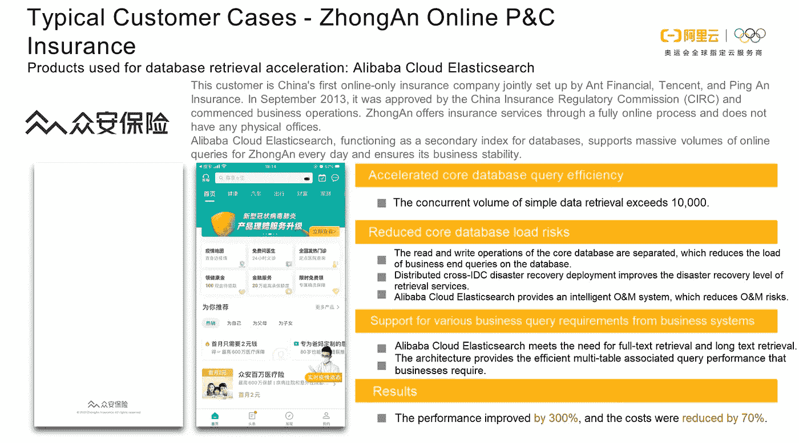

# 阿里巴巴的人工智能在线上菜(AI OS)背后有什么秘密

> 原文：<https://medium.datadriveninvestor.com/whats-the-secret-behind-alibaba-s-artificial-intelligence-online-serving-ai-os-ebe7ed67f7d5?source=collection_archive---------1----------------------->

*通过* [*反新冠肺炎中小企业支持计划*](https://www.alibabacloud.com/campaign/anti-covid-19-sme-enablement-program) *，在爆发中支持您企业的增长和数字化转型。为所有新的中小企业客户提供 300 美元的优惠券，为付费客户提供 500 美元的优惠券。*

*阿里巴巴集团搜索与推荐事业部高级研究员沈家祥*

# 1)人工智能操作系统简介

本文描述了人工智能在线服务(AI OS)及其技术架构的演变，提供了技术概述，并介绍了云原生产品和实践。

AI OS 是由阿里巴巴搜索工程团队开发的在线服务平台，集成了个性化搜索、推荐和广告。AI OS 引擎系统支持多种业务场景，包括所有淘宝移动搜索页面、淘宝移动信息流(你可能喜欢)、各大促销活动场地、淘宝首页商品推荐，以及按品类、行业进行个性化推荐和商品选择。覆盖了 80%以上的淘宝移动用户。AI OS 使用一套技术来支持搜索、推荐、广告，这在大型互联网公司中并不多见。阿里巴巴的平台技术战略本质上涉及电子商务技术和大数据 AI 技术。电子商务操作系统包括商品管理、品类管理、运营管理和交易环节。在大数据和深度学习时代，AI 投放、搜索推荐、广告投放已经成为独立于传统电商的技术场景。除了淘宝移动场景，AI OS 还支持阿里巴巴集团内所有电商场景的场景，如东南亚 Lazada、聚划算、Fliggy、优酷、DingTalk、菜鸟、河马、饿了么、口碑，甚至与内部经济的子公司支付宝合作。

在深度学习时代，AI OS 引擎系统架构有了显著的发展。然而，阿里巴巴并不像其他互联网公司那样开发独立于搜索和推荐系统的深度学习技术。从技术层面到业务场景，AI OS 整合了搜索、推荐、信息流、广告、深度学习，形成基础引擎平台。该平台帮助每个部分基于其他部分进行开发。

下图是基于 AI OS 业务场景的 AI OS 所涉及的技术和概念。

第一层显示了分布式引擎系统所需的基本能力。搜索、推荐、广告都需要召回和排序。在扩展分布式引擎系统之后，需要分布式通信、高性能索引存储以及高效和灵活的索引和更新能力。

中间层代表深度学习时代的技术和场景需求。比如深度学习需要样本处理、训练、在线预测，它们的应用场景是个性化交付。个性化交付体现在搜索、推荐和广告中。索引需要支持实时更新，这在电子商务系统中很重要。

最后一层包含资源管理、高可用性、计算引擎支持、O&M 控制和 AI OS 的插件支持。

下图显示了 AI OS 工程系统的技术。

底层是 Hippo，这是一个有效的资源管理系统。

顶层包括淘宝、云、广告业务，这些业务近年来一直在增长，并逐渐迁移到 AI OS。阿里巴巴的很多技术和业务都是以自下而上的模式发展起来的。我们以强烈的创新意识，从底层到 70%到 80%建立平台化的搜索和推荐，并提升到战略层面，加速中端建设，形成全覆盖布局。

图的右边部分显示了 AI OS 中间件，它包含与实际业务特性相关的基本组件，包括:服务定位:一个运行数万台机器的系统需要有自己的服务定位机制。服务监控:该组件提供秒级的服务监控。内部应用程序的度量对于分布式系统调试非常重要。索引分布:这是引擎数据更新的一个重要的基本组件。消息队列:这是一个使用碎片化主机资源构建的高性能消息组件。它的特点是低 CPU 消耗和网络吞吐量，基本上是一个免费组件。第二层调度和自动缩放:这些是在主要促销活动中用于搜索、推荐和广告的内部分钟级资源调度的重要方法。

左边的算法、离线、训练、计算平台都是深度学习时代开发的。样本和特征处理涉及算法平台 Nebular，它需要与训练引擎 X-Deep Learning (XDL)交互工作。计算平台为算法样本和样本训练提供支持，也是阿里巴巴集团中一个强大的技术支点。它伴随着搜索成长，两者相互促进，相互支持。

中间部分展示了近年来最重要的技术发展，与商业密切相关。借助移动智能，我们不仅仅可以进行简单的推荐更改和混合结果排序。我们在终端上训练模型，预测深度模型。淘宝移动信息流是全球深度学习、训练、预测最大的应用场景。这是我们的特殊探索领域。

HA3 搜索引擎是阿里巴巴的经典引擎，支持全文检索。商业化引擎是一个召回引擎，支持广告业务、与广告的关键字匹配和有针对性的场景推送。图形引擎 iGraph 是一个支持在线图形计算和检索的大型图形检索引擎。它具有多种在线衍生能力，包括个性化的用户关系和知识图表。这些引擎支持实时数据更新，因为 AI OS 框架支持数据和更新管理。AI OS 框架依赖于右边的技术，并扩展了深度学习能力。

# 2)AI OS 技术架构的演进

AI OS 架构可以作为规模逐渐扩大的创业公司的参考。

尽管 AI OS 已经发展了 10 多年，但它最初专注于淘宝搜索业务。2013 年至 2015 年，优化搜索引擎性能，在阿里巴巴体系内开发平台化搜索引擎。采用经典的查询处理+搜索引擎+摘要服务架构来构建搜索。查询处理部分涉及到个性化存储，这是使用简单的 KVs 完成的。这种架构被很多创业公司采用，也是经典的云产品解决方案。

2015-2018 年，信息流业务兴起，我们在底层搜索层(Suez 或 AI OS 框架)进行数据抽象和积累，衍生出图引擎、预测引擎、搜索引擎、推荐引擎，形成了 AI OS 的主要框架。在这个过程中，我们也统一了整个集团的基础搜索和信息流框架。这个过程依赖于阿里巴巴集团内部自下而上搜索平台的推动。在行业中证明了自己并赢得了集团的赞赏后，它被纳入集团战略。

从 2018 年到 2019 年，我们推动了基于深度学习开源框架 TensorFlow 的全图架构。在深度神经网络(DNN)迭代过程中，全图架构中的有向无环图(Dag)以更加标准化和通用的方式描述业务。我们将这种全图架构推广到所有业务线，包括深度学习、业务逻辑调整、场景迭代、特性调整(比如粗分类、精分类、统计、过滤)。这种架构极大地提高了业务迭代的效率。

代码级插件开发，如 C++或 Java 插件开发，用于定制业务逻辑。虽然它能满足业务需求，但维护和升级成本很高。使用基于 DAG 算子的表达式来解决该问题，这是过去两年中的一个重要技术突破。运算符图完成后，只需要更改运算符实现，因此在版本升级的情况下，运算符图保持不变。这样一来，业务迭代和平台升级之间的耦合性就大大降低了。

在这个过程中，我们还在有趣的场景中使用了搜索和推荐技术，比如菜鸟物流引擎，本质上就是图检索和计算。这个引擎伴随着我们的引擎系统成长，包括图形引擎 iGraph。在这种情况下，该引擎支持每天数亿个包裹的流程和路线优化。另外，DingTalk 消息在每个环节都是自上而下加密的，这在常见的搜索引擎中是无法实现的。加密是通过引擎迭代实现的。除了深度学习，我们还逐步引入了 SQL 功能。

随着中端战略在集团的进一步实施，软件抽象和能力衍生在云上发展。我们用蚂蚁金服业务精简了业务，找到了新的突破点。我们也在践行平台化、通用化的思路，用最有效的方法解决问题，开发经典的应用产品，比如 AIRec(一站式精选产品投放系统)、OpenSearch(一站式智能内容搜索服务)。AIRec 平台支持阿里巴巴集团 1000+个性化场景，覆盖淘宝、天猫、聚划算、双 11 业务线，支持超过 10 亿例精选商品投放。OpenSearch 是一站式智能内容搜索服务，具有高搜索质量，以产品的形式支持大规模搜索业务。它涵盖了阿里巴巴集团的大多数搜索业务，并支持超过 10，000 个商业应用。双 11 期间，OpenSearch 发挥了重要作用，支持了 100 万 QPS 的峰值。

# 3) AI OS 技术概述

本章描述了主要的人工智能操作系统组件。

## E2E 深度学习平台:Nebular 和 AOP

深度学习大大加速了模型工程的发展。模型迭代越来越频繁，网络结构越来越复杂，这对算法迭代效率、数据计算效率和模型交付可靠性提出了巨大挑战。我们提出并构建了面向大规模业务场景的一站式深度学习建模平台 Nebular。使用 Nebular，您可以快速完成从功能引入和样本功能更改到模型训练、评估和交付的整个算法建模过程。Nebular 提供了全面的数据模型验证系统，确保您的离线建模和模型交付具有生产级的可靠性。Nebular 支持完整、增量和在线学习，并使用高级抽象以低成本在不同的学习模式之间切换。

## 大型分布式深度学习框架:XDL

XDL 是一个基于开源框架的分布式深度学习框架，用于广告、搜索和推荐等场景。它专门针对高维稀疏特征、互联网结构化数据和结构化模型进行了设计和优化。XDL 是智能营销人工智能技术的核心驱动力。它支持对用户的深度理解和各种营销产品的智能投放，如 Alimama Express、品牌广告和超级推荐。

## 预测引擎:RTP

在传统的增量模型学习模式中，当前模型被恢复、持续训练并每天更新。或者，以实时流模式训练当前模型，并每小时更新一次。新模型在完全切换后生效。基于 AI-OS 的预测引擎 RTP 集成了 TensorFlow 能力，支持深度大模型的实时更新，并充分利用实时数据分发来提高点击率(CTR)或转化率(CVR)估算精度和随之而来的业务结果。模型特征可以实时更新，模型可以以增量模式训练。RTP 在线图被分解以提取模型参数权重，该权重可以被更新以形成大的连接的和可执行的子图，并实时发送模型数据消息。这保证了离线流模型训练和在线实时更新。最后，在线模型更新周期从几小时缩短到几分钟，模型在几秒钟而不是几分钟内生效。

## 全图推荐引擎:TPP

个性化平台(TPP)为阿里巴巴集团的许多个性化业务提供开放和一致的解决方案。它使搜索和推荐技术能够轻松地服务于业务发展，并允许企业在平台上快速找到所需的技术。TPP 是 AI OS 的词条之一。可以在 TPP 上编译解决方案代码，以场景的形式对外提供服务。您不需要关心主机资源应用程序或应用程序部署结构，也不必编写服务框架。你只需要在 TPP 产品页面上实现你的推荐逻辑功能，管理从编译调试到发布的解决方案生命周期。

# 4) AI OS 云-原生产品和实践

从 2014 年开始，我们逐步将集团内积累的技术能力向外部客户推广。下图是基于 AI OS 系统构建的产品组合。

OpenSearch 是一个基于阿里 AI OS 技术的无 O&M 一键式云平台。它是一个基于服务和基于产品的搜索平台，完全筛选搜索系统复杂的底层，并以标准化产品的形式支持业务。OpenSearch 提供高质量的搜索，并且可以在线优化搜索性能。您只需要提交内容并设置一个配置就可以享受搜索功能。可以灵活配置和选择相关性，修改查询，自定义分词，提交行业词典。

我们用 OpenSearch 统一了阿里巴巴集团的中长尾搜索业务。配置自助服务接入的业务已达 1000 家，覆盖了阿里巴巴集团的所有业务单元。经过几年的参与，我们在阿里云吸引了成千上万的用户，包括具有典型应用场景的用户，如内容、电子商务和视频。

AIRec 基于阿里巴巴集团 AIRec 平台开发，提供一站式个性化推荐服务。在你提交内容和用户行为后，AIRec 保证数据隐私，应用基于不同行业模板的个性化推荐算法，实时调整性能提供服务。除了阿里巴巴传统的电商领域，我们在其他行业也做了相当大的算法投入，比如内容、视频。在利用内部技术之后，我们可以自然地以更抽象和更通用的方式开发新的场景。

在这个过程中，用户必须克服数据源跟踪规范和使用障碍。然而，我们致力于提供易于使用的产品。此外，我们在产品中提供监控、调试和操作干预策略，以帮助用户提高性能。在未来，AIRec 可能成为新的中小型企业的绝对必需品。

基于开源生态系统的 [Elasticsearch 服务](https://www.alibabacloud.com/product/elasticsearch)由阿里巴巴和 Elastic 联合推出。我们坚持开放的生态系统，将灵活、易用的 Elasticsearch 与我们稳定、高效的调度和控制系统相集成，并根据用户需求不断迭代内部创新功能。我们将提供用户需要的任何东西。Elasticsearch 适应我们的系统，两者相互支持，相互促进。

在这三个垂直产品下面是我们已经建立起来的基础云技术，比如 ElasticFlow。数据在导入到搜索引擎之前需要被连接。比如 Elasticsearch 就需要 ElasticFlow。此外，还保证了 OpenSearch 的离线开箱即用能力。在这一层，我们需要详细的计算引擎功能。计算引擎为阿里巴巴的计算平台上的搜索和推荐定制数据收集、开发、共享和模型训练能力。这些能力横向精简和共享平台上的产品，也表明在 AI OS 系统中积累的技术能力。

下层是控制平台，基础搜索平台，阿里云基础产品。我们在这一层有一些生态系统产品。

下面描述几个典型的用户案例。

在中国新年期间，我们与明天推进生活(TAL)达成了合作伙伴关系。其直播云教育平台在合作期间流量激增。它使用了 [Alibaba Elasticsearch](https://www.alibabacloud.com/product/elasticsearch) ，Logstash，Kibana，和 Beats 产品。在[冠状病毒(新冠肺炎)疫情](https://www.alibabacloud.com/campaign/fight-coronavirus-covid-19)期间，TAL 的峰值流量翻了一番，他们的弹性搜索集群需要扩大规模。我们在几分钟内扩展了集群，确保了 TAL 用户的出色体验。资源规模翻倍，需要用户调用资源，扩展数据。然后，他们还需要在不需要的时候归还资源。我们的自动缩放功能可以满足 TAL 的要求，并帮助 TAL 最大限度地降低成本。

上图展示了一个典型的电子商务 app。这款 app 使用 OpenSearch，主打运动时尚，关注者众多，特别注重搜索性能。该客户之前构建了自己的搜索系统。但在缩放和搜索排序方面缺乏经验，无结果率为 60%。后来，我们与客户合作，通过使用 OpenSearch 和阿里巴巴的搜索算法来优化他们的搜索系统，包括分词、查询语义理解和查询修改。功能发布后，无结果率下降了 80%，交易转化率提高了 9%。搜索优化促进了商品总量的增长(GMV)。

上图显示了知名的 IT 社区 CSDN，它使用 OpenSearch 和 AIRec。它以前提交网址，并要求其他人捕捉和提供索引。通过索引，它使用大型搜索方法进行查询并对网站进行限制。这是一种常见的方法。但是，在这种模式下，流量货币化的能力可能会受到其他方的限制。此外，大型搜索解决方案无法优化搜索性能。提交的 URL 可能不会被记录，并且不能确保结果的召回和关联。在使用 OpenSearch 解决方案定制这些能力后，搜索性能超过了内部搜索解决方案和原始合作解决方案。与内部解决方案相比，PV_CTR 增加了一倍多。CSDN 现在可以顺利支持网站搜索服务。

众安在线 P&C 保险是阿里云 [Elasticsearch](https://www.alibabacloud.com/product/elasticsearch) 的大客户。我们帮助其提升了搜索性能，降低了成本，满足了数据库检索加速场景下的多表联查和 HA 需求，满足了金融企业的容灾部署需求。

*在继续与全球爆发的冠状病毒作战的同时，阿里云将发挥自己的作用，并尽一切努力帮助其他人与冠状病毒作战。点击*[*https://www . Alibaba cloud . com/campaign/fight-coronavirus-新冠肺炎*](https://www.alibabacloud.com/campaign/fight-coronavirus-covid-19) ，了解我们如何支持您的业务连续性

# 原始来源:

 [## 背后的秘密淘宝的人工智能个性化推荐

### 阿里巴巴云 2020 年 5 月 11 日 258 在爆发中支持您的业务增长和数字化转型…

www.alibabacloud.com](https://www.alibabacloud.com/blog/the-secret-behind-taobaos-ai-powered-personalized-recommendations_596205?spm=a2c65.11461433.0.0.54355355OobKbE)