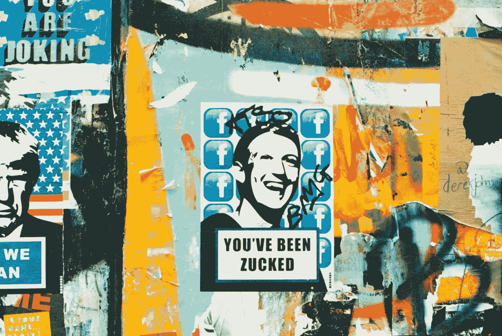
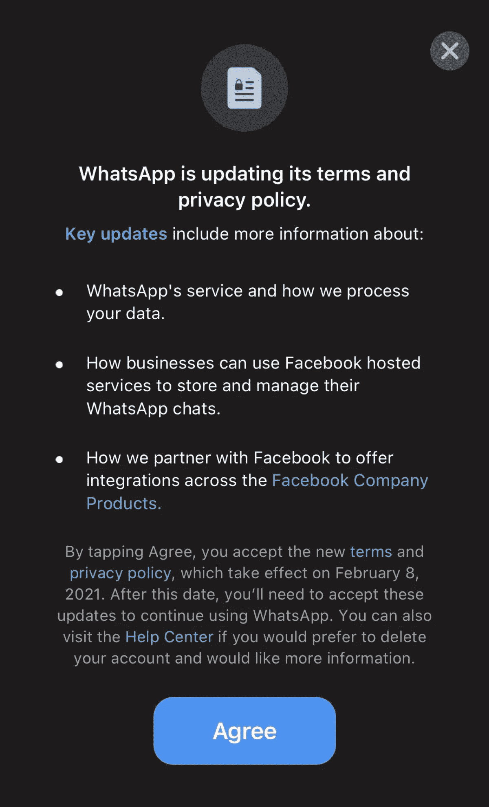
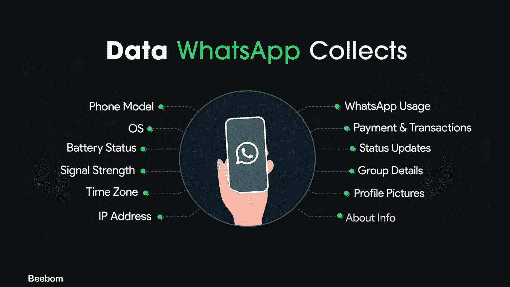

# WhatsApp 强迫其用户与脸书分享私人数据，引发隐私担忧

> 原文：<https://medium.datadriveninvestor.com/whatsapp-forcing-its-users-to-share-their-private-data-with-facebook-sparking-data-privacy-concerns-bb13d85f1982?source=collection_archive---------4----------------------->

## WhatsApp 的新隐私法引发了人们对用户数据隐私的担忧，人们开始转向 Signal 等替代通讯应用来提高安全性。

Photo by [Annie Spratt](https://unsplash.com/@anniespratt?utm_source=unsplash&utm_medium=referral&utm_content=creditCopyText) on [Unsplash](https://unsplash.com/s/photos/whatsapp-and-facebook?utm_source=unsplash&utm_medium=referral&utm_content=creditCopyText)

本月早些时候，WhatsApp 开始推出带有新条款和隐私政策屏幕的弹出消息。弹出窗口要求用户点击“*同意并接受新条款“*”，新条款将于 2021 年 2 月 8 日生效。你所需要做的就是点击“*不是现在”*按钮，但是没有这样的“*不是现在”*按钮。如果您重新打开该应用程序，弹出窗口将再次出现，并且不会让您使用它，直到您接受条款和条件。这在公众中引发了巨大的痛苦和安全担忧。

WhatsApp’s New Privacy Terms Pop-Up

# WhatsApp 的起源

WhatsApp 是一款智能手机即时通讯应用，由雅虎两名前员工布莱恩·阿克顿和简·库姆于 2009 年创建。该应用由 Igor Solomennikov 开发，利用苹果新的推送通知来更新用户的网络状态。用户很快就把它当成了即时通讯服务，这也是 WhatsApp 最终发展的方向。

当时吸引人们的是，这款应用可以免费下载，是手机供应商传统短信平台的替代选择。当时这种信息服务的 USP 是它的隐私功能。

# 被脸书收购

快进到 2014 年，脸书以 220 亿美元收购了 WhatsApp，这是社交媒体巨头迄今为止最大的一笔收购。WhatsApp 目前是世界上最大的消息服务，每月活跃用户超过 20 亿(截至 2020 年 2 月)，每天人们每天发送约 1000 亿条消息(截至 2020 年 10 月)。

该消息应用程序推广其端到端加密技术，确保聊天中的所有内容在默认情况下都是安全的。甚至连 WhatsApp 都无法读取信息或监听对话参与者之间的通话。这也是它能够在短时间内获得如此多用户的原因之一。据报道，它在两年内获得了大约 5 亿用户。

WhatsApp end-to-end encryption video on YouTube

# 阿克顿和扎克伯格之间的分歧

WhatsApp 的创始人布莱恩·阿克顿(Brian Acton)于 2017 年离开脸书，原因是脸书首席执行官和联合创始人马克·扎克伯格(Mark Zuckerberg)在该应用的商业化问题上存在分歧。

当然，当脸书以 220 亿美元收购 WhatsApp 时，他们希望设计一种模式来增加收入，因为人们使用 WhatsApp 的次数超过了脸书。此外，脸书正在寻求用户增长，WhatsApp 每天增加 100 万用户。扎克伯格想利用定向广告和商业信息来赚钱。这惹恼了阿克顿，他离开了脸书，因为他向用户承诺，WhatsApp 上不会有广告，这让他为提前退出付出了 8.5 亿美元。阿克顿当时说，他想专注于一个非营利组织。

# 剑桥分析丑闻

对于一家保存用户个人数据的科技公司来说，这可能是有史以来最大的丑闻。该事件涉及英国咨询公司[*剑桥分析公司*](https://en.wikipedia.org/wiki/Cambridge_Analytica)*未经数百万脸书用户同意获取他们的个人数据，主要用于政治广告。*

*这些数据是通过一个名为“*这是你的数字生活*”的应用程序收集的，该应用程序由数据科学家[亚历山大·科岗](https://en.wikipedia.org/wiki/Aleksandr_Kogan)开发。该应用程序收集了多达 8700 万份脸书资料。剑桥分析公司试图将美国选民的数据出售给政治竞选活动，并最终为特德·克鲁兹和唐纳德·特朗普的 2016 年总统竞选提供帮助和分析。*

*丑闻曝光后，脸书受到了许多用户、科技公司、媒体和政府的强烈反对。这一丑闻如此巨大，以至于引发了一场关于脸书和 Twitter 等社交媒体网站如何处理用户数据的在线辩论。事实上，扎克伯格必须在国会面前作证。*

*一些公众人物批评了脸书，包括 WhatsApp 创始人布莱恩·阿克顿。*

*Tweet by Brian Acton on #deletefacebook*

*脸书不得不向[信息专员办公室](https://en.wikipedia.org/wiki/Information_Commissioner%27s_Office)支付 50 万英镑罚款，原因是将用户的数据暴露在“严重的危害风险”之下。这也激发了一部网飞纪录片《大黑客》(The Great Hack )的创作，该片详细报道了这一丑闻。*

# *WhatsApp 的新隐私政策*

*过去几天，WhatsApp 的新隐私政策一直是热门话题之一。这已经得到了大量推文、博客、媒体报道和 YouTube 视频的支持。*

*WhatsApp 发言人援引，*

> *“正如我们之前在 WhatsApp 2020 年 10 月的商业愿景中所说的那样，为了更好地支持小企业，我们正在更新我们的服务条款和隐私政策，因为我们努力使 WhatsApp 成为从企业获得答案或帮助的一个很好的方式。”*

*脸书的这一举动引发了一个问题，即一家公司能否强迫其用户接受使用该应用的条款和条件。从技术上讲，是的，他们可以。然而，许多人认为这是对用户隐私的直接侵犯。*

**

*The data collected by WhatsApp. Image by [Beebom on Twitter](https://twitter.com/beebomco/status/1347458179878121472)*

*人们已经将 WhatsApp 用于从个人到商业的各种用途，他们在其中分享个人信息，如电话号码、密码、银行信息等。因此，这一隐私更新导致了许多谣言，如“ *WhatsApp 和脸书会读你的聊天记录*”。*

*现在，人们已经开始迁移到替代应用程序，其中包括由布莱恩·阿克顿以惊人的速度创建的 Signal 也在那里。这迫使 WhatsApp[在其隐私政策更新](https://faq.whatsapp.com/general/security-and-privacy/answering-your-questions-about-whatsapps-privacy-policy)上发布了一篇博客，并删除了一条关于误解的推文。*

*然而，似乎用户现在正在从应用程序转移到其他专注于隐私而不是数据商业的替代产品。*

# *信号的崛起*

*当阿克顿离开脸书去一家非营利组织工作时。他于 2018 年 2 月与非营利组织[莫邪·马林斯派克](https://twitter.com/moxie)共同创立了信号基金会，开发了信号消息应用。它使用标准的蜂窝电话号码作为标识符，并通过端到端加密保护与其他信号用户的所有通信。它在 EFF 的安全消息记分卡上获得了最高分，成为最安全的消息平台。*

*该应用程序包括用户可以独立验证其联系人身份和数据通道完整性的机制。Signal 完全依赖捐款和资助。Action 自己出资 5000 万美元。*

*Signal 自推出以来一直被政客和告密者使用。前[国家安全局](https://en.wikipedia.org/wiki/NSA)承包商[爱德华·斯诺登](https://en.wikipedia.org/wiki/Edward_Snowden)已经在多个场合表态支持 Signal。但当世界首富埃隆·马斯克发布一条简单的推特时，互联网变得疯狂起来。*

*Musk’s Tweet on Signal*

*从那时起，Signal 的下载速度每天都在以数百万的速度增长。事实上，在 1 月 12 日，它被 4000 万人安装在 Android 设备上。*那真是一个壮举！马斯克还在推特上表示，他去年向 Signal 基金会捐款，并将在未来捐款更多。**

*Signal 为其用户提供安全的消息、语音和视频通话，所有通信都是端到端加密的。此外，您可以组成群组，尽管您无法选择一次向多个联系人广播消息。此外，Signal 最近还增加了对 8 人群组通话的支持。它允许你将语音呼叫转接到它的服务器上，这样你的身份就不会被你的联系人发现。该功能有点类似于 VPN 的功能。它还提供了一个内置的选项来隐藏您的 IP 地址。它还具有独特的功能，如*自毁信息*和“*自我提醒*”，在这里你可以写下你的杂货清单、电影清单甚至随机想法。*

# *消息应用的未来*

*WhatsApp 现在已经成为我们生活的一部分，人们很难摆脱它。但是，人们不应该轻视隐私。在我看来，你应该能够决定是否要分享你的数据。*

*自从隐私更新以来，WhatsApp 已经失去了许多用户，以至于该公司不得不将推出时间从 2021 年 2 月 8 日推迟到 5 月 15 日。*

*WhatsApp 不会对用于承载两个用户之间通信的元数据进行加密。脸书可以提取这些元数据来了解你和谁谈过话，谈了多长时间。这是一个主要的缺点。既然用户已经意识到了，WhatsApp (&脸书)必须尽快拿出留住用户的计划。*

*我确信 Signal 会尽力利用隐私问题。信号只保留电话号码，它不试图链接到用户的身份。Signal 还会加密您的元数据。为了保护用户隐私，Signal 设计了一种新的用户间通信方式，称为[密封发送器](https://signal.org/blog/sealed-sender/)。基本上，使用密封的发送者，没有人能够知道，甚至不能发出信号，谁在给谁发信息。这就是 Signal 胜过 WhatsApp 的地方。这是我会盲目依赖的功能。这就是爱德华·斯诺登代言这款 app 的特点。*

*显然还有其他应用程序，但如果涉及隐私，没有一个能与 Signal 相比。如果隐私是你最优先考虑的，你肯定应该切换到信号。*