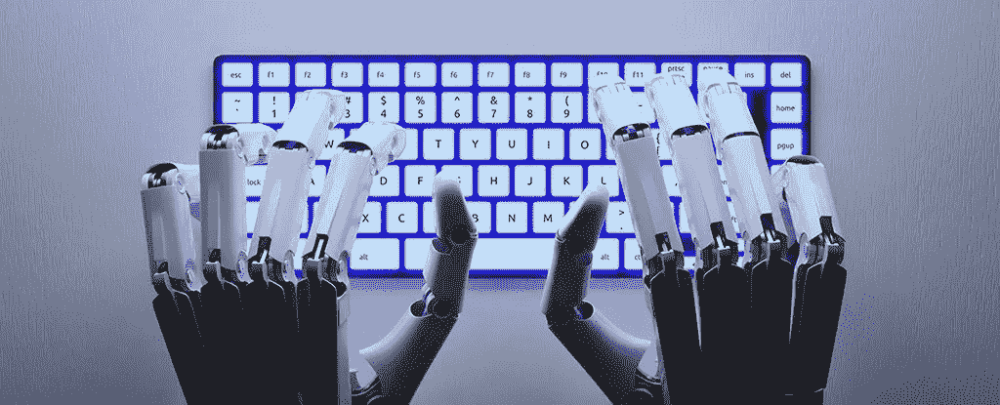

# 当 AI 取代作家？

> 原文：<https://medium.datadriveninvestor.com/when-ai-replaces-writers-34c24e2e80a7?source=collection_archive---------18----------------------->

Photo From Google Images

人工智能已经部署在许多行业，如制造业和体力劳动，这为作家提供了保护——写作具有创造性思维，因此人工智能无法取代这一点。然后 next 爆发了文本生成人工智能，它如此强大以至于公司发现发布它太冒险了。

你可能读过五六十年代的科幻小说，它们充满了对 21 世纪生活的憧憬。这些故事想象了一个拥有个人喷气背包、水下城市、星际旅行、会飞的汽车和能够独立思考的真正智能机器人的世界。21 世纪已经到来，遗憾的是，我们不会得到那些会飞的汽车，但由于深度学习，我们可能会得到机器人。

 [## 人工智能和监督资本主义|数据驱动的投资者

### 大科技，总是现在:人工智能推动的大科技，已经使购物，搜索，在你的…

www.datadriveninvestor.com](https://www.datadriveninvestor.com/2020/03/04/on-artificial-intelligence-and-surveillance-capitalism/) 

从恶意的太空操作系统到凶残的终结者，人们一直担心人工智能机器人会接管。

在小说之外，你可以看到人工智能正在接管人类的工作。他们比人类工作更有效率。他们甚至可以无误地完成重复的任务。

 [## 超过 3000 万美国工人将因人工智能而失业

### 机器人并没有取代所有人，但随着人工智能的出现，四分之一的美国工作岗位将被严重打乱…

www.marketwatch.com](https://www.marketwatch.com/story/ai-is-set-to-replace-36-million-us-workers-2019-01-24) 

上面的链接描述了随着机器接管日常任务，大多数工作都会有所改变。一些餐馆已经改用自助点餐机。谷歌今年正在酒店大堂试用数字语音助手，即时翻译几十种语言的对话。自动驾驶汽车可能会取代短途送货司机。许多经济学家发现，自动化对劳动力制造者有总体的积极影响。

OpenAI 的 GPT-2 的新闻。这是一个生成文本的人工智能，好到公司认为“发布它太危险了”。

不管是不是宣传噱头，这个问题已经从

**“AI 会取代作家吗？”**

到

**“人工智能什么时候会取代作家？”**

# **从笨重的文本机器到智能散文**

去年，Adzooma 测试了市场上的一些人工智能内容生成器。结果并不好。出来的内容全是多余的话，缺乏目的或对内容的理解。因此，由于这些问题，它不能出版。但是事情已经改变了。Adzooma 可能不会从那个测试中得到同样的结果。人工智能的世界迅速发展。你等待的时间越长，就会有越多的事情发生。引领潮流的可能是 GPT 2 号。

# **GTP-2**

好吧，我们永远不会知道 OpenAI 没有发布的 GTP-2 版本。这仍然是最高机密。然而，他们发布了一个不太危险的 GTP-2 工具。老实说，结果非常好。GTP-2 的设计是为了在前一个的基础上产生一个新的。你不能一开始就给它一个主题，你需要用信息来填充它。

来自 OpenAI 网站的解释:

***“GPT-2”是一个大型的*** [***变压器***](https://arxiv.org/abs/1706.03762) ***基于 15 亿个参数的语言模型，在 800 万个网页的数据集上进行训练。GPT-2 的训练有一个简单的目标:在给定某个文本中所有先前单词的情况下，预测下一个单词。***

《纽约客》的文章是在实践中看到它的最好方式之一。

 [## 机器能学会为《纽约客》写稿吗？

### 在这篇文章的每一节的末尾跳到主要内容，你可以阅读一篇人工智能…

www.newyorker.com](https://www.newyorker.com/magazine/2019/10/14/can-a-machine-learn-to-write-for-the-new-yorker) 

GTP-2 生成的文本:

***“人工智能公司 OpenAI 宣布，其人工智能作家 GPT-2(一种智能合成的增压版)的完整版本将推迟发布，因为这台机器太擅长写作了。”***

# **见第二眼……**

我们需要考虑新 GTP 协议的一些缺陷。

GTP-2 生成的文本总是不准确。这篇文章听起来可能不错，但它有编造引用和名字的倾向。语言专家莎拉·格雷戈里说:“输入人工智能的数据会显示引用经常被使用，所以会提供它们使文本更自然”。

如果人们认为这些引用是真实的，那么你就有假新闻的问题了。

下一点，这篇文章仍然缺乏一些目的。它可以很好地从前面的文本继续下去。这听起来不错，也很有意义，但仍然会有一种感觉。

文字不是为了它而存在的。他们在那里是出于某种原因，是为了实现一个特定的目标。由 GTP-2 生成的单词具有不同的目的以与现有文本融合。这种差异意味着它不太合适。

# **使用辅助工具，而不是更换**

AI 不是但不代表 AI 没用。GTP-2 对作家来说是有用的。编辑有时比写作更容易。如果 GTP 2 号给你的是完美的东西，而不是从零开始，你就为自己节省了很多时间。如果你正遭受写作瓶颈的困扰，这甚至会有所帮助。把你目前所拥有的放进去，看看它会带来什么，然后用它来驱动你自己的工作。

# **作家安全与否？**

对于目前的情况，答案是**是的**

但是事情变化很快。随着时间的推移，GTP-2 可以得到改进。再过十年，它可能会写文章。

有一些行业确实使用人工智能作家来生成文本。美联社(AP)使用机器学习(ML)来自动创建大联盟比赛的书面帖子。他们没有记者在每场比赛都采访他们，所以他们只是简单地获取数据，然后把数据输入机器，生成文本。

有一件事我们必须记住，没有什么会被 100%接管。人工智能将发挥其作用，但在大多数情况下，它将有助于简化你工作中单调乏味的部分，让你可以专注于其他事情。

我们正在调整。我们和人工智能合作。我们会很容易学会，因为它会比我们想象的来得更快。