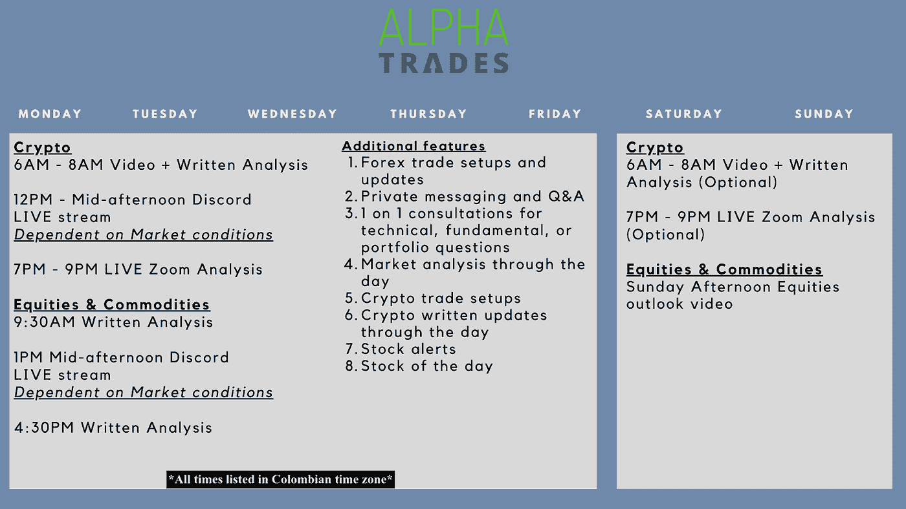
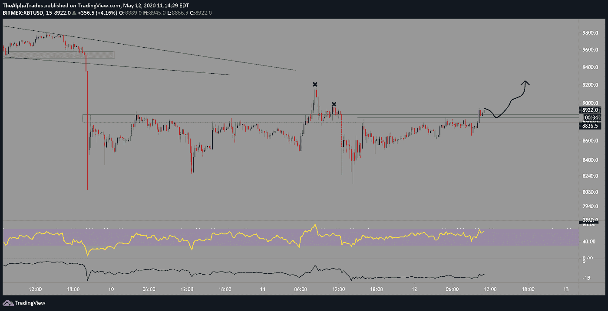
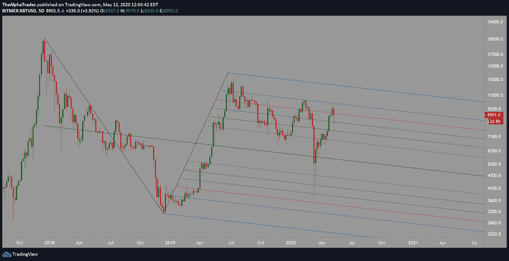
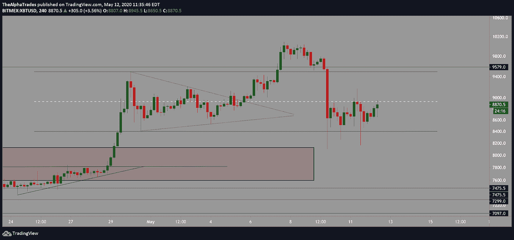

# 什么时候可以买到更便宜的比特币？

> 原文：<https://medium.datadriveninvestor.com/when-can-you-buy-cheaper-bitcoin-7bc89ebd71b1?source=collection_archive---------18----------------------->

## 减半后的短期与长期机会。

When to buy cheaper Bitcoin, Source: The Stocks

昨天，Alpha Trades group 通过 12 小时的直播庆祝了 2020 年比特币减半，直播中有大量的分析、奖品和对话。来自*比特币与市场*的安塞尔顺便来聊了聊比特币以及它与传统市场的一些基本关联。他给了我们一些关于比特币和加密货币未来几个月和几年的有趣预测。晚会非常有趣，我们希望你不要错过！

我们仍然在运行我们的周末赠品(仅限优势会员),让谁能最好地猜测出 BTC 在每周蜡烛线结束时的价格。获胜者将获得 25 美元！滚动到文章末尾，了解更多关于不和谐服务器的信息以及如何联系我们。

# 减半的工作原理

快速回顾一下，以便我们理解本周在 [BTC](https://www.tradingview.com/symbols/BTCUSD/) 发生的根本性变化——每开采 21 万个区块，或者大约每四年，比特币矿工处理交易的报酬就会减半。这意味着新比特币进入流通的速度降低了一半。理论上，这将是一个卖新闻的事件，但我们还没有看到预期的抛售。事实上，比特币似乎在不断攀升，接近 8900-9000 点。

这里提醒一下阿尔法交易每周遵循的宽松时间表。您会注意到，优势会员每天都能获得大量价值。下载或收藏图片，这样你就不会错过任何东西。

Alpha Trades weekly schedule, Source: Alpha Trades, LLC

# 比特币减半后的分析

现在，随着内务处理的方式，让我们进入一些比特币分析。昨天直播的时候，我在 8720 做了一个快速的头皮做空交易，在 8650 出局。减半日的交易风险很大，但将此视为快速进出交易被证明是明智之举。自从我拿走那块头皮，市场在上午晚些时候已经攀升到 9000 点附近。

今天早上早些时候，15 分钟图表显示一个关键的支撑阻力(SR)水平受到挑战，因为突破的机会更大，我在 8975 区域设置了一个长期交易目标。在这个范围之上，是过去一天的价格波动带来的大量流动性整合。进入这个区域可能会抽走一些流动性，为下一次交易做好准备。比特币与标准普尔 500 的关联度仍然太高，不能忽视传统市场，我将密切观察标准普尔 500 的任何剧烈波动。一旦股票展期，BTC 可能会跌得更厉害。

 [## 加密货币行业是死是活？数据驱动的投资者

### 九月初，我们在 X-Order 内部就代币市场的未来进行了一场辩论。有趣的是，我们的观点是…

www.datadriveninvestor.com](https://www.datadriveninvestor.com/2019/12/12/will-the-cryptocurrency-industry-be-dead-or-alive/) 

下面是对比特币的长期看法。希夫干草叉揭示了 BTC 如何触及 75%的完美拒绝纤维。如果价格超过 5000 或 4000，BTC 将有很大机会获得冠状病毒的低价。45000 点区域是一个强有力的支撑区域，如果它不能支撑 BTC，那将是对该资产的致命打击。跌破该水平会打开 2400 点的目标，然后低至 1400 点以下。

Bitcoin long scalp target from this morning, Source: Alpha Trades, LLC

Bitcoin Schiff Pitchfork levels, Source: Alpha Trades, LLC

在近期，当价格测试 8900 区域时，4 小时的时间框架显示，自几天前对称三角形突破以来，BTC 回到了较大的范围内，价格低于下图中白色虚线表示的 EQ。该范围的下限约为 8386，而上限约为 9490。今天早上突破 EQ 给出的目标是 9490，而如果价格最终跌破 8386，我想做空到大约 7900-7800。

Bitcoin ranges and deviation, Source: Alpha Trades, LLC

RSI 在四小时的时间框架内仍然看跌，而最近的日线蜡烛图打印了一个[多奇](https://www.investopedia.com/terms/d/doji.asp)，这意味着从这个角度来看，整体价格走势中性至看跌。

比特币在连续八周上涨后，终于印出了红色的周线蜡烛。从周线来看，我看不到强劲的支撑，所以一旦比特币开始下滑，我预计它会突破几个 SR 水平。如果你本周正在交易比特币，请小心，即使只是出于这些原因。

# 来回答最初的问题“我们什么时候能买到更便宜的比特币？”

资产经理 Leah Wald 今天在推特上说[比特币减半事件不是一个强烈的买入信号](https://medium.com/exg/the-bitcoin-halving-is-not-a-buy-b55ae9fb0e58)，我倾向于支持这一观点。自 3 月份价格暴跌以来，比特币一直处于避险环境中，这意味着当美国股市开始下跌时，比特币的表现不会很好。在这种时候，当没有人能够对这些市场的走向做出明智的预测时，在交易像 BTC 这样的非流动性、投机性资产时要小心。因此，以更便宜的价格购买比特币的最佳时机可能是一旦我们更深地陷入整体经济下行趋势的低谷。我用比经济衰退前少得多的资本进行逐层交易，因此，在价格随股市下跌之前，比特币对我来说仍然过高。

# 处于优势

感谢您成为这个社区的一员。如果你对这篇文章有共鸣，请[订阅不和谐服务器](https://bit.ly/2KJ1oor)。你将可以免费访问公共频道，在那里我们每天发布大量免费有用的内容。更多细节请看下面的视频。

Where Bitcoin is headed post-halving, Source: Alpha Trades, LLC

# 放弃

Alpha Trades，LLC 提供的信息不用于制定任何财务决策，也不是购买、持有和/或销售特定产品、数字资产或 ICO 的请求或建议。

访问我们的完整服务条款:[https://bit.ly/3faVeeV](https://bit.ly/3faVeeV)