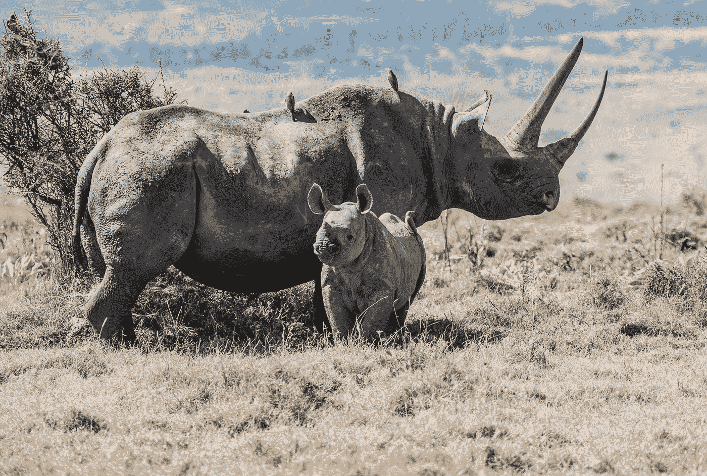
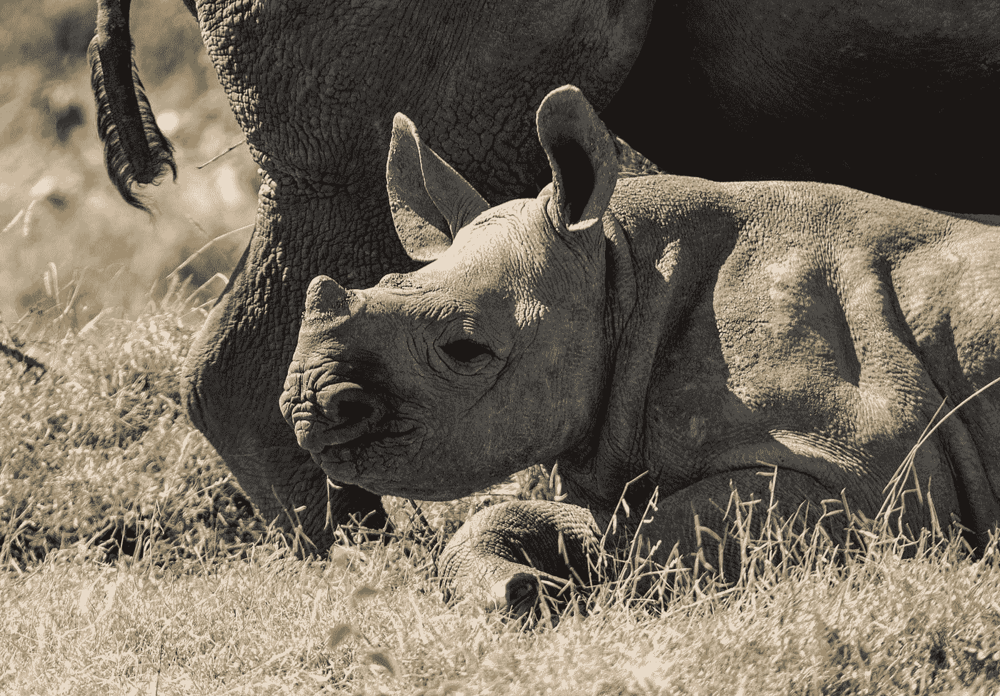

# 当社区和保护一样重要时

> 原文：<https://medium.datadriveninvestor.com/when-community-is-just-as-important-as-conservation-ef6619085a1a?source=collection_archive---------11----------------------->

Photo by [David Clode](https://unsplash.com/@davidclode?utm_source=medium&utm_medium=referral) on [Unsplash](https://unsplash.com?utm_source=medium&utm_medium=referral)

## 犀牛和其他伟大的动物是如何在肯尼亚山的阴影下重获新生的

我坐在离 Morani's 餐厅几码远的野餐桌的部分树荫下，这家餐厅位于肯尼亚内罗毕以北大约四小时车程的 Ol Pejeta。我在听塞缪尔·穆蒂西亚，他是这个巨大遗产的保护负责人，正忙着为非洲不稳定的未来重写什么是可能的，平衡动物和人类的需求。

ol PE jeta(Maasai，发音为 J，大致翻译为“火与烟的地方”)诞生于 20 世纪 30 年代。在附近的 Nanyuki 镇，该地区的许多居民是白人，部分原因是向殖民移民提供了 100 年的土地租赁。这些租约中的许多仍然有效，因为这些租约和土地使用的税收和经济利益继续超过其他考虑。

 [## 对于社区建设，数据驱动的投资者

### 从任何意义上来说，珀尔·莫伯斯都是一个游戏玩家。一名活动家、艺术家、角色扮演者和社交媒体项目经理…

www.datadriveninvestor.com](https://www.datadriveninvestor.com/2018/11/16/for-community-building-game-on/) 

Ol Pejeta 占地超过 90，000 英亩，是一个广阔的乡村，其特点是高稻草色的草地，游客和员工使用的车辙路，游荡的动物，从利用战略上放置的混凝土水库提供的水的大象，到游荡的犀牛。一些，带着孩子。

犀牛现在有 167 只，是 Ol Pejeta 最大的成就之一。整整 75，000 英亩的保护区专门用于这些动物，它们与汤普森瞪羚、大型猫科动物、豺狼、大群漫游的斑马、长颈鹿以及构成非洲景观的各种大小动物共享这片土地。

Ol Pejeta 是世界上最后一只幸存的北方白犀牛[【苏丹】](https://www.bbc.com/news/world-africa-43468066)在 45 岁高龄时死去的地方，它受到了爱护和精心照顾。他的纪念碑和其他大型动物，大象和犀牛的墓碑一起矗立在平原上一棵伸展的树下。你可以开车或骑马去看它们。这些生物生活得很好，吃得很好，过着正常的生活，在很大程度上不受偷猎者的伤害，他们只想撕掉象牙和角，把他们流血的尸体留给秃鹫。

一位犀牛管理员后来对我说，当我把自己吊在陆地巡洋舰的窗外，为一只居住在那里的雌性犀牛擦洗屁股时(她喜欢这样，这是好事)，他“无法想象会有人想杀死这么美丽的动物。”

# 没错。

塞缪尔解释说，对于犀牛来说，可持续数量的关键数字是 100。他们需要 2000 只野生大熊猫才能在人类、气候变化和偷猎的压力下生存。考虑到犀牛大约需要 7 年才能成熟，它们的平均寿命约为 28 年，一只雌性犀牛在适当的条件下，一生可能会产下大约 10 只后代。这意味着，人口数量的增长需要几十年的时间，而不仅仅是几年。所以 Ol Pejeta 必须为长远打算，同时也要为疾病、食肉动物和偷猎不可避免的影响做好准备。

与此同时，对这些动物的角(以及常驻大象的象牙)的渴望并没有减弱。如果有什么不同的话，它的增长是由于亚洲中产阶级的突然爆发，在那里，人们坚信犀牛(以及老虎和其他动物器官)传递着力量和性能力的神奇特性。这种说法毫无根据并不重要。他们坚定地植根于文化信仰中。因此，当亚洲人突然有了钱来买以前只有少数人买得起的东西时，对这些珍贵部件的压力就会成倍增加。对此也有很多保护措施:

 [## 无名英雄

### 一个关于狗和人、动物保护和肯尼亚农村社区欣赏的故事

medium.com](https://medium.com/@jhubbel/unsung-heroes-178ce4a75d48) 

根据 Samuel 和 Victor 的说法，Ol Pejeta 很高兴能够从其使用的土地中获得每英亩 15，000 肯尼亚先令的价值。相比之下，其邻居的地产每英亩约 800 KSE。

更有意思的是:Ol Pejeta 有一个成功的商业模式，涵盖了他们的运营费用。这对捐助者和我们这些想要投资这样一项行动的人来说意味着什么。直接进入保护区。

万一你第一次没有理解它的重要性，让我换个说法。很多时候，当你和我把钱捐给一个国际保护组织时，我们投资的很大一部分不得不被砍掉作为运营费用。按照 Ol Pejeta 的设计方式，他们的业务(农业、畜牧业等)涵盖了运营费用。所以如果你捐了 1000 美元，那 1000 美元的每一分钱都会直接捐给犀牛保护组织，如果这是你的愿望的话。

这不仅对动物来说是个好消息，对那些厌倦了觉得自己的钱花得不值得的捐赠者来说也是个好消息。这是为什么许多人被送到 Ol Pejeta 学习他们在做什么，他们是如何做的，以及如何在其他地方复制它的众多原因之一。

Photo by [Annie Spratt](https://unsplash.com/@anniespratt?utm_source=medium&utm_medium=referral) on [Unsplash](https://unsplash.com?utm_source=medium&utm_medium=referral)

我后来从 Ian Miruir 的访问中得知，他是 Ol Pejeta 长期战略中多样化和广泛的社区部门项目(CDP)的负责人，该战略的一部分是大量投资，以确保他们的邻居能够更好地在许多方面(如果不是所有方面)最大限度地利用他们的土地。

CDP 是 Ol Pejeta 的第二大开支，包括:

1.  教育(范围广泛，包括从建设学校到奖学金的一切)
2.  健康
3.  农业/农业综合企业(也非常广泛，包括从教授更好的耕作方法到提供种子和更好的作物品种，再到提供种鸡)
4.  牲畜(也非常广泛，包括当地兽医人工授精、购买当地牲畜和疾病预防方案)
5.  活力

我亲眼目睹了一些教育、农业和畜牧业活动。可以说，双方参与这些项目的人(从 Ol Pejeta 和社区成员的角度来看)不仅对他们的工作和结果非常兴奋，而且对未来的发展方向也非常兴奋。

这只是通过 CDP 在农业领域发生的事情的一个例子:

 [## 肯尼亚农业转型/未来转型

### 犀牛保护组织正在重新构想人类和野生动物如何更好地和谐相处

medium.com](https://medium.com/datadriveninvestor/transforming-farming-transforming-futures-in-kenya-b2a1930cc25) 

Samuel 和 Victor，以及带领我参观浩瀚的保护区(我不得不回去，如果没有其他原因的话，还有这么多要看的)的有才华和有能力的工作人员，都被他们的工作所激励。虽然挑战令人生畏，但也有许多亮点显示出巨大的希望。

邻近的农场/保护区和当地居民都认识到有很好的理由参与 Ol Pejeta，向其学习并与之合作。他们将当地社区的成功作为其整体战略的主要重点。学校、农场和企业都看到了这片巨大的混合用途土地的好处，它如此致力于确保非洲大型哺乳动物的未来，也同样致力于其人民的未来。为了取得成功，这两个优先事项必须相互受益，而不是以牺牲一个优先事项而牺牲另一个优先事项为代价。

注意，其他的保护机构也在采取行动，并且有很多努力正在进行中，以帮助复制他们的模式。

这对这些婴儿来说是个好消息:

Photo by [David Clode](https://unsplash.com/@davidclode?utm_source=medium&utm_medium=referral) on [Unsplash](https://unsplash.com?utm_source=medium&utm_medium=referral)