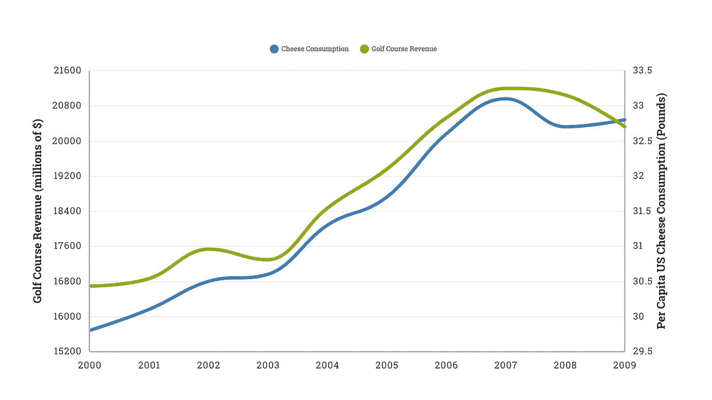
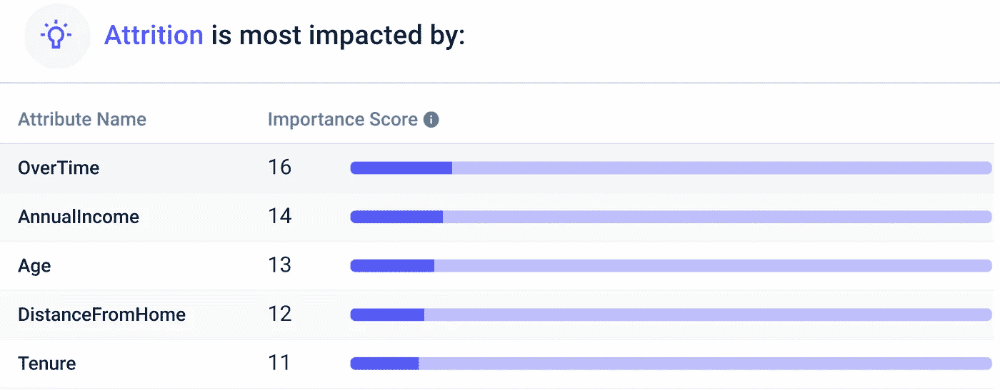

# 相关性并不意味着因果关系(除非它意味着因果关系)

> 原文：<https://medium.datadriveninvestor.com/when-correlation-does-imply-causation-f71ac1f3d09c?source=collection_archive---------7----------------------->

## 因果关系可以通过研究和实验设计来确定。

Photo by [Ben White](https://unsplash.com/@benwhitephotography?utm_source=medium&utm_medium=referral) on [Unsplash](https://unsplash.com?utm_source=medium&utm_medium=referral)

我们都知道“相关性并不意味着因果关系”，对吗？

毕竟，美国的奶酪消费量与高尔夫球场的收入密切相关，但这并不意味着你吃了多少奶酪条就决定了特朗普高尔夫的底线。

Visualization by author.

不理解这一前提的投资者可能会错误地在实际不存在的数据中找到关系。

然而，其他相关数据确实暗示了因果关系。例如，冠状病毒病例的数量与冠状病毒死亡的数量相关，冠状病毒病例可以明显导致冠状病毒死亡。

 [## 在疫情期间筹款？创业最有效的 4 种方式|数据驱动的投资者

### 在疫情时期推介一家初创公司的基本原则与在正常时期没有什么不同。事实上，在那里…

www.datadriveninvestor.com](https://www.datadriveninvestor.com/2020/07/05/fundraising-during-a-pandemic-4-ways-for-startups-to-be-most-effective/) 

# 如何确定因果关系

然而，我们需要一种经验方法来确定因果关系——而不仅仅是使用本能。我们可以利用研究和实验设计来寻找因果关系的证据。

在 [*公共卫生前沿*评论文章](https://www.sciencedaily.com/releases/2020/05/200513081810.htm)中，研究人员揭示了冠状病毒患者可能会经历免疫系统的过度反应，从而导致死亡。既然研究清楚地表明 A ➡ B，我们就有了因果关系的证据。

然而，虽然研究为因果关系提供了证据，但我们无法证明某个因素是导致结果的唯一原因。例如，被诊断患有冠状病毒会导致死亡，但一些患者有其他因素——共病——会增加他们的死亡几率。

## 使用证据

我们掌握的证据越多，就越能把两个变量联系起来。例如，我们可能对发现低脂肪、高碳水化合物(LFHC)饮食是否会导致心脏病感兴趣。通过粗略的分析，我们可能会发现 LFHC 饮食和心脏病是相关的。

然后，我们可以设计一项研究，揭示 LFHC 饮食如何导致心脏紧张的生物学机制。这将是一个证据，表明我们的相关性意味着因果关系。

我们还可以进行一项对照实验，发现酮饮食——与 LFHC 相反，或者高脂肪低碳水化合物饮食——可以减轻心脏压力。这将是另一个证据，表明相关性意味着因果关系。

再举一个例子，我分析了一个样本员工流失数据集。凭直觉，我们可以猜测哪些因素会影响减员。例如，工作多、收入少、住得离办公室远的员工更有可能辞职。

通过分析雇员的数据集(有一列是流失的)，我们可以为我们的假设收集证据。使用 [Apteo 的](http://apteo.co) predictive insights 工具，我可以选择“流失”作为我想要衡量的 KPI，它会告诉我哪些关键因素会影响这个 KPI。我们可以看到*加班*对预测*减员*的影响最大，其次是*年减员*，所以这是支持我们假设的一个证据。

Screenshot of Apteo. Captured by author.

同样，任何单一的证据都很难证明因果关系，就像在法庭上不太可能根据单一的证据给某人定罪一样。然而，如果一个组织确定因果关系是可能的，它可以采取措施对这些见解采取行动。如果我们假设高加班时间确实会导致损耗，我们可能会采取措施减少加班时间(例如，通过分担负担)，为加班时间支付更多费用，降低可能的加班小时数，等等。

Photo by [Tingey Injury Law Firm](https://unsplash.com/@tingeyinjurylawfirm?utm_source=medium&utm_medium=referral) on [Unsplash](https://unsplash.com?utm_source=medium&utm_medium=referral)

## A/B 测试

A/B 测试是营销人员试图建立因果关系的常用方法。

例如，你可能拥有一个电子商务网站，你想知道你的行动号召按钮应该是什么颜色。

你网站的访问者被随机分成两组，一组看到绿色的“购买”按钮，另一组看到红色的“购买”按钮。

By author.

只要我们的 A/B 测试有足够的样本量(基于对照组的平均值和标准偏差)，我们就有证据表明因果关系具有统计学意义(通常 p < 0.05).

## Tools

Now we know how to establish causality — so what tools can we use?

If you want to run A/B tests on a website, [Google Optimize](https://marketingplatform.google.com/about/optimize/) 是一个非常简单的解决方案。您也可以在 Python 中进行[因果推理，尽管需要注意这是一个非常深入的过程。借助 Apteo 等工具，您可以分析您在数据中发现的任何见解的](http://www.degeneratestate.org/posts/2018/Mar/24/causal-inference-with-python-part-1-potential-outcomes/)[统计显著性](https://www.apteo.co/post/introducing-predictive-insights-by-apteo)，并[统计比较平均值](https://docs.apteo.co/comparison_of_averages/)。

# 结论

相关性本身并不意味着因果关系。然而，实验设计和研究是任何数据科学家都可以用来为因果关系提供证据的工具。

**访问专家视图—** [**订阅 DDI 英特尔**](https://datadriveninvestor.com/ddi-intel)