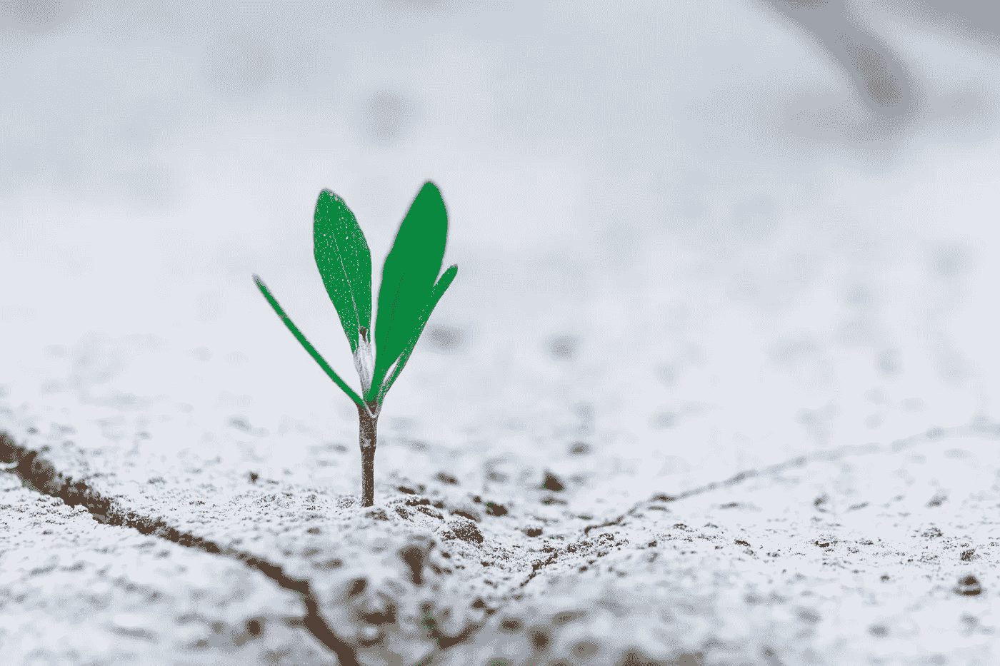

# 当灾难来袭:2020 年趋势

> 原文：<https://medium.datadriveninvestor.com/when-disaster-strikes-2020-trends-7762d0f139ac?source=collection_archive---------27----------------------->

上周，我很荣幸地在联合国参加了一个只有受邀者才能参加的圆桌会议“当灾难降临时”。此次讨论聚集了全球领导人，共同应对这一领域一些最紧迫的问题，并再次确认需要可持续的解决方案，这些方案在火灾结束、洪水退去和媒体继续关注后仍将继续存在。

1.  **气候变化:**灾害是[全球经济损失](https://www.worldbank.org/en/topic/climatechange/overview)估计 5200 亿美元，每年有超过 2600 万人陷入贫困。[现在，这些事件中超过 90%](https://www.un.org/sustainabledevelopment/blog/2015/11/un-report-finds-90-per-cent-of-disasters-are-weather-related/) 被归类为与气候相关的事件，其频率和强度预计只会恶化，对我们的基础设施、生态系统和社会系统造成损害。
2.  救援物资的再分配:每次危机过后，世界都会给予难以置信的支持，然而再分配仍然是最大的挑战之一。一个问题，[珠穆朗玛峰效应](https://www.everesteffect.com/)，旨在解决。在大多数情况下，实际上有足够的物资和服务来支持有需要的社区。问题往往在于*这些商品如何*在受影响的生态系统中分配。例如，飓风道林过后，世界厨房在巴哈马准备了 200 多万份饭菜，但没有足够的司机来运送所有这些饭菜。一个本可以通过技术轻易解决的问题。
3.  **心理健康**需要处于对话的最前沿，资金和资源紧随其后。 [54%的成年人和 45%的儿童在自然灾害后患有抑郁症，现在的研究表明，间接暴露于自然灾害中的人也会受到严重影响。耻辱感通常是护理的最大障碍，但获取途径、费用、文化和症状识别也阻止人们接受他们需要的帮助。](https://www.apha.org/~/media/files/pdf/topics/climate/climate_changes_mental_health.ashx)
4.  **复原力:**复原通常以捐赠的美元来衡量，而不是以社区恢复正常来衡量。对于许多社区，如巴哈马和波多黎各的社区，灾前条件远非最佳。我们需要一个可持续的模式，资金可以用于所有阶段，包括复原力建设和备灾这两个资金最不足和最受忽视的领域。

是时候重新分配资源，重新定位良好的意愿，重新想象数百万人如何一劳永逸地康复了。加入我们在[https://www.everesteffect.com/](https://www.everesteffect.com/)和@everesteffect。

 [## 气候变化、ESG 和对更好数据的追求|数据驱动的投资者

### 在地球上许多地方经历了另一个令人难以置信的炎热夏季后，来自 S&P 的最新发现…

www.datadriveninvestor.com](https://www.datadriveninvestor.com/2018/08/24/climate-change-esg-and-the-quest-for-better-data/)