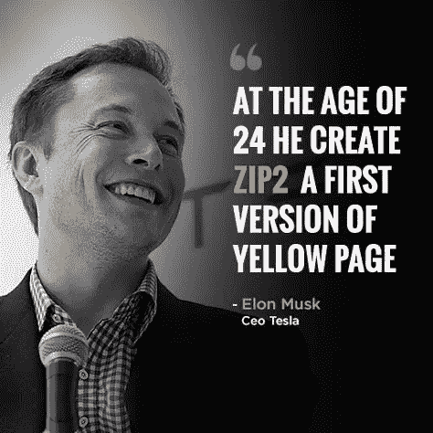
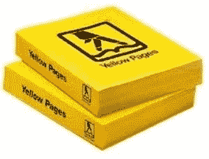
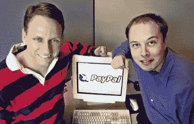

# 当埃隆·马斯克(Elon Musk)对黄页的负责人说:“他把书扔给了我”

> 原文：<https://medium.datadriveninvestor.com/when-elon-musk-pitched-to-the-head-of-yellow-pages-he-threw-the-book-at-me-af259e213a82?source=collection_archive---------4----------------------->

## 埃隆·马斯克(Elon Musk)如何建立他的第一家公司并赚得第一笔数百万美元的故事。

**由** [到**安东尼·布隆伯格**到](https://www.anthonyblumberg.com/)

> 当埃隆·马斯克试图在互联网繁荣之前推销黄页的时候，“他把书扔给了我。”

1995 年，就在互联网泡沫开始之前，埃隆·马斯克相信“互联网肯定会成为超新星，”他在 1 月份的第三排特斯拉播客中回忆道。

因此，埃隆决定建立一个名为 Zip2 的网络初创公司，他和他的兄弟金巴尔·马斯克(Kimbal Musk)打算用它来创建黄页电话簿的在线版本(当时这是一本真正的书)。Zip2 使企业名录数据可以搜索并绘制成地图，因此用户可以挨家挨户地找到企业。

兄弟俩曾与报纸合作(在网上列出分类广告和诸如此类的东西)来创收，但他们想通过与黄页合作来扩大业务。

 [## 投资区块链前要问的三个简单问题(也是一个困难的问题)|数据…

### 现在是了解区块链的最佳时机。不同货币之间的增长率，比如…

www.datadriveninvestor.com](https://www.datadriveninvestor.com/2020/03/12/three-simple-questions-and-one-difficult-one-to-ask-before-investing-in-a-blockchain/) 

“我记得与拥有黄页的[公司]负责人交谈过，”金巴尔在第三排特斯拉播客上说。“我们说，‘我们想和你合作。让我们成为你把黄页放到网上的伙伴之一。

“[这位高管]拿起黄页——这本书，这本厚厚的黄页，里面全是广告，这个价值数十亿美元的风险行业——扔给我说，‘你想过要换掉它吗？’"

但当时的反应是典型的，因为当时“大多数企业不知道互联网是什么”，埃隆在播客中说。"大多数人没有电子邮件地址，也没有上过网."

“在那个时候，很少有人从事互联网(业务)，所以这真的是一个问题，‘互联网会成功吗？’我们对此深信不疑，而这些人却不是。"

当埃隆和金巴尔试图获得资金或与其他公司合作时，他们被迫解释互联网。

“我们说，‘听着，这花费很少。你仍然拥有所有的内容和一切。他们会把我们赶出办公室，[说]“不。你怎么敢提出这样的建议，”埃隆说。“我们就像‘好吧，我想我们就建造它吧。"

根据阿什莉·万斯(Ashlee Vance)的书《埃隆·马斯克:特斯拉、SpaceX 和对美好未来的追求》(Elon Musk: Tesla，SpaceX，and the Quest for a Fantastic Future)，Zip2 最终赢得了《纽约时报》、Knight Ridder 和赫斯特公司(Hearst Corporation)的支持，它们不仅与 Zip2 合作，还共同投资了 5000 万美元

据报道，1999 年，埃隆和金巴尔以大约 3 亿美元的价格出售了 Zip2，埃隆用这笔钱创办了第二家公司 X.com，后来成为 PayPal。2002 年，易贝以 15 亿美元收购了 PayPal。

Elon and Kimbal Musk

埃隆于 2002 年创办了 SpaceX，并于 2004 年成为特斯拉的投资者，2008 年担任首席执行官。

2016 年，他创立了 Neuralink，一年后，他创建了 The Boring Company。

2004 年，金巴尔转移了产业，共同创立了厨房餐厅集团，该集团拥有三家从农场到餐桌的连锁餐厅:隔壁、厨房和 Hedge Row。他还拥有一家室内农业公司 Square Roots，并创办了“绿色大基金会”,向儿童教授农业知识。

金巴尔投资了特斯拉和 SpaceX，并在这两家公司的董事会任职。

据《福布斯》报道，如今，埃隆·马斯克的身价为 342 亿美元。

大家注意安全！更多关于金融、新闻和投资的文章，请查看我的博客:[https://www.anthonyblumberg.com/](https://www.anthonyblumberg.com/)

留下评论，一些掌声，关注我的个人资料！我真的很感激。