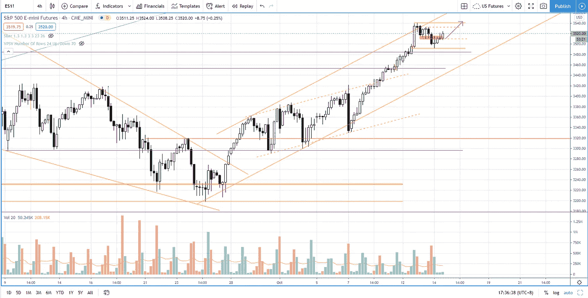

# 当日内交易标准普尔 500 时，通过回答这个问题找到退出交易的最佳时机

> 原文：<https://medium.datadriveninvestor.com/when-is-the-best-time-to-exit-your-trade-when-day-trading-s-p-500-66d3993cb44b?source=collection_archive---------19----------------------->

在交易回顾部分，你会发现**你应该知道的一件事**以及当你决定退出交易的最佳时机时可以采取的不同方法。

观看视频，了解 2020 年 10 月 14 日交易时段标准普尔 500 指数期货的**每日市场分析。在这个视频中，我向你展示了上一个交易日的市场回顾和三分钟内的交易回顾(包括进场、出场和背后的原理)。展望未来，我将涵盖偏见，要注意的关键水平，我稍后的交易计划。**

## 时间戳

*   [1:10](https://www.youtube.com/watch?v=pMy8WGvBgtM&t=70s) 市场回顾
*   气候上升通道超买
*   [4:03](https://www.youtube.com/watch?v=pMy8WGvBgtM&t=243s) 退出策略
*   [4:30](https://www.youtube.com/watch?v=pMy8WGvBgtM&t=270s) 交易目的
*   [6:00](https://www.youtube.com/watch?v=pMy8WGvBgtM&t=360s) 为什么退出交易
*   [7:05](https://www.youtube.com/watch?v=pMy8WGvBgtM&t=425s) 紧尾随停止
*   [7:45](https://www.youtube.com/watch?v=pMy8WGvBgtM&t=465s) 宽止损，摆低摆高
*   [8:08](https://www.youtube.com/watch?v=pMy8WGvBgtM&t=488s) 行业回顾
*   [9:40](https://www.youtube.com/watch?v=pMy8WGvBgtM&t=580s) 增加向下摆动的供给
*   [12:10](https://www.youtube.com/watch?v=pMy8WGvBgtM&t=730s) 第一面退出交易的红旗
*   13:00 第二面红旗
*   当前的市场前景
*   [17:10](https://www.youtube.com/watch?v=pMy8WGvBgtM&t=1030s) 交易计划

如果你还没有看我的[每日市场分析视频](https://www.youtube.com/watch?v=_Pd6NBw9xZ4)，为了更好地了解市场回顾和交易回顾。

**偏向** —中性(日内交易)；看涨(长期)

**关键点位** —阻力:3587、3540；支持:3510–3515，3450–3480

**潜在设置** —在关键级别寻找潜在反转。

# 资源

**每周市场展望&最佳交易建议**直达您的收件箱:[https://www.tradeprecise.com/](https://www.tradeprecise.com/)

**专业免费**制图平台:创建账户→[www.TradingView.com](https://bit.ly/2U2Femd)

**非美国居民？** ( **马来西亚、新加坡**、澳洲、纽西兰、欧洲等……):[点击此处，存款 2000 新加坡元](https://ji.hn/sgtiger)即可免费获得**股票(价值 100++ &美元)老虎经纪**的欢迎礼物

美国居民？[点击此处，当您存入 1500 美元](https://ji.hn/ustradeup)时，就有机会在 TradeUP 上获得一份**免费的 AMZN 股票(价值 3000++美元** ) & **欢迎礼物**

**从媒体获取无限文章** —加入以下:[https://priceactiontrading.medium.com/membership](https://priceactiontrading.medium.com/membership)

# 进一步阅读

 [## 大头针，快照，TWTR 跑赢市场-准备暴涨？

### 上周，当市场正在调整时，大多数股票都受到了重创。然而，大头针，快照和 TWTR…

medium.datadriveninvestor.com](/pins-snap-twtr-outperform-market-ready-to-skyrocket-ef8dddb6c025)  [## 摇摆交易的顶级仙股——HNRG、QEP、SNDL，告诉[巨大的上涨潜力]

### 找出这 4 只最便宜的股票——HNRG、QEP、SNDL，告诉他们基于回调可以进行摇摆交易…

medium.datadriveninvestor.com](/top-penny-stocks-for-swing-trading-hnrg-qep-sndl-tell-huge-upside-potential-b4937a3ce955)  [## 市场修正，泡沫还是崩盘？标准普尔 500 价格行为分析

### 标准普尔 500 期货(es)昨日因供应激增下跌 2.5%，跌破上行通道。这是正常的…

medium.datadriveninvestor.com](/market-correction-bubble-or-crash-s-p-500-price-action-analysis-6f26e6698dbc) 

Photo by Author — Ming Jong Tey

Photo by Author — Ming Jong Tey

披露:如果您点击本文中的链接进行购买或开立账户，并将所需金额存入推荐的经纪人账户，我们将免费为您赚取佣金。

免责声明:本演示中的信息仅用于教育目的，不应作为投资建议。