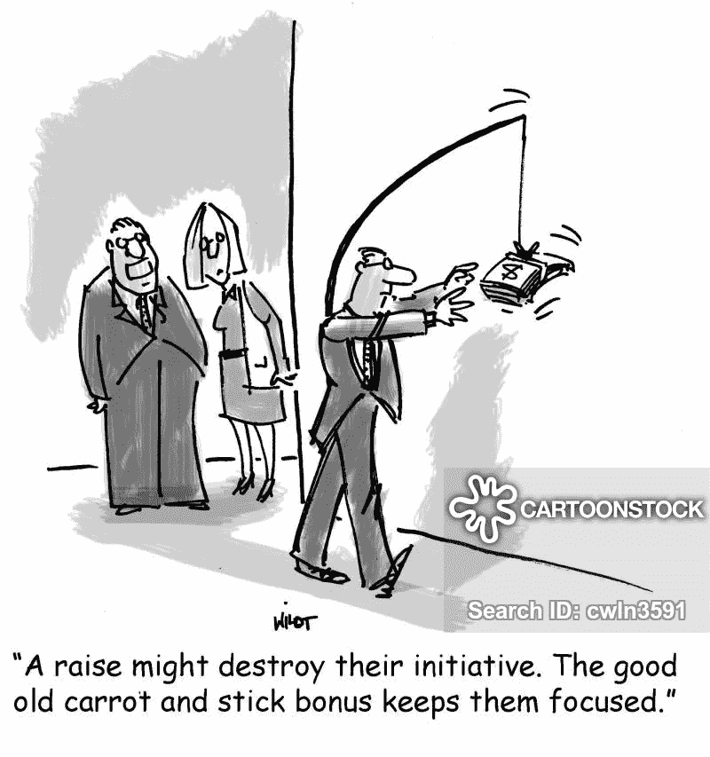
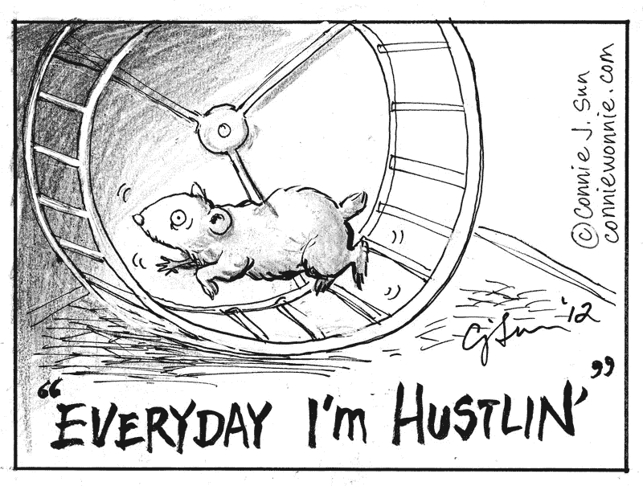
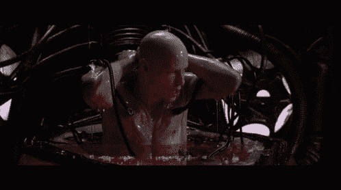
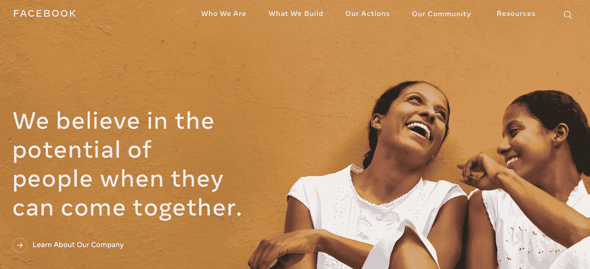

# 什么时候离开脸书比较合适？

> 原文：<https://medium.datadriveninvestor.com/when-is-the-right-time-to-leave-facebook-1c6a2bd87a75?source=collection_archive---------22----------------------->

## 扎克伯格不是人工智能驱动的机器人，但他可能是黑客帝国。

这个臭名昭著的算法及其与 FaceBook 商业模式的契合，促使我得出结论，脸书正变得越来越没用。

最近 FB 泡沫对我来说破灭了。这是在读到 Signal 突然被大量采用来替代 WhatsApp 时发生的。[查看 Wired 关于这种情况的文章](https://www.wired.com/story/signal-encrypted-messaging-features-mainstream/)。

当切换到 Signal 时，我无法避免将两个点联系起来:维基媒体基金会的工作方式和 Signal 的工作方式:

> *“信号”是一个独立的非营利组织。我们不依赖任何大型科技公司，也永远不会被任何公司收购。发展是由像你们这样的人的赠款和捐款支持的。*
> 
> —Signal.org
> 
> *“非营利的维基媒体基金会为免费知识提供必要的基础设施。我们托管着由世界各地的志愿者创建、编辑和验证的免费在线百科全书维基百科，以及许多其他重要的社区项目。所有这些都归功于像你们这样的个人的捐赠。我们欢迎任何与我们有共同愿景的人加入我们，收集和分享充分代表人类多样性的知识。”*
> 
> —维基媒体基金会。

这两个组织都放弃了传统的经营方式。相反，他们都选择由公共资金和用户捐款来支付他们的费用和证明他们的存在。利润不是动力。他们与客户共享的价值观是。

相比之下，脸书需要提供一些功能来激励用户继续在线制作内容。这是一个胡萝卜加大棒的局面。*我猜 FB 的股东也在和 FB 的团队玩胡萝卜加大棒的游戏*。

FB 为我提供了一个**免费平台**来传达我所做的事情，并允许我传达我的业务价值主张。到目前为止，一切顺利。

但后来我发现，在脸书上发布信息并不一定能帮助我抓住潜在客户的注意力。付费广告当然效果更好。有道理，显然这是一门生意。

如此多的人购买广告，以至于每过一天，接触到想要的受众就变得更加困难。此外，我们大多数人都不喜欢广告(付费或免费帖子)。突然我们被困住了，我们感觉有些不对劲，需要改进。因此，我们相信我们必须为广告支付更多，提高我们的内容质量以适应算法，**以这种方式延续了一个永无止境的花费时间和金钱的过程，每次得到更少的结果**。我们注重提高对平台的使用，而不是花时间与真正的客户交谈。

> “我们认为我们正在致力于我们的内容战略，而 FB 专注于从我们的工作中获得更多。”

我讨厌被引诱进仓鼠轮的想法。

我可以为**离开**脸书增加一个理由，那就是他们使用我们数据的方式。但我相信你比我更了解这一点。

脸书已经成为一个巨大的仓鼠轮子农场，收获用户的能量，并希望获得更多的金钱和权力。哦！哦！我以前见过这个( ***** ):

Neo in The Matrix — Humans as energy source.

过去，我认为 FB 提供了一种双赢的局面。他们从我的工作中赚钱，但我更接近人们和潜在客户。但这对我来说已经不起作用了，让我解释一下。

> 我的脸书网络的一部分生活在秘鲁，我的家庭成员和我的大多数青年朋友。几个月前，我的祖国经历了一场分裂的政治危机，FB 上的帖子就像火中的木头。我决定忽略那些内容，避免评论，甚至在某些情况下，我决定停止关注一些最具煽动性的发布阴谋论的人(就几个)。令人惊讶的是，不久之后，我的新闻订阅不再显示我大多数秘鲁朋友的帖子。我猜该算法认为我对来自秘鲁的内容不再感兴趣，所以它不再提供符合该过滤器的信息。显然，该算法未能检测出我关心我的秘鲁联系人的帖子，但不关心政治和部门。今天，我的新闻订阅显示了过多我不关心的商业信息，一些密友的帖子，仅此而已。

所以我想知道，如果所有的 FB 用户都发生同样的事情，他们看到的信息越来越少，发布的内容越来越少(因为只有少数人可以看到他们的内容)，他们会离开这个平台吗？

***我会立即登录一个 FaceBook 的替代品，它的工作原理类似于维基媒体基金会，并发出信号*** 。

与此同时，我相信建立简讯受众，并在加速脱离脸书应用程序(包括 WhatsApp 和 Instagram)的同时不断改进我的内容。这个帖子是我的第一步。

在一个民主国家，当每个人都在同一时间发言时，我们只能听到噪音，没有人能听到，这种民主变得功能失调。FB 不再是关于交流，而是关于从噪音中获利。

( ***** )你还记得我之前提到的那个矩阵吗？现在读一下 FB 关于 page 是怎么说的:

January 28, 2021, screenshot from [https://about.fb.com](https://about.fb.com)