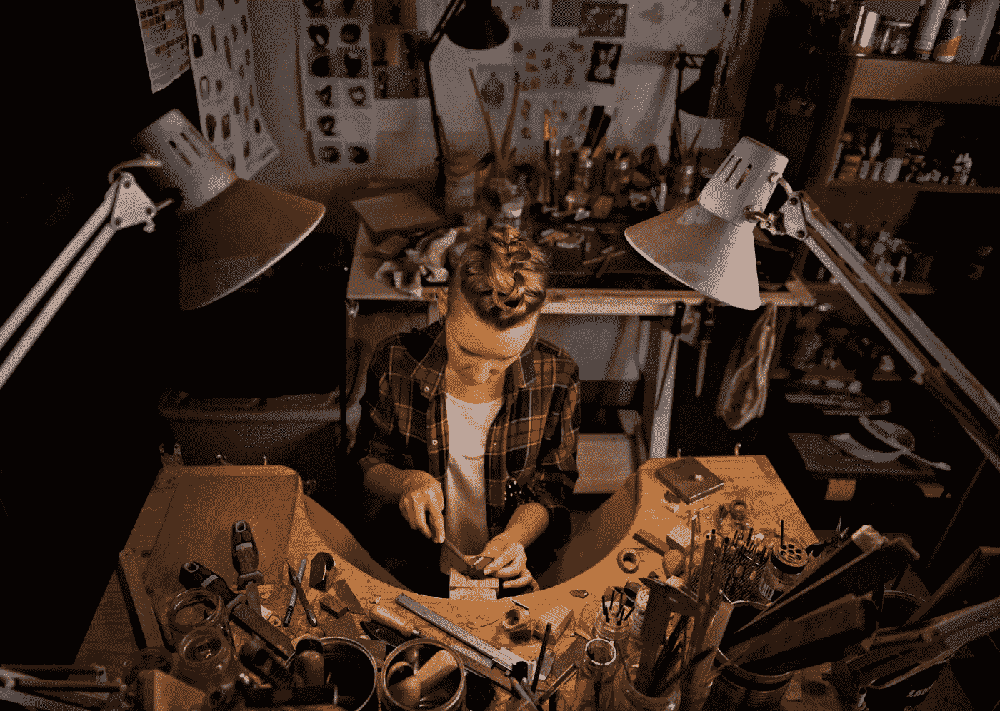

# 企业家精神是 STEM 未来成功的关键

> 原文：<https://medium.datadriveninvestor.com/when-it-comes-to-stem-some-parents-just-dont-understand-9e5b227cb310?source=collection_archive---------6----------------------->

## 利用这些实用知识提高科学、技术、工程和数学成果

Image: Getty# 207915098 / Family Sitting At Table

*作者:* [*安德鲁·b·劳普*](https://medium.com/u/d8c8d333927a?source=post_page-----bc7b73a1ac7b----------------------)*/*[*@ stem CEO*](https://twitter.com/stemceo)

在将更多 STEM 学习纳入学校课程的热潮中，一个主要卖点一直是 STEM 学习能带来更好的工作。诚然，平均而言，STEM 工作的薪酬高于文科工作，但随着时间的推移，薪酬差距往往会缩小。

STEM 中的第一份工作几乎肯定会比教学或社会工作中的初级职位报酬更高，但快速变化的技术领域需要持续的教育，这是一项昂贵的投资。在推动 STEM 教育的重要性时，高薪工作的承诺对那些希望孩子得到最好的父母来说变得很有吸引力。

**STEM 职业:现实检验**

尽管许多家长认为大学 STEM 专业等同于印刷钞票，但令人吃惊的是，74%拥有 STEM 专业学士学位的人并没有在 STEM 领域工作。这些可能是地球上最聪明的调酒师和服务员，尽他们所能支付他们的账单。一些原因可能是因为许多 STEM 职业需要更高的学位。例如，最近获得化学学士学位的毕业生可能需要继续攻读硕士学位甚至博士学位，才能在实验室或医疗机构找到超出数据输入或清洗试管范围的工作。

 [## STEM 职业固有的流动性

### 让今天的头脑为明天的 STEM 工作做准备

medium.com](https://medium.com/@stemceo/the-inherent-fluidity-of-stem-careers-49358fcef819) 

一般来说，研究生项目的竞争非常激烈，尤其是博士项目，许多项目每年只接收 14-30 名学生。没有完美成绩或极高 GRE 分数的学生可能会发现自己被排除在完成学业和做他们梦想的工作的机会之外——或者至少是他们的父母代表他们想象的工作。

甚至那些设法获得这些高级学位的人也经常发现他们不值得他们为之付出的金钱。众所周知，学术界的终身职位很难获得，那些运气不好的人最终往往会争夺报酬低、福利少的兼职教师职位。几乎三分之一的兼职教授实际上生活在接近或低于贫困线的水平。

不幸的是，仅仅拥有 STEM 文凭并不能保证成功。

**在 STEM 规划未来**

那么焦虑的父母该怎么办呢？

Image: Getty# 500767047 / Young Woman In Workshop

尽管单单一个 STEM 学位并不能保证一份有利可图的职业，但它*是许多 STEM 工作选择的先决条件。诀窍是密切关注学位的成本，尽你所能确保你的孩子以你实际上能负担得起的价格获得优质教育，而不承担沉重的学生债务。要考虑的一些重要选项:*

*   社区大学:对许多家庭来说，这是最划算的选择，因为你的孩子可以以很少的费用完成前两年的大学教育，然后转到四年制大学完成学业。
*   **职业学校:**一些计算机和电子行业的技术工作和其他动手工作的初级职位[不需要](https://www.stairwaytostem.org/stem-jobs-that-dont-require-four-year-degrees/)学士学位。具体的培训可以直接导致稳定的工作在网页开发，IT 和更多。
*   **明智的财政援助:**寻求奖学金、助学金和联邦政府资助的财政援助，而不是高息的私人学生贷款。

**拥抱创业**

考虑到高昂的大学费用和对高等教育长达数年的承诺，创业可能更适合许多喜欢 STEM 并希望尽快追求有回报职业的学生。许多用于成功创办新企业的技能与在 STEM 领域学到的技能是相同的:乐于实验、依赖逻辑和证据，以及专注于创造性解决问题。

对于许多有 STEM 倾向的学生来说，设计一个能让生活更美好的小玩意并将其推向市场，可能比在企业或学术机构从事研究工作更有回报。这也是成为电子竞技行业企业家的大好时机。由于进入成本极低，[的企业家们](https://technical.ly/delaware/2020/05/22/futures-first-gaming-startup-delaware-esports-stephen-sye/)可以尝试在线工具和现有平台，以吸引观众参与这一快速增长的全球性娱乐活动。

 [## 电子竞技和 STEM 教育:2020 年展望

### 结构化视频游戏在学校有一席之地吗？

medium.com](https://medium.com/datadriveninvestor/esports-and-stem-education-a-2020-perspective-a3f2cc934e33) 

**教孩子们创业的有趣方法**

最好的 STEM 学习是动手操作，帮助学生学会以有趣、有意义的方式解决问题。创业技能也是如此:它们是可以教授的，我们越早开始将一些聪明的商业思维融入到孩子们的教育中，他们就越能为未来开创自己的事业做好准备。

幸运的是，有一些很好的资源可以让孩子们理解创业概念。在家里或教室里尝试这些想法，激发学生对全新学习领域的兴趣:

*   **企业家游戏:**由现实生活中的企业家 [Elliott Eddie](https://www.blacknews.com/news/elliott-eddie-black-inventor-creates-board-game-how-to-start-business/) 设计，这款棋盘游戏让玩家建立自己的家庭或实体企业，包括从银行获得的启动贷款、发薪日以及在游戏过程中需要处理的各种现实世界的挑战和意外收获。玩家很快学会运用数学、谈判、团队合作和应变能力方面的技能。埃迪专门设计了这个游戏，向 12 岁以上的孩子展示成为企业家是一个可行的职业选择，并填补了这一领域的教育空白。

 [## 游戏化能否解决 STEM 人才缺口？

### STEM 内部的人才缺口是一个长期存在的问题，但游戏能解决问题吗？

medium.com](https://medium.com/@stemceo/can-gamification-solve-the-stem-talent-gap-ec7e006aa80b) 

*   孩子们在开始创业之前，需要掌握钱的基本知识:数钱、挣钱、存钱，并在预算范围内花钱。由 [Victoria Khaze](https://www.theoldschoolhouse.com/product-reviews/?rid=7207) 创建的 Money Munchkids 针对学校缺乏金融教育的情况，为 K-3 年级提供了完整的课程，采用适合年龄的方法教授孩子们经济学和个人理财的基础知识。该课程面向在家上学的学生和任课教师，让 5 岁及以上的孩子也能轻松赚钱。

在 STEM 领域取得成功的方式不止一种，许多年轻人会开辟自己的道路。我们可以帮助他们铺平前进的道路，教他们创业所需的创业技能，并以他们自己的方式建立一个成功的职业生涯。

Image: Getty# 207915098 / Grandfather Teaching Grandson

本文最初于 2020 年 8 月 25 日刊登在*Forbes Community Voice*上，并于 2020 年 10 月 28 日*更新为 *Medium* 。*

[安德鲁·b·劳普](https://medium.com/u/d8c8d333927a?source=post_page-----bc7b73a1ac7b----------------------)是创始人/执行董事 [@stemdotorg](https://twitter.com/stemdotorg) 。*“通过健全的政策实践使科学、技术、工程和数学(STEM)教育民主化……应用 STEM 来更好地理解它。”*