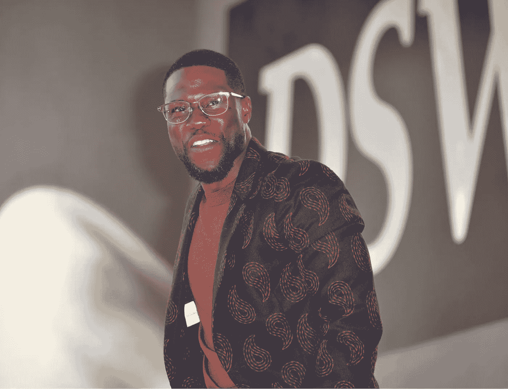

# 如果杰夫·贝索斯走进房间，你会说“嗨”吗

> 原文：<https://medium.datadriveninvestor.com/when-jeff-bezos-walked-into-the-room-kevin-hart-stood-up-and-said-hi-aae25068e34e?source=collection_archive---------7----------------------->

## 这三个词甚至让世界首富心跳加速

Shutterstock

尽管超级碗的私人房间里挤满了名人，但当杰夫·贝索斯，一个以“b”拼写“millions”的家伙走进来时，房间变得非常安静。

kev——房间里唯一的黑人——告诉他的朋友他会走过去打招呼。“这不像我们是在数字对数字的基础上，”凯文说。你什么时候才有机会和世界首富交谈？

“别这样，”他的朋友回答道。“这里的每个人都渴了。”

凯文扬起眉毛，拉着他妻子的胳膊，把她拖到秃头男人面前，他的身价比房间里其他人加起来都要高 100 倍。

“你好，我是凯文·哈特。我对你的世界一无所知，但**我钦佩你**。我钦佩你所做的一切。”

“哦，你好，凯文。很高兴见到你，”贝佐斯微笑着回答道。

*故事取材于这些* [*三个*](https://www.youtube.com/watch?v=XW_KhFq4LQo&t=1117s) [*很长的*](https://www.youtube.com/watch?v=-zp6itL345I) [*访谈*](https://www.youtube.com/watch?v=vzx6h2sAGTU&t=33s) *。*

# 有时候，你必须在车祸中折断脊柱，才能意识到生活的真谛

为了更好地理解凯文·哈特是什么样的人，想象一下这个。

你是超级明星。你 40 岁，身价约 2 亿美元。你非常健康，全世界的孩子和他们的父母都想和你在浴室里合影，你的脸是国际商标。在一个温暖的九月星期天的凌晨 1 点，你开着你的 70 年普利茅斯，然后…砰！

车的后部松了，你偏离了乡村道路，穿过一个木栅栏，翻了几个跟头，正好掉进路边的水沟里。

当你在医院醒来时，医生告诉你，除了缓慢而痛苦的康复之外，你的脊椎损伤没有真正的治疗方法。你几乎不能忍受从床上起来时的疼痛，医生们温和地建议你在波苏球上走几步——如果你喜欢的话。

 [## 为什么那个创业者筹的比我多那么多？数据驱动的投资者

### 养多少既是一门艺术，也是一门科学，这个话题在许多其他帖子中有详细讨论。这篇文章将…

www.datadriveninvestor.com](https://www.datadriveninvestor.com/2020/06/14/why-is-that-entrepreneur-raising-so-much-more-than-me/) 

你就像——一定有什么可以做的，对吗？一些锻炼，也许捏一个网球让我的胳膊恢复功能？

医生说，不太好。这里有一个呼吸机，你可以伸展你的肺部，稍微练习一下呼吸。

## “唯一有意义的人”

这时候他突然想到:他现在也在游戏中，就像其他人一样。他在玩“也许我明天能爬到楼梯顶”的游戏。他在玩“也许我明天可以自己起床”的游戏。他在玩“昨天，我是国王，今天我基本上是残疾人，所以如果我明天吃自己的食物，那将是美好的一天。”

有趣的是，卧床能改变一个人对生活的看法。事故发生前，凯文·哈特一直是那种什么都想争的人。更多电影，更多节目，更多 Instagram 赞。

但是医院里没有摄像头。没有观众。没有愤怒的邻居会对你的超级汽车轮子狂吠。没有古驰鞋，没有和岩石开玩笑，什么都没有。只有你，孤独无助。

从日常生活中的好莱坞明星到依靠五个护士给你擦屁股，凯文·哈特意识到了一件无价的事情:他在与“唯一有意义的人”——**自己**的战斗中**。**

凯文花了两个半星期才能够再次行走。有时候，他不得不让儿子把床边的电视遥控器递过来。他说，经历了这一切之后，他的生活中不再有“糟糕的日子”。

# “再积极就不酷了。”

凯文正确地指出，如今似乎消极是一种新的酷。你知道，当你打电话给他们时，他们总是很忙。这种人不会同意你的观点，不是因为他们真的这么想，而是因为他们可以这么做。

他举了一个有趣的例子:*想象一下，如果我和你在谈论泰坦尼克号。一部伟大的电影，有史以来最伟大的电影之一，我们都同意。然后在谈话中总有一些家伙会说“我讨厌泰坦尼克号！”*

杰夫·贝索斯时刻也是一样的。“不要和他说话，”他的朋友说。为什么？因为他是杰夫·贝索斯，伙计。人们不会直接走过去和他说话。

我认为人们选择消极——称之为现实主义——因为反对流行观点是最容易脱颖而出的方式。我们生活在万物泛滥的时代:新闻、脸书朋友、Instagram 上的关注对象、大学学位、你可以谋生的工作类型。没错，我们比以往任何时候都拥有更多的权利，但只有 21 世纪的人类才能理解，面对选择，一个人会感到多么渺小。

凯文是那种通过他艰苦的职业道德和果断而脱颖而出的人——以及这两者所结出的果实。他是那种早上 6 点起床健身，开车去丹佛的一家小酒吧尝试新的喜剧套路，然后在晚上走到杰夫·贝索斯面前打招呼的人

也许凯文·哈特最鼓舞人心的是他对自己和他人的残酷的诚实。看着他的眼睛，我知道他是个说谎高手。然而，在他的喜剧套路和采访中，他分享了欺骗妻子和增加税收债务的故事——就像他的书名一样，这些故事连他自己都无法编造。

让我们成为那种走向杰夫·贝索斯的人。让我们更像凯文·哈特。

**访问专家视图—** [**订阅 DDI 英特尔**](https://datadriveninvestor.com/ddi-intel)