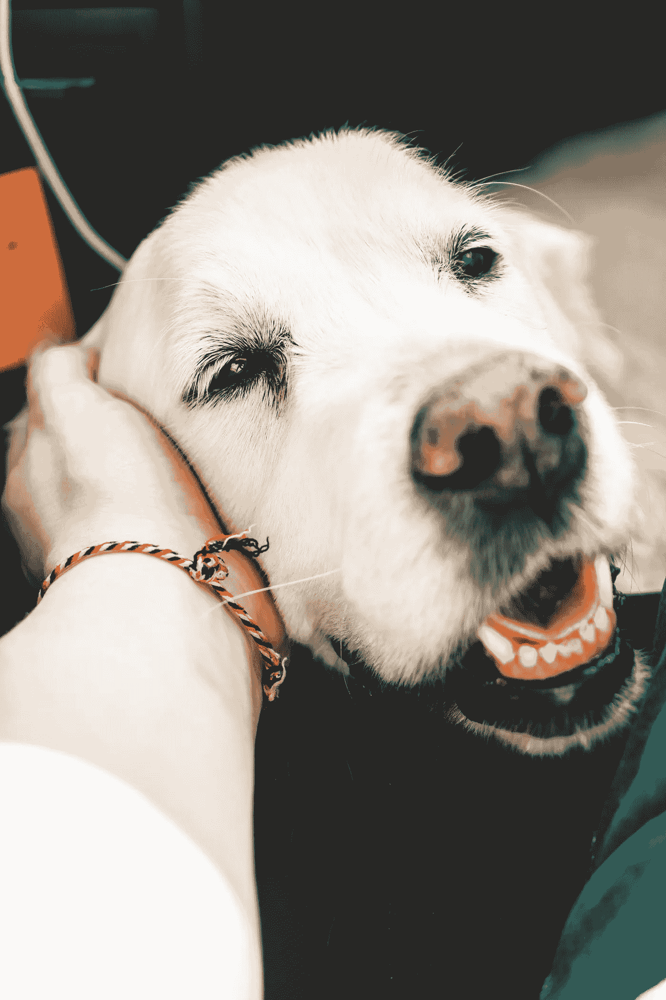

# 当我的狗死后，我明白了爱意味着什么

> 原文：<https://medium.datadriveninvestor.com/when-my-dog-died-i-learned-what-it-means-to-love-1666777ca583?source=collection_archive---------16----------------------->

Photo by [Alexandre Debiève](https://unsplash.com/@alexkixa?utm_source=unsplash&utm_medium=referral&utm_content=creditCopyText) on [Unsplash](https://unsplash.com/s/photos/old-dog?utm_source=unsplash&utm_medium=referral&utm_content=creditCopyText)

“对不起，我们已经尽力挽救了——”

“不。不。不。那不可能……”我难以置信地告诉自己。

"即使在生命的最后几个小时，他也是一名战士。"

"对不起，我来得太晚了……"我喃喃自语，一边跪在我的狗旁边，它气喘吁吁地躺在冰冷的金属桌子上。

“我不打扰你们了。一旦你准备好讨论火化过程，你可以在接待处找到我。”

他的头在我的手掌上睡着了，我抱起他，把他柔软的身体抱在怀里，最后一次用鼻子蹭他柔软纠结的皮毛。

12 年来，Lucky 是我的知己和最好的朋友，在我经历人生的起起落落时，她都陪伴着我。失去他的那一天成了我一生中最沮丧的时刻。

如果你是一个爱狗人士，你会理解这种无价的纽带。作为一个爱狗人士，我们不知道的是，它们教会了我们多少关于自己、关于他人和关于生活的知识。

除了幸运是一个有趣的毛茸茸的朋友，我还学到了一些关于爱情最重要的事情。

# 他很容易满足

在学校度过漫长的一天后，我回到家时，幸运狗一看到我就叫。它欢快地摇着尾巴，向我跑来，把爪子搭在我的膝盖上，表示它想被抱起来。

不管我离家多久，幸运总是热情地欢迎我回家。几乎是瞬间，好像我一天的烦恼都消失了，唯一重要的是他对我的脸颊快乐的舔。

也许是我在他耷拉的耳朵后面抓挠，或者是我紧紧的捏了他一下，让他深情的眼睛一直亮着。

不管是幸运地向他表达了他对我的爱还是我对他的爱，这让我意识到一件事:我们可以用简单的方式表达爱。

# 他有保护欲

Lucky 是一只小吉娃娃，它喜欢对任何来我家的陌生人吠叫。直到我轻轻地拍着他的头说:“好吧，好吧，”他才会停下来。没事的。”

有时，我和姐姐会激烈地交谈，发出一阵喧闹的笑声。认为我们中的任何一个都有危险，Lucky 会叫着抓我的腿，希望他小小的努力能把我拉出“危险”的境地。

在一个只有女性的家庭里，我妈妈曾经开玩笑说他是我们家的保镖。

这是真的，因为幸运不会让任何不好的事情发生在我们身上，我希望能够通过创造一个安全的心理空间来让我未来的伴侣感受到同样的保护——身体上和情感上。

 [## 健身房 10 年的 10 条人生经验|数据驱动的投资者

### 走错一步，他们就会掉下去。两位登山者优雅地回到了地面。他们在那里…

www.datadriveninvestor.com](https://www.datadriveninvestor.com/2020/02/03/10-life-lessons-from-10-years-in-the-gym/) 

# 他尽最大努力安慰我，即使这看起来没什么

我仍然记得我一生中最伤心的一次经历；我情绪低落，连续几天没有任何食欲。

由于大部分时间我都呆在卧室里，知道我会在哪里，Lucky 会轻轻地跳上我的床，依偎在我身边。有时，他会把边界推开一点，撬开我的胳膊偷偷拥抱我。

知道我并不孤单是一种安慰。即使我不被别人爱，我知道我的狗爱我。

Lucky 也很擅长在出问题的时候感觉到我情绪的变化。他从不要求我和他一起玩捡东西游戏，抚摸他，或者用他最喜欢的吱吱叫的毛绒小鸡玩拔河游戏。他总是让我知道他在那里。

同样，我希望以人们需要的方式出现在他们面前，倾听他们或者成为他们可以信赖的人。

# 他从未让我失望

Lucky 不是世界上最聪明的狗，但它永远不会忘记我教它的技巧。他的专长是坐下来和我击掌。

当我带它出去散步或参加狗狗派对时，它会守在我身边，表现出它最好的一面。我在公园或聚会上遇到的人经常称赞“男孩”Lucky 有多好，而我们则看着其他狗在圈子里疯狂地互相追逐。

随着年龄的增长，他变得越来越迟钝，精力也越来越少。我甚至会因为把他的玩具扔得离他站的地方很远而感到内疚。

不管怎样，Lucky 还是跑过去，拼尽全力和我玩了几轮捡球。我认为这是他不想让我失望的一部分。

在经历了我的狗的坚韧之后，我努力坚持我对未来伴侣的任何承诺，为我的关系而战，尤其是在痛苦的时候。

幸运已经离开我们 11 个月了。我仍然保留着一个他的相框，放在我的电视架上。写这篇文章绝对让我感到怀旧，因为我回忆起了我们共同度过的所有美好时光。

现在他已经穿过了彩虹桥，我不禁感到一种解脱感，想象着他和其他狗一起无休止的玩耍时间和丰富的零食。

> 狗的寿命很短，太短，但你知道进去。你知道痛苦即将到来，你将失去一只狗，这将是巨大的痛苦，所以你要充分地与它生活在一起，永远不要忘记分享它的快乐或喜悦或为它的天真感到高兴，因为你不能支持狗可以成为你终身伴侣的幻想。在接受和给予爱时，总是意识到它会带来无法承受的代价，这种难以忍受的诚实中有如此的美。
> 
> ——迪恩·孔茨

*感谢您的阅读！*

## 获得专家视图— [订阅 DDI 英特尔](https://datadriveninvestor.com/ddi-intel)