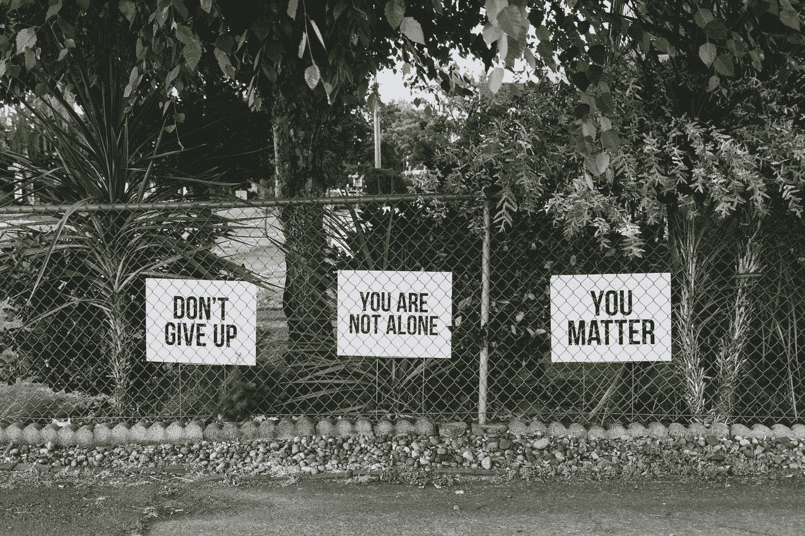

# 当不归属是一种超能力

> 原文：<https://medium.datadriveninvestor.com/when-not-belonging-is-a-super-power-b98fcd9d60d4?source=collection_archive---------5----------------------->

## 如何知道自己是不是桥牌人？

Photo by [Dan Meyers](https://unsplash.com/@dmey503?utm_source=medium&utm_medium=referral) on [Unsplash](https://unsplash.com?utm_source=medium&utm_medium=referral)

在我 20 岁出头的时候，我参加了一个由《女人的认知方式》一书的作者玛丽·贝伦基主持的集体静修。在一次小组练习中，她让每个人指出他们属于哪一组，是运动员、书呆子、倦怠者还是预科生等等。

你还记得你的高中时代，对吗？你在学校认同的那个团体。也许你是一个运动员，一个书呆子或者一个倦怠者。也许你的学校有溜冰者，金属头，哥特，或其他一些团体。你的大多数朋友，如果不是全部的话，都属于同一个团体。

轮到我时，我真的无法回答她的问题。最后，有点不好意思地，我承认我的朋友在所有的团体里，我不属于任何一个团体。

 [## 想知道领导是谁？请他决定。

### 一个有效的领导者能为组织提供的最有价值的东西之一是决策能力…

www.datadriveninvestor.com](https://www.datadriveninvestor.com/2019/01/25/want-to-know-who-the-leader-is-ask-him-to-decide/) 

“哦，你是桥牌人！”玛丽说。她似乎真的很高兴。

通过这个练习和之后的汇报，我了解了什么是桥梁人，以及他们能对周围的人产生多大的影响。当她进一步解释时，我立刻意识到这是我生来就该做的事情之一。

## 什么是桥人？

我的 18 岁生日聚会是一个很好的例子，说明了我的桥牌人倾向是如何表现出来的。

我在一个小镇长大，在同一个学区上学，直到我上高一。因为我的父母离婚了，我毕业于附近的对手学校，在一个城镇之外。这意味着到高中结束时，我在两所学校都有了朋友。

我向我所有的朋友发出了聚会邀请。有人警告我说我疯了。两所学校的朋友都坚持认为会有打斗和戏剧，因为敌对学校的孩子会发生冲突。我每次的反应都是我不能容忍任何争斗。

你猜怎么着？那天不仅没有打架，还开始了几段友谊，甚至几对情侣关系。

具有讽刺意味的是，我的一个最好的朋友，几次告诉我，我邀请了所有人，与那个竞争对手学校的一个家伙调情，并在多年后结婚，这是在自找灾难。

## 职场呢？

职场往往和高中很像。高管粘着高管，劳工粘着劳工，秘书粘着秘书，等等。也许这是我的自负，我不确定，但在我看来每个人都是有价值的。每个人的意见都是有用的。职称不会增加或减少一个想法或观点的份量。

在公司环境中，对我来说最重要的是解决问题。我会和任何我觉得能帮忙的人交谈，争取他们参与这个项目。因此，我不再局限于一个部门，我可以从任何部门招聘技能和资源。

桥梁人不仅拒绝被贴上自己的标签，而且当他们进出不同的群体时感到舒适和被接受。桥梁人真正了解一个以上群体的来龙去脉。他们也可以帮助其他人缩小不同群体之间的差距。

当你考虑到每一个层面上所有相关人员的意见和需求时，对问题的看法就会清晰得多。而且，你可以做得更多，效果更好，因为你的资源也更广泛。

下次你觉得“我不能和那个人说话”的时候，深呼吸。记住那句老话，“我们内在看起来都一样”。为了项目的利益而努力前进。

我现在特意培养的能力之一是成为一个桥梁人的能力。我坚信，如果需要，这是一种可以培养的技能。朋友告诉我这是我的超能力。

以下是桥牌人擅长的一些技能:

*   真实意图-一个桥梁人不能有自私的意图或不可告人的动机。你必须真诚地希望所有参与者都得到最好的结果。
*   同理心——培养真正感受他人感受的能力，理解更大的图景和含义。
*   积极倾听——练习以他人理解的方式倾听和回应他人，从而建立信任。
*   耐心——这需要更多的时间来收集所有相关方的反馈，并建立信任，让其他人分享关于什么可行什么不可行的真实反馈。
*   调解——学会营造一种环境，让他人有信心使用自己的声音，并感到自己被倾听。

当然，我们总是需要专家，但是桥牌人在生活中有他们特殊的目的。

*梅格·斯图尔特是全职自由撰稿人，* [*自由撰稿人过滤*](https://medium.com/freelancefilter) *，并著有预科生小说中篇小说* [*【共度风雨】*](https://www.thesurvivalistblog.net/category/weathering-the-storm-together-novel/) *。她是一个充满激情的技能贮藏者，自由写作、技术和教学的交叉是她的最佳选择。她和两个最小的女儿小狗里斯以及小猫斯卡托和哞生活在俄亥俄州。* [*加入她的部落*](https://wondrous-artist-8894.ck.page/6937775ba5) *更多这样的帖子。*