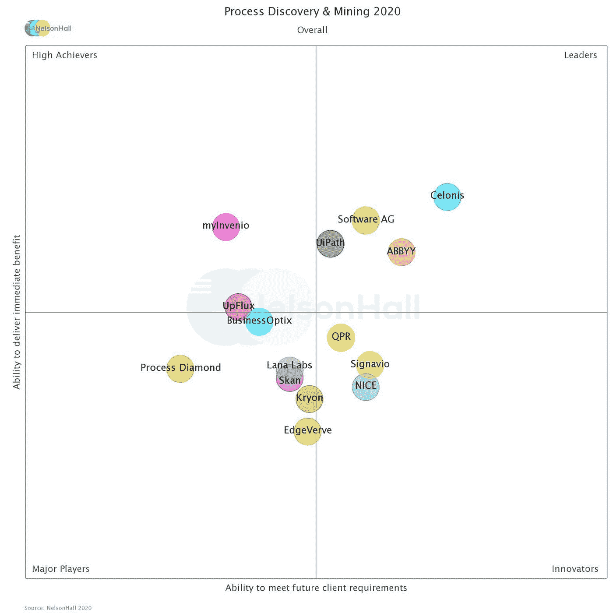
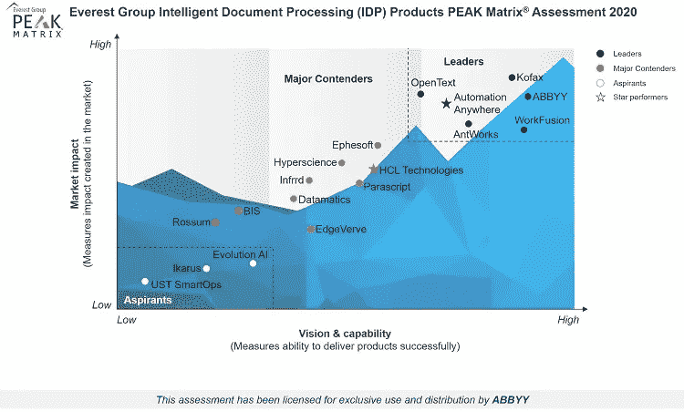

# 当一扇门关闭时，一扇新的门会打开…一个过程智能职业

> 原文：<https://medium.datadriveninvestor.com/when-one-door-closes-a-new-one-opens-a-process-intelligence-career-b43d20f3bb29?source=collection_archive---------21----------------------->

Photo by [Ian Schneider](https://unsplash.com/@goian?utm_source=medium&utm_medium=referral) on [Unsplash](https://unsplash.com?utm_source=medium&utm_medium=referral)

## 您是否希望与世界领先的数字情报公司合作，为全球受众开发和推动战略愿景？

大家好，我是 Ryan，我正在下面谈论我真正热爱的东西——过程智能。

如果您正在阅读本文，我希望您也对过程智能充满热情！

也许你对人工智能、机器学习、分析、过程挖掘和其他很酷的数字事物感到兴奋？我知道我是！

您可能知道，[如果您在 LinkedIn](https://www.linkedin.com/in/ryan-raiker/) 上关注我，今年早些时候，我辞去了长期担任 ABBYY 过程智能解决方案(以前称为 TimelinePI)首席产品营销经理的职务。我跳槽到现在领导 ABBYY 数字营销团队的职位相当突然。虽然这种变化是积极的，但它在我们的组织中留下了一个缺口，我们作为一个团队一直在努力弥补，但我们需要一个长期的同事！

为此，我与您分享 ABBYY 过程智能产品组合产品营销总监的空缺职位信息。我个人可以告诉你，如果你对流程、数据、分析和自动化有专业知识和热情，来推动我们的营销和产品战略，以加速流程挖掘、流程分析、流程监控和流程智能的增长，这是一个很好的工作。

## 但是瑞安。？我为什么想在 ABBYY 工作？

ABBYY 是一家快速发展的全球性软件公司，专注于数字智能解决方案。我们致力于开发创新解决方案，通过数字化转型为企业赋能。我们全面的产品线包括内容和流程智能解决方案，使组织能够实时捕获关键数据，以便快速采取影响客户体验、竞争优势、可见性和法规遵从性的行动。

在 www.abbyy.com 的[了解更多关于我们的产品、服务和故事。](http://www.abbyy.com/)

[ABBYY](https://www.linkedin.com/company/abbyy/) 最近还被专注于数字运营转型的全球分析公司 [NelsonHall](https://www.linkedin.com/company/nelsonhall/) 评为其流程发现和挖掘供应商 NEAT 评估的领导者。如果你感兴趣，你可以下载报告了解更多:[https://bit.ly/3hTwQ2C](https://bit.ly/3hTwQ2C)

在行业内又一年创纪录的增长和客户获取之后，ABBYY 在 Everest Group 基于市场影响、愿景和产品能力的 2020 年智能文档处理(IDP)产品峰值矩阵报告中被评为领导者。ABBYY 是应用最广泛的智能文档处理平台之一，也是愿景和能力最高的供应商。

 [## 用集体智慧对抗新冠肺炎|数据驱动的投资者

### “集体智慧是人类集体参与智力合作以创造……

www.datadriveninvestor.com](https://www.datadriveninvestor.com/2020/08/07/fighting-covid-19-with-collective-intelligence/) 

Everest Group 智能文档处理产品峰值矩阵报告解释了 ABBYY 在所评估的 18 家 IDP 技术供应商中的领导地位，详细描述了竞争格局，并强调了关键的 IDP 产品能力趋势和预测。

[如果您感兴趣，可以下载该报告了解更多信息。](https://www.abbyy.com/solutions/content-intelligence/everest-group-intelligent-document-processing-products-peak-matrix/)

**其他:**除了有竞争力的薪酬和福利，ABBYY 还自豪地提供工作与生活平衡的灵活时间表，许多远程工作岗位，以及建立在全球社区多样性基础上的文化。我们公司的价值观是由创新、团队合作、开放的思维和超越自我所驱动的。

ABBYY 是一个机会均等的雇主，重视多元化给工作场所带来的力量。

# 要求

## **教育&认证:**

计算机科学、工程、数学、市场营销或类似领域的学士学位或同等学历

## 体验:

*   5 年以上产品营销、产品管理、业务/流程分析师或客户成功方面的专业经验，侧重于流程挖掘、商业智能、流程管理或智能自动化；

## 技能:

*   在走向市场战略、销售方法、战略线索挖掘、直接营销媒介和 SFA/CRM 技术平台方面经验丰富
*   拥有 SaaS 和云产品或解决方案的经验
*   进行市场研究和分析的经验——收集和分析数据，并得出结论
*   在流程挖掘、RPA、BPM、ERP 或智能自动化方面有很强的背景和专业知识
*   流利的英语口语——流利的其他语言是加分项
*   出色的英语书面交流。
*   精通微软办公套件或类似平台
*   20-50%的时间准备出差。

# 责任

*   进行目标市场研究；分析客户需求和竞争产品，以创建有效的产品定位和信息；向销售团队传达产品价值，开发销售工具
*   产品发布—为新产品发布和发布制定战略和计划。与跨职能团队合作，确保成功执行/实施这些战略和计划。这包括内容创建、消息传递、简报和支持；
*   开发产品定位和信息，使 ABBYY 过程智能在过程挖掘、过程发现和过程分析市场中脱颖而出；
*   作为我们在过程智能方面的专家，与领先的分析师和咨询公司合作；
*   与产品管理部门一起，确定产品路线图、功能、更新和维护的优先级，以便正式发布给市场和客户。

也许你或你认识的某个人可以通过为全球受众开发和推动你的战略愿景，在我们不断发展的组织中产生真正重大的影响。

[查看 ABBYY Careers](https://www.abbyy.com/company/careers/open-positions/1217-director-of-product-marketing-timeline-flexible-location-all-states/) 和[上的帖子，如果你感兴趣，请在 LinkedIn 上给我发消息](https://www.linkedin.com/in/ryan-raiker/)！

**访问专家视图—** [**订阅 DDI 英特尔**](https://datadriveninvestor.com/ddi-intel)