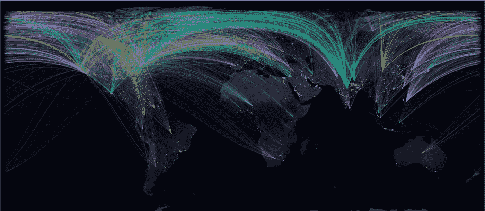
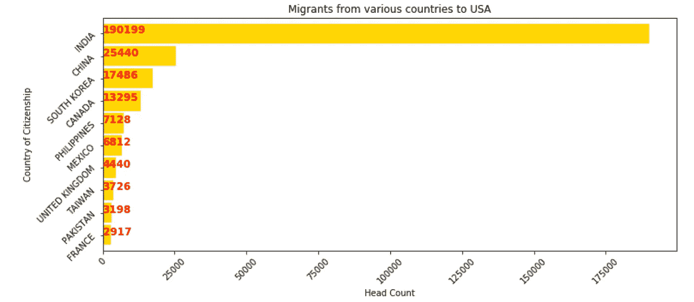
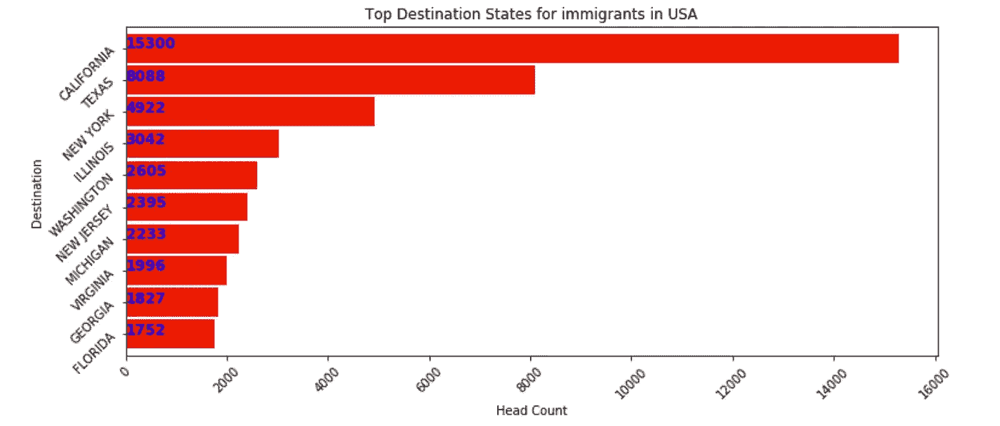
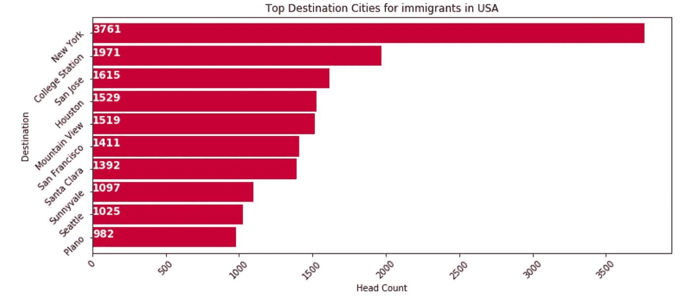
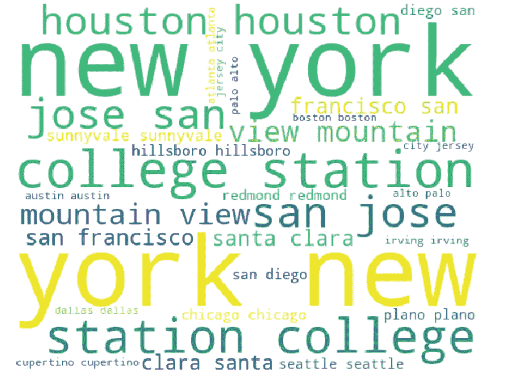
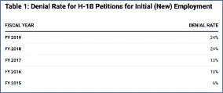

# 当 Python 为 R 倒下的时候！

> 原文：<https://medium.datadriveninvestor.com/when-python-fell-for-r-a9d63a419276?source=collection_archive---------17----------------------->

***本文已写，参加 SaturnCloud 的 V 日挑战。(***[***www . Saturn cloud . io***](http://www.saturncloud.io/)***)***

几个月前，我和我的队友就一个**数据可视化项目**进行头脑风暴，这个项目是我们**硕士项目课程**的一部分。起初我们对该做什么没有任何具体的想法。和其他小组一样，我们提出了很多想法，有些好，有些不好。最终，经过与教授的几轮讨论和咨询，我们想出了一个绝妙的主意。

 [## 2019 年最值得学习的编码语言|数据驱动的投资者

### 在我读大学的那几年，我跳过了很多次夜游去学习 Java，希望有一天它能帮助我在…

www.datadriveninvestor.com](https://www.datadriveninvestor.com/2019/02/21/best-coding-languages-to-learn-in-2019/) 

***那么，那个牛逼的想法是什么？***

我们试图想象在 2010 年到 2017 年期间从世界各地到美国的移民趋势。出于我们的研究目的，我们只考虑了**H1 B 申请人**。

我们将我们的项目命名为“**破碎的美国梦**”，因为数据/统计(如下所示)显示，移居美国的移民数量逐渐下降，然后迅速下降。我在下面附上了该项目的摘录，供感兴趣的人参考。

因此，在这一点上，如果你认为这有什么了不起的，我不会让你为此负责。事实上，数据集或我们想用我们的发现描绘的东西没有什么了不起的。神奇之处在于我们想展示它的方式。

我们看到了一个关于脸书在世界各地使用的图表，其中的表示是在黑暗模式下完成的，这给我们所有人留下了深刻的印象(链接[此处](https://www.bbc.co.uk/news/science-environment-11989723))，我们希望在我们的项目中实现这一点。这个练习让我们有机会在我们的项目中展示这一点。

用于我们项目研究的**数据集**是: [**美国永久签证申请**。](https://www.kaggle.com/jboysen/us-perm-visas)我们选择 Python 作为数据可视化的武器，因为我们大多数人都精通 Python。

使用 **Python，最初的探索很容易；**当我们试图绘制一些**条形图**或**热图**(在美国)时。然而，我们很快就遇到了一个障碍，或者更像是一个需要解决的难题。这幅图描绘了世界各地移民到美国的路线。我们用 Python 制作的图形不清晰，曲线也不够平滑。它看起来参差不齐，有点像素化。所以不是我们想要的样子。用 Python 制作的所有其他图形对于解释和理解都足够好了；然而，这应该是我们的" **wow factor** "由于这不合适，我们将从我们的项目中失去" **wow factor** "。而且，我们都还没准备好接受这个事实。

这是当我们中的一个人建议重做 R 中的图形时，我们对结果感到敬畏。

你自己看吧。它可能不是米开朗基罗，然而我们却愚蠢地以它为荣:

Immigration trends (for H1-B applicants) from various parts of the world to USA during the time-frame 2010 to 2017

对我们来说，这个项目是 Python 和 R 之间的完美结合。Python 图形补充了主要图形(用 R 绘制的世界地图),解释了我们项目成功的原因。

以下是 Python 中的支持图，项目摘录如下:

WordCloud showing the most visited places by H1-B immigrants

**项目源代码** : [点击此处](https://github.com/piumallick/Data-Visualization/blob/master/Project_TheCrumblingAmericanDream/Project_Notebook/TheCrumblingAmericanDream.ipynb)

**项目报告** : [点击此处](https://github.com/piumallick/Data-Visualization/tree/master/Project_TheCrumblingAmericanDream/Project_Report)

**项目组成员** : [古塔姆·乌帕拉帕蒂](https://www.linkedin.com/in/goutham-uppalapati/)，[舒布里卡·塞加尔](https://www.linkedin.com/in/shubhrika/)，[什鲁提·古普塔](https://www.linkedin.com/in/-shrutigupta/)，[皮乌·马里克](https://www.linkedin.com/in/piu-mallick-1940351a/)(就是我)。

想了解更多关于该项目的讨论和个人故事吗？请向下滚动。:)

# **关于项目的讨论**

**“目前美国 H1B 签证项目的状况如何，新的一年我们可以期待什么**？”—这是目前最热门的问题，因为特朗普政府正在努力对美国 H1B 签证计划实施新的严格法律。

不可否认的事实是，外国人将 H1B 签证视为在美国进一步发展职业生涯、组建家庭和建立新生活的黄金大门。签证特别受欢迎，因为人们也可以从它过渡到绿卡。许多申请人是国际学生，他们试图从 F-1 学生身份转换到 H1B 工作签证，以获得绿卡。根据通用统计数据，美国公民及移民服务局(USCIS)每年总共签发 85，000 份此类签证，其中 65，000 份发给拥有学士学位或同等学历的申请人，20，000 份发给从美国获得硕士学位或更高学位的申请人。

因此，值得考虑的事实是，个人通过了 H1B 签证通道，他们对美国社会做出了什么贡献。近 50%的财富 500 强公司是由第一代或第二代移民创建的，请参见“**数据”**部分了解更多信息。根据最近的一份报告，亚马逊、微软、谷歌和英特尔等美国科技巨头位列 H1 B 类申请人的前十大雇主。美国教育工作者毫无疑问地认为，外国出生的科学家和工程师的进入仍然是美国科技产业不可比拟的“T4”力量和活力来源。在这种情况下，人们会期望美国政府支持 H1-B 签证计划。相反，它正努力引入一系列似乎阻碍其有效性的政策。

有一件事是肯定的——根据特朗普总统的行政命令“**购买美国货，雇佣美国人**”，为在数学和工程领域取得适合高科技的外国公民获得工作签证变得更加困难。该政策指示国土安全部只向最有技能的外国人或收入最高的受益人发放 H-1B 签证。根据美国国家政策基金会(NFAP)获得的新数据，美国移民局已经开始增加 H-1B 签证拒签和向 H-1B 签证申请人发出的证据请求的数量。据 NFAP 的一位消息人士称，“雇主报告由于拒绝和要求提供证据的增加而损失的时间已经在项目延迟和合同罚款方面花费了数百万美元，同时帮助了专门在美国以外运营的竞争对手。”根据《福布斯》发表的一篇文章，可以注意到 H1-B 拒绝率在更大程度上激增，尤其是在川普时代。下图非常清楚地描述了这一事实。

# 项目背后的个人故事

我们早些时候研究发现，人们从世界各地移民到美国是为了更好的工作机会、更好的生活，并希望他们能够实现“**美国梦**”。上面显示的事实和数字也证明了这一点。甚至，我们作为现在的研究生(是 STEM 学生，拥有美国知名大学的硕士学位)，也渴望在毕业后找到更好的就业机会，过着类似的梦想。美国一直欢迎全球各地的人才，这反过来促进了美国的经济，因此可以自称为世界头号国家。然而，看看目前的情况，我们可以说，目前的情况可能不如以前好，人们移居美国可能在一定程度上造成了影响。我们需要等待和观察美国政府为我们展现的未来！