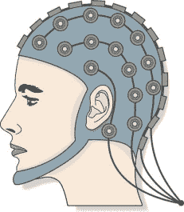
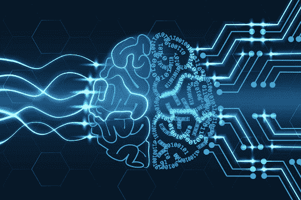

# 当科幻进入现实

> 原文：<https://medium.datadriveninvestor.com/when-science-fiction-enters-reality-bd8683c1ffe2?source=collection_archive---------20----------------------->

科幻小说以其疯狂的技术故事统治了世界，充满了诸如读心术和人类变成电子人的想法。然而，这些想法可能不仅仅局限于小说的页面。埃隆·马斯克的公司是研究脑机接口(大脑增强设备)的最知名的公司之一。这篇文章将提供这些设备是如何工作的，以及笼罩它们的伦理困境的分析。

# 什么是脑机接口？

脑机接口是连接到大脑的设备，要么植入，要么连接到头部外部。它们的目的是用我们自己的大脑活动与计算机互动。它们可以用来移动假肢，让天生没有的人恢复听觉和视觉，等等。

脑机接口检测某些电脉冲(信号)，然后在检测到特定信号时执行它们应该执行的命令。例如，每个动作都有独特的神经信号。当移动一只手时，大脑沿着特定的路径发送一个独特的信号。当某人失去一条肢体或瘫痪时，特定肢体的信号不再移动，电脉冲的数据包被阻止到达目的地。脑机接口可以为这些冲动创造新的途径。例如，如果用于假手的 BCI 检测到用于移动手的信号，它将移动假手。

# 非侵入性脑机接口

非侵入性脑机接口可以包括脑电图(EEG)。这些可以用来观察和记录正在发生的大脑活动。他们使用放置在头皮上的传感器来测量脑电活动

# 侵袭性 BCIs

侵入性脑机接口可以是芯片或电极，或者放置在大脑表面或大脑深处的任何其他材料。这些设备已被一家名为的公司用于减少癫痫发作，并且是 Neuralink 希望用来帮助瘫痪或失去四肢的人的 BCI 类型。

# Neuralink 是如何工作的？

这个名为 Neuralace 的网状装置在注射后会散开，并将自己与大脑整合在一起。目前，该公司的任务是帮助瘫痪或失去四肢的人。然而，在该设备开发出来之后，埃隆·马斯克(Elon Musk)曾表示，这可能是一种让人类领先于人工智能(AI)的方法。 **Neuralink 是一种薄的网状设备，将通过针头插入头骨，将大脑与计算机功能融合在一起。**像这样的设备可以使人们上传和下载信息到他们的大脑中，不用说话就可以与他人交流，并使我们的能力超出我们的想象。听起来科幻已经进入现实了，不是吗？

# 伦理问题

显然，像 Neuralace 这样的设备，肯定存在一些伦理问题。首先，其中一个问题是这种设备可能引发的经济分歧。这种设备首次推出时可能会很贵，因此富人可能会终身享有另一种不公平的优势，因为他们将是第一个使用这种强大设备的人。

**此外，还有关于隐私和自由意志的问题。**如果该设备遭到黑客攻击，会发生什么？这会导致精神控制，导致自由意志的丧失吗？我们不知道上面列出的严重问题的答案，这引发了一些关于该设备的担忧。

这个领域有太多未知的信息，这可能会导致一些可怕的想法，即像 Neuralace 这样的设备可以将人类带到哪里。

# 关键要点

*   脑机接口是连接到大脑的设备，要么植入，要么连接到头部外部。
*   BCI 检测某些电脉冲(信号)，然后在检测到特定信号时执行它们应该执行的命令。
*   BCIs 有两种类型，侵入性和非侵入性。
*   Neuralink 是一家致力于帮助瘫痪或截肢患者使用 BCI 设备 Neuralace 的公司。
*   当 BCI 在世界范围内广泛使用时，有许多伦理问题围绕着它们。

请在下面留下您对 BCIs 的看法！你认为人类能够克服使用这些设备时的道德问题，还是应该将这些设备局限在科幻小说中？