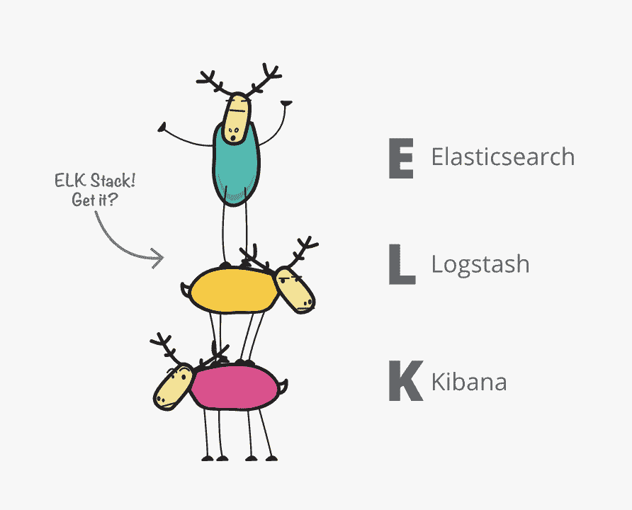
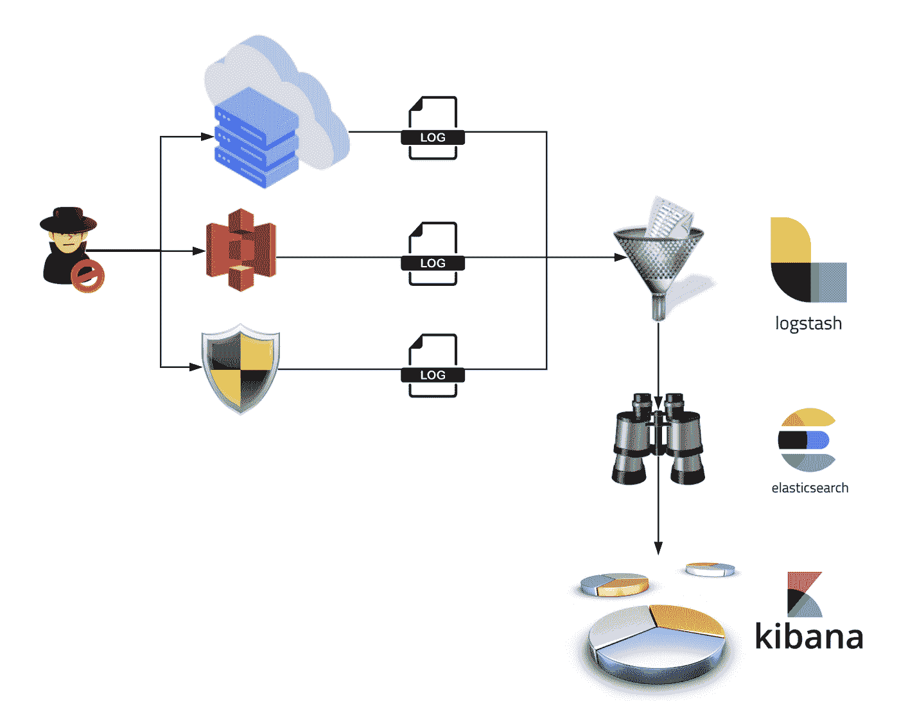

# 当树枝折断:暹罗时代的结束和麋鹿的崛起

> 原文：<https://medium.datadriveninvestor.com/when-the-bough-breaks-the-end-of-the-siem-era-and-rise-of-elk-a076754edcac?source=collection_archive---------1----------------------->

# ***从西安到弹性企业大规模流失背后的故事***

> “生存下来的不是最强壮或最聪明的人，而是那些最能驾驭变化的人。”-利昂·c·梅金森

KnighTV Live!: Episode 5: The end of the SIEM Era and Rise of Elastic

# **简介**

在我的 [Ashes to Ashes](https://www.linkedin.com/pulse/ashes-we-all-fall-down-death-siem-rise-soar-alissa-valentina-knight/) 文章中，我谈到了 SIEM 解决方案造成的事件疲劳问题如何需要 SOAR 来帮助解决该问题，这也扩展和改进了 SecOps，机械化和组织了以前由人类分析师在所有感觉和响应行动中依赖的活动。SOAR 通过结合数据收集、威胁和漏洞管理、事件响应和案例管理、工作流和分析，为组织提供实施自主工作流的能力，并通过所谓的“行动手册”处理执行和响应行动，从而有效地推进了 SIEM

由 FireEye 进行的一项调查发现，36%的受访者每个月都会从他们的 SIEM 收到超过 10，000 个警报，其中 52%是误报，64%是冗余警报，平均每年给公司造成 127 万美元的损失。

 [## 在创业之旅中，拥抱学习|数据驱动的投资者

### 好像建立一个数百万美元的公司还不够困难，企业家必须额外照顾他们的…

www.datadriveninvestor.com](https://www.datadriveninvestor.com/2018/10/16/on-the-entrepreneurial-trek-embrace-the-learning/) 

不言而喻，SIEM 已经很快失去了它们的吸引力，因为安全分析师每天都在遭受来自 SIEM 误报的攻击，或者来自他们为了日常护理和喂养以及 24x7 监控而必须保留的 MSSP 的攻击。很快就发现，SIEM 需要经验丰富的工作人员每天 24 小时进行调整，这些工作人员能够为特定的平台创建规则，以便不断降低噪音。对企业中的事件进行有效的集中监控的梦想需要重新构想。

但是就像生活中的所有事情一样，事情并没有那么简单。按每月接收的数据量收费的大数据 SIEM 解决方案的成本越来越高，这是怎么回事？根据最近的 [IDG 数据和分析调查，企业管理的平均数据量为 347.56TB，是平均数据量为 47.81 TB 的中小型企业的七倍，各种规模的组织都预计数据量将在相对较短的时间内大幅增加。](https://cdn2.hubspot.net/hubfs/1624046/IDGE_Data_Analysis_2016_final.pdf?t=1496694598964)

# 弹性叠层

输入[弹力](http://www.elastic.co/)。Elastic 是三个开源项目的堆栈:Elasticsearch、Logstash 和 Kibana，通常被称为 ELK 堆栈。ELK stack 有效地支持组织从任何来源获取任何格式的任何数据，然后对其执行搜索查询，以进行进一步的实时分析和可视化。这听起来是不是很熟悉 SIEM 解决方案的功能？Elastic 堆栈中的特性太多了，这里无法一一列举，但是可以在官方的 [Elastic 网站](https://www.elastic.co/elastic-stack/features)上自由阅读它们的全部内容。

我在下面创建了一个插图，演示了 ELK 堆栈如何吸收并允许处理和可视化堆栈中每一层的数据。

Image by Alissa Knight

但是 ELK 堆栈的每一层到底是做什么的呢？什么是基巴纳？什么是 Beats？那不是[德瑞医生](https://en.wikipedia.org/wiki/Dr._Dre)创作的耳机吗？嗯，是也不是，但我更喜欢 Airpods，但我跑题了。顺便说一句，Beats 的创建是为了解决需要数据传输器的系统的需求，能够有效地将数据从数千个端点发送到 Logstash 或 Elasticsearch。

# 粉红色的大象

也有许多公司在构建由 ELK 后端驱动的商业产品，包括网络检测和响应(NDR)解决方案，如 [Lastline](http://www.lastline.com/) 。听着，让我们指出房间里的粉色大象。大数据 SIEM 非常昂贵。对于使用 SIEM 解决方案的组织来说，这是一个持续的挑战，这些解决方案根据您发送的数据量收费，试图限制他们发送的数据量，一些组织仅数据接收一项就要支付超过 10 万美元的成本。

我接触过的许多 CISOs 迁移到 ELK 的主要原因是向 Splunk 发送数据的成本越来越高。一些首席信息安全官，如 Box 可观察性团队的工程经理 Deepak Wadhwani，在迁移到 ELK 后，每 TB 的成本降低了 50%以上。作为一名前 SOC 分析师，我们现在是如何进入这样一个时代的？在这个时代，SIEM 的数据接收成本实际上导致组织由于成本而限制甚至拒绝日志源，这实际上否定了最初拥有 SIEM 的前提。

事实是，企业一直在寻求减少他们在安全控制上的 CAPX 和 OPX 支出，以更多地投资于“座位上的暖屁股”

# 摘要

净净是托管安全服务提供商(MSSPs)必须通过提供 ELK 堆栈的监控和管理服务来发展或消亡，公司需要开始认真考虑在其当前的大数据 SIEM 中撤资。公司应认真考虑将 ELK 作为其大数据 SIEM 不断增长的成本问题的经济高效的替代方案，甚至可能迁移到 MDR，以免继续处理不断增长的事件疲劳问题，导致更长的平均响应时间(MTTR)行动。问自己一个棘手的问题:您是否真的获得了您认为可以获得的大数据 SIEM 基础架构投资回报。

在 ELK 系列的下一篇文章中，我将为您的本地和云资产提供 ELK 堆栈实现的现场手册。

**喜欢和分享。**您支持我在网络安全领域继续开展内容开发和影响者工作的最佳方式是喜欢并分享我的文章。请现在就做！

**订阅并关注。** [订阅我的 YouTube 频道](http://youtube.com/c/alissaknight?sub_confirmation=1)以获得我每周上传的 VLOG、直播流和 Vodcast/Podcast 剧集的通知，并在 [Twitter](http://www.twitter.com/@alissaknight) 上关注我。要查看我最新的内容日历，请访问我们公司的网站。