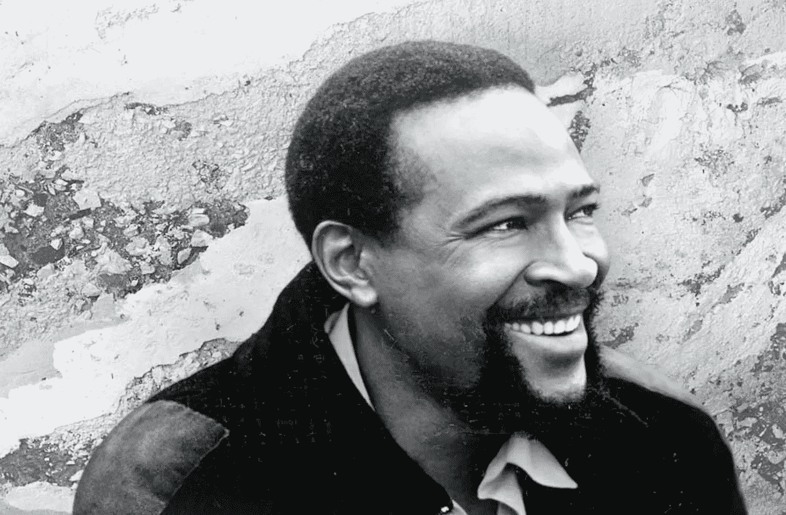

# 当抛弃成为热门。

> 原文：<https://medium.datadriveninvestor.com/when-throwaways-become-hits-39b35867cda9?source=collection_archive---------17----------------------->

## 小心你认为无用的东西。它可能是绝对的赢家。

"*我真希望我知道我在做什么，因为我每分钟都在写热门歌曲*"布鲁诺·马尔斯

伯瑞·高迪在 50 年代末组建的唱片公司“美国希斯维尔”至今仍被认为是最成功的唱片公司之一，它制作了 180 多首冠军单曲，其中最著名的是《至上女声组合》(12 首冠军单曲，是迄今为止最成功的女子组合)。然而，摩城的成功更多的是运气而不是公式。

马文·盖不想录制“我听说这是小道消息”格蕾蒂丝·奈特和 Pips 已经出了一个版本，所以马文不明白这一点。“对我来说这是一次性的，”马文后来说。“我们把它放在*的凹槽*里，因为诺曼·怀特菲尔德希望它在那里。我不是特别喜欢。”

所有人都认为伯瑞·高迪也没有。当诺曼·怀特菲尔德和巴雷特·斯特朗第一次把它呈现给戈迪时，他拒绝了(就像他拒绝盖伊的《怎么回事》一样)。戈迪最终同意让盖伊录制，但一开始只是作为 B 面。“我也认为这是一次性的，”贝里承认道。

> 鲍勃·迪伦省略了《T4:血迹斑斑》中的“由我决定”，因为他觉得有太多涉及他自己职业生涯的内容。此后，它被称为“迪伦的杰作之一。”

这首歌成了盖伊最卖座的单曲，在《公告牌》杂志的最棒歌曲排行榜上名列第 66 位。由巴迪·迈尔斯演唱的《后葡萄干麦片》的*加州葡萄干*版本登上了*公告牌百强榜。*

 [## 人工智能与创意:作为创意引擎的 BigGAN |数据驱动的投资者

### 的确，2018 年可以被视为人工智能创造的创造力全盛时期的开始。当然可以…

www.datadriveninvestor.com](https://www.datadriveninvestor.com/2019/02/13/ai-creativity-biggan-as-a-creative-engine/) 

并不是只有戈迪一个人拒绝潜在的成功。有时歌曲作者自己会有第二种想法。鲍勃·迪伦省略了《血迹斑斑》中的“由我决定”,因为他觉得有太多关于他自己职业生涯的内容。此后，它被称为“迪伦的杰作之一。”

乐队的“The Weight”差点没能登上 Big Pink 的音乐榜。罗比·罗伯逊(Robbie Robertson)保留了这首歌，认为与其他歌曲相比，它在歌词上“太怪异了”。“我最后把它扔了进去，”他说。

当乐队的版本只在 *Billboard* 排行榜上达到 *#61* 时，阿撒·富兰克林的版本达到了 *#19* 。一个有趣的旁注:杜恩·奥尔曼用一个装有减充血药的空瓶子弹滑吉他。

《重量》仍然是流行音乐史上被翻唱次数最多的歌曲之一。主食歌手的 Mavis Staples 声称二十年后他们仍然在表演它。“如果我不这样做，我就不能离开舞台，”她承认道。

还有太阳唱片公司的山姆·菲利普斯。一天，他让一个脖子上长着粉刺、梳着鸭尾辫的年轻人来录音。这个人就是猫王，尽管他唱了一长串歌曲，但没有一首听起来是对的。菲利普斯正要把孩子送回家，这时普雷斯利开始夸张地唱一首阿瑟“大男孩”的混搭歌曲，“没关系，妈妈。”剩下的就是历史了，就像他们说的，就是历史。

那么，抛弃如何成为热门呢？就连罗比·罗伯逊也无法给出一个确定的答案。“有时候你写了一些东西，想知道它怎么会好，”他说。“这超出了典型的预期。你没有什么可以比较的，所以你觉得你应该把它放在你的后口袋里。”

想象一下，约翰·菲利普斯向妈妈和爸爸的其他成员展示“星期一，星期一”，却没有得到任何回应。“我只是觉得这很蠢，”米雪·菲利普斯承认道。“我们都这样做了。约翰一直试图说服我们，所以最后我们让步了。约翰就是这样。”

《星期一，星期一》是妈妈们和爸爸们最卖座的单曲。

在任何创造性的努力中，总是会有怀疑。没有人想“落在典型和预期之外”，尤其是在涉及职业的地方。我们都在考虑自己的声誉和个人销售能力——甚至包括盖伊、菲利普斯和罗伯逊。有时候环境和命运会替我们做决定。

> “看到就知道了”这个说法，可能是“我想要惊喜”的另一种说法。

似乎当我们对预期感到舒适的时候，我们内心的某些东西渴望得到我们不期待的东西。“看到就知道了”这个说法，可能是“我想要惊喜”的另一种说法。

艺术家们经常想知道一首歌是从哪里来的，比如基思·理查兹在半夜醒来，在床头的录音机上录下“满足感”的基本和弦。

我们没有人真正知道什么是惊喜，或者更重要的是，什么是*可销售的*惊喜。文森特·范·高夫从未有过可出售的惊喜(他卖的唯一一幅画是给他的兄弟西奥)。

正如罗伯逊所指出的，如果你没有东西与之比较，你怎么知道？他等了几个星期才向乐队展示“重量”这本身就令人惊讶，考虑到他们住在一起，迪伦经常在楼上写歌，并在歌曲完成前给他们看歌词。

迪伦经常告诉罗伯逊，你不可能*知道*什么有效，什么无效。你所拥有的只是比较，一旦它可以和另一首歌相比，它就不再是原创了。

迪伦怀疑《你哪儿也不能去》是否太商业化了。他在地下室的磁带上录制了这首歌(所有这些他都想扔掉)，但这首歌流传了下来，成为伯德兄弟和飞人卷饼兄弟的热门歌曲。

所有这些都应该让我们思考:我们扔掉了哪些本该保留的东西？在期限或不合理的客户的压力下，或者只是不想成为笑柄，我们会有多快放弃一个想法？有多少内部评审扼杀了伟大的创意？

我回想起一个机构，在那里每个人都对一个概念投票——我指的是*每个人*。包括客户小组、媒体和研究人员在内，大概有十五六个人。不可避免地，他们投票支持最安全的竞选。

> 马斯克不断回头，几次差点破产，但像迪伦一样，他发现创造完全原创的东西的想法势不可挡。

埃隆·马斯克(Elon Musk)已经抛弃了许多想法，甚至最初的电动汽车也是如此。没人认为特斯拉有机会。马斯克不断回头，几次差点破产，但像迪伦一样，他发现创造完全原创的东西的想法势不可挡。特斯拉现在处于电动汽车技术的最前沿，紧随其后的是美国三大汽车制造商。

如今，抛弃想法变得更加容易。我们所做的就是点击删除。在平常的一天中，我会点击删除数百次。我抛弃了好主意吗？大概(开什么玩笑，我当然有！)

至少在硬拷贝时代，我们可能会低头看一眼废纸篓。我们可能有先见之明——或后知之明——打开一张皱巴巴的纸，发现它很棒。

> 也许我们需要一个程序把我们所有的删除发送到一个“也许文件”

技术、删除按钮、方便的小垃圾图标都让人们更容易扔掉和丢弃，可能会失去我们本应享有的名声。

也许我们需要一个程序把我们所有的删除发送到一个“也许文件”

或者也许我们应该对我们最初创造的东西更有信心。

罗伯特·科马克是讽刺作家、小说家和博客作者。他的第一部小说[“你可以把马带到水边(但你不能让它潜水)”](http://robertcormack.net/)在网上和大多数主要书店都有售。查看[天马出版社](http://skyhorsepublishing.com/)或[西蒙和舒斯特](http://simonandschuster.ca/)了解更多细节。

## 访问专家视图— [订阅 DDI 英特尔](https://datadriveninvestor.com/ddi-intel)