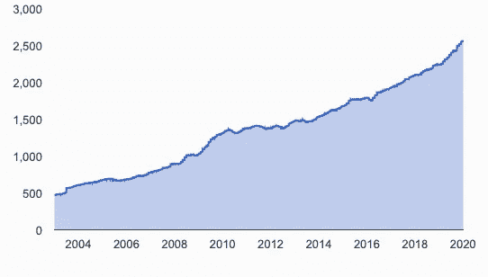

# 当传统投资下跌时，投资者可以考虑哪些选择？

> 原文：<https://medium.datadriveninvestor.com/when-traditional-investments-fall-what-are-the-alternatives-for-investors-to-consider-23f96acb7d80?source=collection_archive---------19----------------------->

世界上最大的对冲基金管理公司 Bridgewater 的创始人雷伊·达里奥最近说，“(T2)有一场贸易战，一场技术战，一场地缘政治战，还可能有一场资本战。如何实现这一目标将决定我们的未来。他所指的“资本战争”是由政府和企业对债务的贪得无厌所推动的。在美国，“量化宽松”已经更名为“新资产购买”，每月支出[高达 600 亿美元](https://qrius.com/quantitative-easing-now-looks-permanent/)。这也有助于降低债务成本，从而将利率保持在历史低位。

 [## 为什么包容性财富指数比 GDP 更能衡量社会进步？|数据驱动…

### 你不需要成为一个经济奇才或金融大师就能知道 GDP 的定义。即使你从未拿过 ECON 奖…

www.datadriveninvestor.com](https://www.datadriveninvestor.com/2019/03/08/why-inclusive-wealth-index-is-a-better-measure-of-societal-progress-than-gdp/) 

伊卡洛斯的飞行

来源:*来源雅各布·彼得·戈威——普拉多博物馆*

就像希腊传说中的伊卡洛斯飞得太高太靠近太阳，然后坠落到地球上一样，股票和债券市场正在被提振，在廉价信贷的浪潮下越升越高。上市公司一直在努力增加收益

可能导致股市潜在回调的是他们目前的债务规模。组成标准普尔 500 指数的美国 500 家最大公司的市盈率为 19 倍。该指数由少数几家公司主导:苹果(4.6%)、微软(4.5%)、脸书(1.8%)、谷歌(3%)和亚马逊(2.9%)，这些公司占标准普尔 500 指数(S&500 估值的 17.8%。潜在的更大担忧是，在这些跨国组织中*只有*脸书是净现金正的，其余的都有大量债务。事实上，截至 2020 年 1 月 8 日，标准普尔 500 指数中只有 17 家公司没有债务！

与此同时，欧洲中央银行现在拥有€2630 亿英镑的公司债券。这相当于以欧元计价的公司债务现值的 10%以上，而欧元计价的公司债务本身一直在稳步上升。欧洲央行目前每月购买€200 亿欧元的政府和企业债券，因此面临越来越大的信用风险，因为随着欧元区经济增长放缓，欧洲央行购买的一些企业债券可能会违约。

欧洲公司债券市场的规模

来源:信贷市场日报

所以，我听到你问，这跟区块链和数字资产有什么关系？好吧，美国已经威胁伊拉克，如果它要求美军离开，那么美国可能会拒绝巴格达进入其在美国的银行账户(根据华尔街日报的报道)。因此，事实上，特朗普政府正在将美元作为一种杠杆、一种工具，或者像一些人所说的那样，一种武器，来鼓励其他国家按照美国政府的意愿行事。人们不禁要问，还需要多长时间，才会有更多的国家放弃持有和交易美元，转而寻找替代货币，例如非政府控制的资产，即黄金或加密货币。鉴于对中国冠状病毒爆发的持续担忧，我们会看到中国公民(其中许多人被限制在家中)开始购买比特币作为对冲，以防病毒进一步传播吗？

另一个需要考虑的问题是，鉴于债券、房地产和股票等许多传统资产的价格，如果我们看到这些市场的价格开始下跌，或者我们看到债务违约(从而削弱投资者的信心)，对非相关替代资产的需求可能会增加；像诉讼融资这样的资产(仅在美国的市场就可能高达[1000 亿美元](https://perma.cc/L9NZ-3PMT))可能会吸引相当大的兴趣。然而，我们也可能会看到，根据租户类型或信用风险，在收入流分离的情况下，提供数字版本的房地产和衍生品。然后，通过使用智能合约，支付可能会使用数字货币自动分配。

随着股票和债券市场继续“狂欢”廉价信贷，寻找使用区块链技术发行的替代资产，作为一种以更自主的方式“分割回报”的方式，从而消除当前许多基于纸张的模拟系统。当我们看到十年牛市时，这些新类型的数字资产可能会受到更大的关注。根据花旗银行的数据，自 2009 年 3 月股市陷入令人震惊的停滞以来，标准普尔 500 指数[上涨了 373%!](https://www.citibank.co.uk/personal/market-insights.do?article=longest_running_bull_market_history)

当然，投资者不希望故意遭受与可怜的伊卡洛斯相似的命运吧？