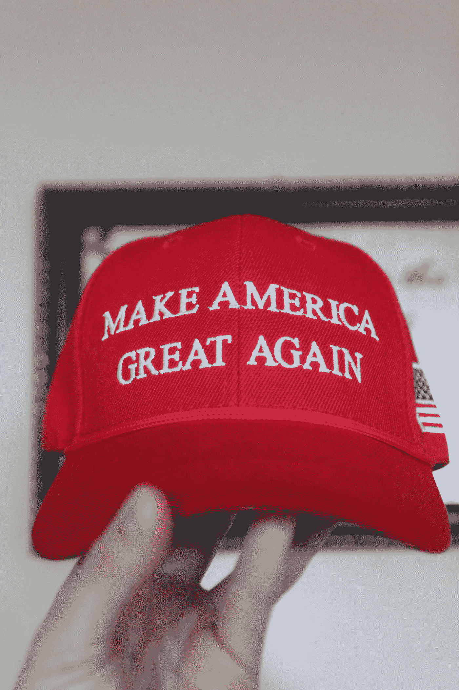

# 当白人认为其他白人不是种族主义者时

> 原文：<https://medium.datadriveninvestor.com/when-white-people-give-other-white-people-credit-for-not-being-racist-68d0ab2cae0d?source=collection_archive---------3----------------------->

Photo by Aubrey Hicks on Unsplash

因为我显然有受虐倾向，所以我关注保守派律师乔纳森·特利的博客。尽管他无疑会声称自己不偏不倚，但他总是准备为特朗普做的几乎所有事情辩护，并批评左翼人士的行为，同时忽视右翼的大部分行为。在特朗普被弹劾的审判中，他是唯一支持特朗普的合法证人，经常可以在福克斯新闻频道找到他为自己的不良行为辩解。除了发帖，他通常不参与博客上的冗长对话，博客已经成为许多持种族主义观点的人的藏身之处。然而，那里确实有一些非常优秀的人。

最近的一篇帖子发现，特利抱怨弗吉尼亚州的一家法庭下令将全白人法官的画像挂在那里，因为这将对陪审团产生不利于黑人被告的不当影响。我对此没有特别的看法，但他在为白人法官的肖像辩护时这样说。

“根据伯恩哈德的逻辑，反对奴隶制和种族隔离的主要法学家会因为他们的种族而被免职。因此，写布朗诉教育委员会一案的厄尔·沃伦必须被除名，因为他是白人。具有讽刺意味的是。沃伦写道:

> “仅仅因为种族而将[黑人儿童]与年龄和资格相似的其他人分开，会产生一种对自己在社区中的地位的自卑感，这种感觉可能会以一种不太可能永远无法消除的方式影响他们的心灵和思想。”

然而，根据伯恩哈德法官的方法，沃伦的肖像将不得不被删除，因为他的形象会产生同样的“自卑感”，因为他碰巧是白人。

虽然伯恩哈德法官称这些肖像为“装饰品”，但在我看来，使用基于种族的标准来移除它们是如此令人不安，而且是被误导的。"

引起我注意的是特利教授把厄尔·沃伦大法官作为反种族主义英雄，因为他的一个行为。在撰写布朗诉教育委员会一案的判决时，沃伦也给了我们这样一句话:“以所有深思熟虑的速度。”这使得该决定几十年来都没有得到执行。让我们小心不要因为一个可以说是美好的时刻而给予白人一生的信任。沃伦也赞成拘留日本人，尽管他后来确实后悔了。

并不是说没有很多白人不是种族主义者。对于所有这些人来说，一些白人会为他们辩护，告诉我们他们的身体里没有种族主义的骨头。举个例子，纽约市议会前主席安德鲁·斯坦恩写了一篇专栏文章，宣称唐纳德·特朗普是一个非种族主义者。斯坦因显然已经忘记了川普是如何拒绝将公寓租给纽约的黑人，[在黑人的申请上标上“C”代表有色人种](https://www.businessinsider.com/fbi-report-trump-housing-discrimination-2017-2)，这样他们就可以被拒绝。特朗普担任总裁的公司因住房歧视被联邦政府起诉两次。第二次是因为未能纠正第一次诉讼中发现的问题。川普在《纽约时报》的一则全页广告中呼吁判处死刑，该广告刊登在 T4 中央议会的一个版面上。即使在他们被判无罪后，他仍反对纽约市对这五人的和解，称这是不正当的。

他在担任总统期间的近期活动包括启动大规模监禁、试图取消少数族裔投票、给黑人贴上来自“狗屎国家”的标签等等。这可能是一个巧合，但当川普得知新冠肺炎主要杀害少数族裔和老年人时，他开始提倡群体免疫，也就是让他们都去死。把一个明显是种族主义者的人称为种族主义者，这本身就是一种种族主义行为，必须停止。

在白人中间变得普遍的是降低种族主义行为的门槛，使其几乎不再存在。第二个常见的事情是为种族主义行为辩护，否认它是种族主义，就像乔纳森·特利和安德鲁·斯坦的情况一样，我有点厌倦那些不断从事种族主义的人，他们从来没有为此负责。亚伯拉罕·林肯说过一些相当种族主义的废话，他也没有得到通行证。

“我会说，我现在不赞成，也从来没有赞成以任何方式实现白人和黑人种族的社会和政治平等，[掌声]——我现在不赞成，也从来没有赞成让黑人成为选民或陪审员，也不赞成让他们有资格担任公职，也不赞成与白人通婚；除此之外，我还要说，白人和黑人之间存在着身体上的差异，我认为这种差异将永远禁止这两个种族在社会和政治平等的条件下生活在一起。因为他们不能这样生活，虽然他们仍然在一起，一定有优越和低劣的位置，我和其他人一样支持优越的位置分配给白人。我在这一场合说，我不认为因为白人拥有优越的地位，黑人就应该被剥夺一切权利。我不明白，因为我不想要一个黑人妇女做奴隶，我就一定要她做我的妻子。”亚伯拉罕·林肯

我敢肯定，我可以列出一个长长的白人名单，这些人要么根本不是种族主义者，要么不像他们那个时代的其他人那样是种族主义者，事实上，他们过去的行为和言论都有问题。[乔治·华盛顿用他奴役的人的牙齿装上了假牙。](https://medium.com/the-aambc-journal/why-we-need-a-white-history-month-5db5b08c93ce)托马斯·杰斐逊不仅从 14 岁开始强奸莎莉·海明斯；她给他生了多个孩子。[他促进了国内奴隶的繁殖，](https://medium.com/discourse/thomas-jefferson-did-more-to-promote-domestic-slavery-and-slave-breeding-than-any-other-president-363d02e2fae7)结束了国际奴隶贸易，不是像他的支持者建议的那样最终结束奴隶制，而是为了增加那些像他一样有多余奴隶的人的利润。

我想说的是，当白人开始告诉我其他人不是种族主义者时，我的蜘蛛感觉消失了，研究通常会找到证据证明这些说法是错误的。对美国种族主义的过去或种族主义仍然存在产生怀疑是系统性种族主义没有得到解决的一个原因。如果美国有相当于“曲速行动”的手段来解决种族主义问题，我们今天的状况会好到什么程度？人们只能怀疑。

**访问专家视图—** [**订阅 DDI 英特尔**](https://datadriveninvestor.com/ddi-intel)