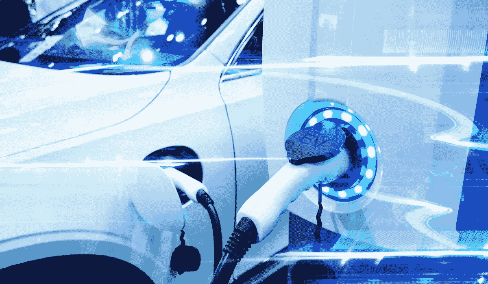
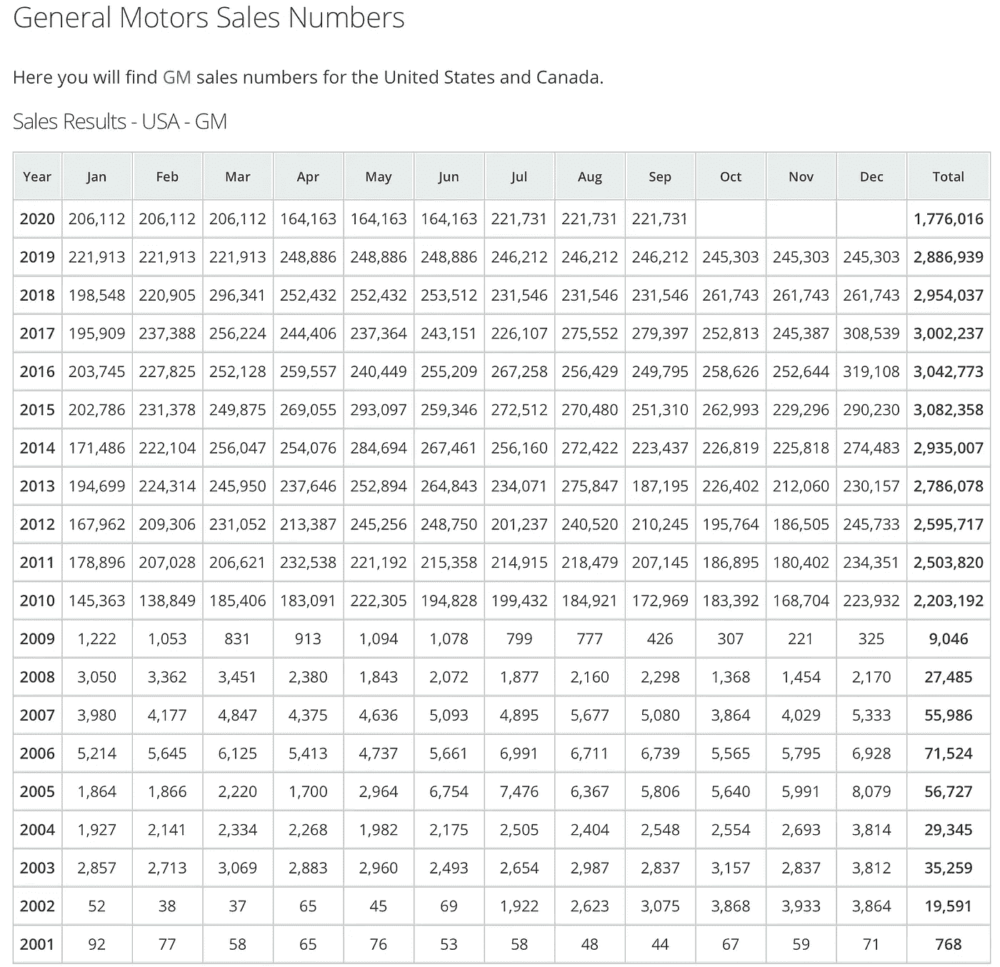

# 电动汽车股票泡沫何时会破裂？

> 原文：<https://medium.datadriveninvestor.com/when-will-the-ev-stock-bubble-pop-a34abf5b6d76?source=collection_archive---------5----------------------->

## 有些东西必须付出…

电动汽车股票是 2020 年的最大赢家之一。该领域的两大领导者特斯拉和 Nio 的股价分别上涨了 670%和 1200%。

虽然电动汽车肯定是未来的发展方向，但该领域的许多股票已经走在了前面。Nio 的市值高于通用汽车，尽管通用汽车一周内售出的汽车数量超过了 Nio 作为一家公司售出的汽车数量……而通用汽车从中获利颇丰。

Workhorse 的市净率为 3，270，这取决于美国邮政的一份合同，该合同仍无法证明估值的合理性。

假设兴登堡是二对一，我们在这个领域也有多个坏演员，如尼古拉汽车公司和康迪(他们在尼古拉汽车公司的位置上)。

结合电动汽车空间的投机性质和来自传统汽车公司的日益激烈的竞争，电动汽车股票有一种泡沫的感觉。

那么……泡沫破裂需要多长时间？

目前，像 Nio 和特斯拉这样的电动汽车更容易继续实现快速销售增长。Nio 在 2020 年销售了近 4 万辆汽车。Nio 在 2021 年销售 80，000 辆汽车(或更多)并不是不可行的，只要他们能生产那么多汽车并进行营销。

通用就不一样了。

如果你看看通用汽车在美国的销售趋势，你可以看到最初几年的快速增长，随后是陷入大衰退的停滞。

通用汽车每年在美国销售数百万辆汽车，但并没有增长。相反，通用汽车目前正试图保持前几年的销量。

我不认为通用汽车会在 2021 年突然达到 600 万辆汽车销量，然后在 2022 年达到 1200 万辆汽车销量。我不认为他们会在 2023 年卖出 2400 万辆汽车。

这个领域竞争激烈，规模越大，每年的销售额和收入就越难翻番。

对于任何成长股来说，叙事都是必不可少的。只要 Nio 能够继续产生显著的收入增长(他们一直报告三位数的增长)，股价就会继续上涨。当 Nio 报告较低的增长(即收入增长低于 20%)时，该股将会猛然惊醒。

 [## 首次创业的 4 个资金管理技巧|数据驱动的投资者

### 超过 82%的企业倒闭是由于财务管理不善和现金流问题。开始新的…

www.datadriveninvestor.com](https://www.datadriveninvestor.com/2020/10/23/4-money-management-tips-for-first-time-entrepreneurs/) 

具有讽刺意味的是，随着这些公司继续增长(即，你不可能永远保持三位数的增长)，或者随着传统汽车公司提供高质量的电动汽车替代品，这一过程可能会加快。

随着越来越多的公司接受电动汽车，特斯拉、Nio 和其他公司的估值可能会下降，与传统汽车公司更加一致。

特斯拉领先其他主要竞争对手几年，但这一差距可以通过其他汽车公司拥有的资本、资源和人才来弥补。

尽管电动汽车公司被吹捧为不同于传统汽车公司，但它们的利润率并没有变。

以下是电动汽车和传统汽车公司的一些利润率:

TSLA: 1.97%的利润率

NIO:利润率为 56.26%

通用汽车:2.92%的利润率

女:0.12%的利润率

TM: 5.50%的利润率(TM 是丰田的股票代码)

Nio 的亏损一直在收窄，因此目前-56.26%的利润率将在接下来的几个月里更接近正数。接近 0%的利润率将有助于进一步推动增长，但当 Nio 的利润率为正但几乎不变时会发生什么？

尽管是碰巧生产电动汽车的汽车公司，特斯拉和 Nio 的估值不公平，就像它们是科技公司一样。

科技公司获得高估值的部分原因是它们拥有更高的利润率。

尽管互联网现在已经成为我们生活中必不可少的一部分，但互联网泡沫伤害了每一只互联网股票。电动汽车不会像互联网一样变得必不可少，但它们是未来。这并不能成为市场上几乎所有电动汽车股票价格被严重高估的借口。

Nio 能跳到 500 美元还是特斯拉能跳到 1500 美元？在这个市场上，只要增长叙事成立，一切皆有可能，因为对许多电动汽车投资者来说，估值似乎是一个事后想法。但是我宁愿把我的钱投资在对我来说风险不大的股票上。

总有一些东西要付出。

[***想学习如何投资股市赚钱？确保你订阅了我的 YouTube 频道***](http://bit.ly/2W4ag01)

## 访问专家视图— [订阅 DDI 英特尔](https://datadriveninvestor.com/ddi-intel)