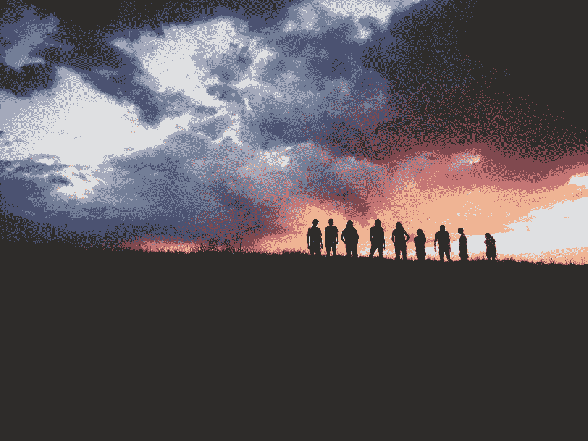

# 当你到了 50 岁，开始失去朋友

> 原文：<https://medium.datadriveninvestor.com/when-you-hit-your-50s-and-start-losing-friends-d54e8bd526a0?source=collection_archive---------1----------------------->

## 一路上我所拥有和失去的

Thanks to: [Hudson Hintze](https://unsplash.com/@hudsonhintze?utm_source=unsplash&utm_medium=referral&utm_content=creditCopyText), [Unsplash](https://unsplash.com/s/photos/group-project?utm_source=unsplash&utm_medium=referral&utm_content=creditCopyText)

当你 50 多岁的时候，珍妮·约瑟夫的红帽诗会有所帮助。你开始思考你是谁，并且毫无歉意地迎头痛击生活。

你正处于人生的第二阶段，只争朝夕的心态有助于强化随之而来的脆弱性。

*当你可以拥抱不完美的人类并茁壮成长时，为什么要浪费时间为不完美的人类感到难过呢？*

## 我的自我价值不是由我的社交网络决定的

我对朋友的看法也因此改变了。几十年来，我以为我应该有更多。

*我生活在一种普遍的感觉中，那就是做我就是孤独。童年受欺负的后遗症是你觉得你永远没有足够的朋友。*

你内化了自己天生不讨人喜欢的信念，并花了很长时间来摆脱这种达尔文式的条件反射。

也许是结婚生子，搬到一个社会排斥被认为是粗鲁的国家，或者仅仅是年龄。不管怎样，过去的一年让我不再通过我的社交网络来判断自我价值。

一些曾经占据了我大脑很大空间的事情悄悄地简单地解决了。这有助于我拥有许多朋友和参与社区活动的历史与我作为失败者的自我形象相矛盾。

我也变得更像自己的朋友了。

我喜欢与人交往。我比不外向。但是，我强迫性地查看我的通讯录或脸书好友名单来证明我的价值的日子已经一去不复返了。

我深深感激这种随着年龄增长而带来的解脱。这尤其有帮助，因为我最近的几个社交团体已经因为关于 COVID 和[阴谋](https://julesevans.medium.com/conspirituality-the-overlap-between-the-new-age-and-conspiracy-beliefs-c0305eb92185)、职业变化以及相关的 2020 年困难的冲突意识形态而崩溃。

## 连续的，柏拉图式的一夫一妻制

特别是寻找一个最好的朋友。我会长期寻找我的灵魂伴侣，一个唯一可以分享秘密的人。这是一段我从中学开始就没有成功维持的关系，一段我长期拥有然后又失去的关系。

连环，柏拉图式的一夫一妻制是痛苦的。

当然，我的丈夫和孩子是我永远最好的朋友，是我在这个世界上最重视的人。但是我非常想要一个瑞秋给我的莫妮卡。

我仍然羡慕那些拥有这种友谊的人，但是缺乏友谊不再像以前那样折磨我。

我有过一些侥幸脱险的经历，和我关系很好的女人，但是后来事情变冷了。我当然有朋友，我愿意为他们做任何事。不管出于什么原因，我还是没有最好的朋友。

我上一段‘最好的友谊’最近结束了。令人惊喜的是，降级为友好并没有像以前那样震撼我。生活在一个虚拟的世界中，有能力在共同的兴趣上建立直接的亲密关系，家庭承诺和更强大的内心生活也得到补偿。

## 真正的友谊是永恒的

当我得知一个老朋友只剩下有限的生命时，我感到很惊讶。这是一个我多年未见的人，我也没有和他定期交流。

这让我想到了友谊。在这个即时的时代，我怎么会对一个我可能再也见不到的人如此心烦意乱呢？

但这就是友谊的美妙之处。像文学和艺术一样，它的价值是内在的，它的欣赏是永恒的。

悼念朋友的消息让我思考。随着时间的推移，我试图超越童年的失败感，我已经有了至少八个不同的朋友网络。它们主要与我生活的地方、我的宗教团体或另一种实践团体或我的职业有关。

## 友谊既不稀缺也不交易

在那段时间里，我对友谊保持着一些扭曲的观念，回想起来，这些观念是亲密和快乐的不必要的障碍。

*现在我明白了，我的观点受到了残酷现实的影响，这种狗咬狗的心态支撑着我被欺负的经历。我相信:*

1.  友谊是有限的。如果你听到有人谈论他们生活中的其他朋友或更亲近的人，那就是在提醒你，你不那么重要了。而且，
2.  友谊是交易性的。如果你的朋友主动为你做某事，或者接受你的邀请为他们做某事，这意味着你们是更亲密、更真诚的朋友。

在任何微妙的交换之外思考友谊需要转变。

*看着再次拜访我亲爱的老朋友的机会消失，凸显了友谊的一些更深刻的真理。我打算尽我所能拥抱他们。*

当我寻求保持一种良好的社会生活方式时，我的目标是围绕友谊体现这些更健康的价值观:

1.  亲自花时间是最好的。
2.  花时间通过视频或语音交谈是第二好的选择。(人们可以争论它们的顺序，但我认为这是主观和上下文相关的。)
3.  当你们只是聊天时，你们彼此都很友好。但是如果你们没有参与到彼此的真实生活中，没有看到彼此在不同情况下的行为，你们就不是同样意义上的朋友。
4.  真正的朋友既善良又诚实，并且能直觉地知道何时以及如何成为真正的朋友。

前者以友谊为商品，后者以朋友间互动的质量为中心。两者都没有定义友谊的本质，也没有定义让你保持友谊的本质。

## 我一看就知道

根据亚里士多德的说法，你偶然发现的友谊是基于功利或短暂的快乐，它们不太持久；而高尚或真实的友谊更纯洁、更永恒。

扎特·拉纳写下了这种善良的友谊，“我们是和我们一起度过时光的人。我们与亲近的人建立的联系直接决定了我们的生活质量。生命太短暂，不适合浅薄的友谊。”

*我喜欢把友谊想得更有机一些。这有点类似于斯图尔特法官对淫秽的主观定义，“当我看到它时我就知道了”。*

在漫长的十个月里，没有一次聚会，没有一次玩耍，没有一次女孩之夜，这让我想到，也许我对我的朋友感到失望，因为我们一起度过的时光是真实的，是面对面的。

与这种在家隔离的挑战性时间相比，这是一种浓缩在时间中的感伤记忆。在我单身纽约的日子里，我们是朋友。我们在共同的专业领域并肩作战。我们是一群热情、幽默、敬业的同事中的一员，为了食物和饮料工作到深夜，试图拯救世界。

而且，很有趣。我猜亚里士多德可能会说，功利主义。

***但至于我；我只是为失去一个好朋友而难过。***