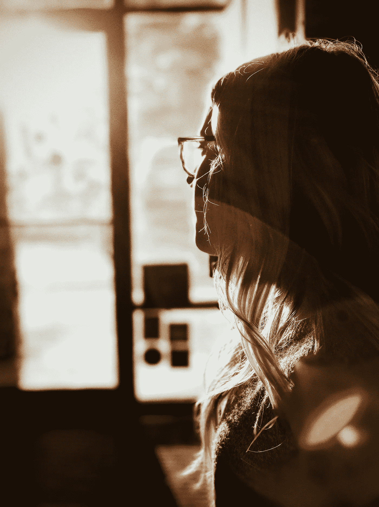

# 当你山穷水尽时，放手吧

> 原文：<https://medium.datadriveninvestor.com/when-youre-at-the-end-of-your-rope-let-go-bcc17f850ddd?source=collection_archive---------11----------------------->

## 不要让你无法控制的东西杀死你

Photo by [Caleb George](https://unsplash.com/@seemoris?utm_source=unsplash&utm_medium=referral&utm_content=creditCopyText) on [Unsplash](https://unsplash.com/s/photos/thinking?utm_source=unsplash&utm_medium=referral&utm_content=creditCopyText)

你有没有过这样的感觉，好像你正试图在一块浮冰上跳踢踏舞，而这块浮冰一直在你脚下倾斜和移动？

你被雨夹雪袭击了？

到处都没有掩护吗？

每次你开始控制，浮冰就会倾斜，你就会屁股着地。

如果你不再尝试跳舞，而不是一次又一次地摔倒，你只是坐着，原地不动。

你会开始随着浮冰移动并稳定你的行程。

你仍然无法控制，但也不会被折腾。

# 控制是一个幻影

> 海市蜃楼:你认为你看到的东西的幻觉，但实际上并不存在

我们中的一些人觉得有必要控制我们生活的每一个方面，没有任何偏离的余地。当面对太多太快的变化时，我们许多人都会陷入这个陷阱，因为通过控制一切来寻求安全是很自然的。

> 桑德拉·桑格博士说:“一次又一次，研究表明，尽管有智力、知识和理性，人们还是经常相信他们能够控制生活中的事情，即使这种控制是不可能的。”

作为一个孩子，我总是期待一些不好的事情毫无征兆地降临在我身上，所以我努力控制我周围的一切。我总是寻找隐藏的陷阱，当我对每种情况下的每种可能的排列都有计划时，我会感到更安全。

每当事情发生或事情发生变化时(他们总是这样做)，我的选择都不可行，我就会拼命挣扎，以重新获得控制感。

几年前的一天，我的世界被打破了轴心，一切都变了。

我无法挽回已经发生的事情。

我的整个人生将会不同。

我所有精心策划的计划顷刻间化为乌有。

我没有 B 计划，C 计划，甚至 z 计划。

我只有悲伤。

# 放手不是放弃；它继续前进

> “如果我不能控制它，我不会让它杀死我。我要放手了。”

活得够久，你就会知道悲伤。今天，在我们努力控制肆虐的疫情时，它已经造访了我们许多人。

但是，不仅仅是失去亲人让许多人陷入悲伤和混乱。

今天，我们中的许多人都在为其他种类的损失而悲伤——生计、从未有过的记忆、身体接触、共进晚餐、手拉手散步、笑脸，等等，等等。

我们渴望失去的东西。我们渴望控制无法控制的东西。我们越是努力抗争，试图夺取控制权，我们就越感到痛苦。这助长了我们的负面情绪，让我们的系统充满沮丧、愤怒和抑郁。我们的压力越来越大，加剧了我们所处的负面空间。我们的心理、精神、情感和身体健康都受到了打击。

> “重要的是要记住，我们生活中的控制往往是虚幻的。一旦你下定决心，“嘿，我真的完全无法控制这件事，”你就可以开始行动了。第一步是放手，承认一切都不会是原来的样子，承认我们无法控制自己的大部分生活，然后开始收拾我们确实可以控制的东西。

第一步是放手，承认没有什么是永远不变的，承认我们无法控制我们的生活，然后开始收拾我们可以控制的东西。我学会了带着悲伤生活，专注于我力所能及的事情，一次迈出一小步，在我陌生的新世界中找到平衡。

> 根据正念冥想研究所的创始人兼主任查尔斯·弗朗西斯的说法，“抓住我们无法控制的事情不放会给我们带来很大的压力和不快乐。它还让我们停留在过去，让我们无法自由地成长和生活。如果我们想要快乐和自由，那么我们需要学会放下。”

当我们不再需要一个尽善尽美的结果，不再把我们的幸福和安全感建立在一个特定的结果或情况上，我们的生活就会变得开阔。

*   我们开始看到以前从未考虑或承认的新的可能性和机会。
*   我们的自尊和自信增长了，为了我们的幸福和满足，我们变得独立于我们自己之外的人和事物。
*   我们学会相信自己和自己的能力，相信自己能够找到答案，做出明智的决定，照顾好自己和我们所爱的人。

我们不再需要确定性，而是寻找不仅仅是生存，而是在不确定性中茁壮成长的方法。

> 我的座右铭是:“如果我不能控制它，我不会让它杀死我。我要放手了。”

# 放弃控制的方法

> 根据艾略特·科恩博士的说法，“面对未来固有的、不可避免的不确定性确实看起来令人生畏——如果你要求确定性的话。但是放下这个需求，才是放下恐惧的关键。如果你不需要控制结果，如果你不期望确定地预测本质上不确定的事情，那么你可以放松。当我们学会放手时，我们就能摆脱阻碍我们前进的痛苦和折磨。”⁴

有许多方法可以释放控制不可控事物的需求。

## 利用列表的力量。

德克萨斯州奥斯汀市戴尔医学院的弹性创造力项目主任卡丽·巴伦(Carrie Barron)医学博士认为，清单可以帮助消除困惑。它们让你更容易区分哪些事情在你的控制范围内，哪些事情不在你的控制范围内，并帮助你区分重要和不重要的事情。⁵

**第一步。制作一个有两栏的列表。**

*   在 A 栏中，列出所有你无法控制的事情。你很可能会遇到像经济、政府、疫情、失业、财务损失等大而棘手的事情。
*   在 B 栏中，列出所有在你控制范围内的事情，比如财务上的谨慎，健康的习惯，积极的心态和观点，温习你的技能和能力，寻找收入机会，等等。

**第二步。以 B 列为例，创建行动项目。**

*   立即行动
*   1-3 个月的行动
*   3-6 个月的行动及其完成步骤
*   6-12 个月的行动及其完成步骤
*   超过 12 个月的行动及其完成步骤

这些清单有助于将你的注意力集中在你能控制的事情上。它们向你展示了你可以采取的步骤，减轻了你对自己处境的压力。如果你发现自己在反复思考 A 列中的项目，停下来，把你的注意力转向你清单上的下一个行动步骤。

> “有些事情在我们的控制之中，有些则不然。在我们控制之下的东西是观点、追求、欲望、厌恶，总之，无论是我们自己的行为。不受我们控制的东西是身体、财产、名誉、命令，总之，不是我们自己行为的任何东西。”爱比克泰德

## 建立一个支持网。

我没有写“网络”

支持网是由你最亲密、最信任的关系组成的。它可以包括配偶、父母、孩子、朋友、导师，甚至你的宠物。我的猫，科迪，是我支持网的重要成员。

> 根据玛丽·伊丽莎白·迪安博士的说法，“你周围的人对你的生活方式有很大的帮助。确保你和支持你的人交谈，当你感到失控时，他们可以帮你接地。”⁶

变焦永远无法取代面对面、面对面的陪伴，但将自己与他人隔绝会让我们更难接受自己的处境。

在必要的社会隔离或自我施加的悲伤隔离中，重要的是向那些关心我们的人和我们关心的人伸出援手。面对挑战时，我们没有人是孤独的，在困难的时候，我们都需要支持和同情我们的人，和他们在一起我们会感到安全。

## 创造和平的空间。

我不信教，尽管——或者可能是因为——我的成长经历。当我的世界分崩离析时，我没有“上帝”可以求助。祈祷是虚伪的，然而我需要找到一些能给我一点宁静的东西，所以我转向冥想。

几千年来，人们发现冥想有着深远的益处。除了减少压力和提高整体健康和幸福，冥想练习让你充满一种平静和接受的感觉，这种感觉会在冥想时间结束后很长一段时间内伴随着你。

打坐不需要成为瑜伽士。以下是我使用的一些简单的冥想策略。

*   停止行动，停止思考，深呼吸。专注于你的呼吸，当它流入和流出的时候，保持你的注意力回到你的呼吸上，直到你感觉到任何紧张或压力释放。当我感到不知所措或需要控制无法控制的事情时，这是我的第一选择。
*   选择一个对你有意义的词，如*和平、平静、爱。对自己慢慢重复几分钟，专注于它给你带来的感觉。冥想结束后，你会一直带着这种感觉。你可能想带一个代表你的话的护身符。我买了两个薄薄的纯银手镯，上面写着“和平”和“力量”，当我不在一个可以冥想的地方时，我会摩擦它们。刻的字现在已经很旧了。*
*   弄一两个冥想应用。有些是免费的；有些需要按月付费。我使用*冷静*和*洞察计时器*应用。

# 放手很难；放手就是自由

我们都害怕失去我们珍视的东西，我们生命中最重要的东西。我们寻求稳定和安全——确保我们的生活和世界是安全的，我们可以依赖他们的存在。而这一切都是幻觉。

我已经学会松开手，让事情顺其自然。它容易学吗？号码

现在容易吗？不总是这样，但是当我集中精力在我能控制的事情上，控制有意义的事情上，并释放其他一切的时候，我会找到更多的平静。我相信无论发生什么，我都会没事。

我只是坐下来，跟着浮冰走。

> “当你决定控制你有能力控制的东西，而不是渴望控制你没有的东西时，你的生活就会发生难以置信的变化。”史蒂夫·马拉波利。

…

# 参考

1.  [《控制的错觉》，PsychCentral 的桑德拉·桑格博士](https://psychcentral.com/blog/the-illusion-of-control/)
2.  同上。
3.  [“如何学会放下你无法控制的东西”，Lifehack.org 大学的 Charles Francis](https://www.lifehack.org/847748/learn-to-let-go)
4.  “失去控制的恐惧”，由埃利奥特·d·科恩博士在《今日心理学》上发表
5.  [《今日心理学》的医学博士卡莉·巴伦(Carrie Barron)的《列清单如何消除焦虑并培养创造力》](https://www.psychologytoday.com/us/blog/the-creativity-cure/201403/how-making-lists-can-quell-anxiety-and-breed-creativity)
6.  [“控制的错觉和一些例子”，作者玛丽·伊丽莎白·迪安博士，健康更好](https://www.betterhelp.com/advice/behavior/what-is-the-illusion-of-control-and-what-are-some-examples/)