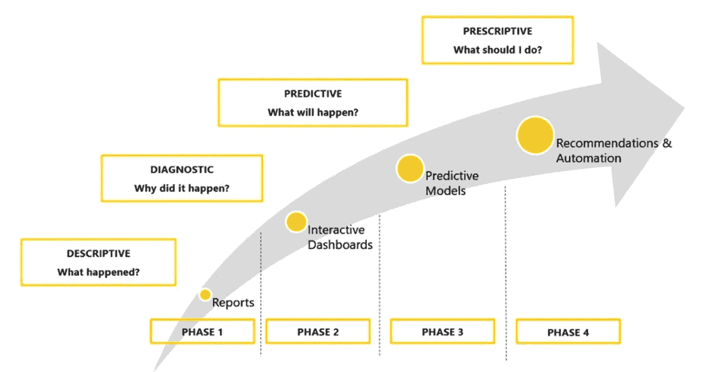

# 您处于分析成熟度曲线的哪个阶段？

> 原文：<https://medium.datadriveninvestor.com/where-are-you-on-the-business-intelligence-maturity-curve-ec0d424ec894?source=collection_archive---------10----------------------->

如果你想了解数据分析的威力，只需看看我们成千上万的人现在戴着的用于跟踪步伐和体育锻炼的健身手环就行了。

这些追踪器中的传感器，甚至是我们一天中大部分时间都随身携带的智能手机，都提供了一系列数据点，这些数据点被转换成指标，我们可以随着时间的推移跟踪这些指标，以监控我们的睡眠、体重、心率，并确定我们的活跃程度。

Fitbit 等公司的许多服务更进一步，将你的习惯和生活方式与类似体重、年龄和活动的人进行比较，让你了解你的健康状况与你的同龄人相比如何。许多匿名数据也被医疗行业用来追踪健康模式和寻找疾病的治疗方法。

# 日常生活中的分析

现在，健身追踪器走得更远，像 Apple Watch 这样的产品可以让你触摸数字表冠来进行心电图检查，以检查你的心律是否不规则。苹果的健康记录应用程序现在也允许在 iPhone 上访问患者的记录，包括来自多个提供商的诊断、处方和过去的测试结果。

下一步是巨大的飞跃——将健康跟踪数据与患者的记录相结合，并使用人工智能(AI)来预测未来的疾病风险，并建议治疗方法以保持患者健康。这是卫生部门即将到来的游戏规则改变者，个性化医疗的时代，它将对初级保健到医疗保险产生影响。

 [## 2020 年最佳短期投资选择精选资源|数据驱动型投资者

### 投资是增加你净财富的一个好方法。如果你通过遵循一个严格的…

www.datadriveninvestor.com](https://www.datadriveninvestor.com/2020/03/28/handpicked-resources-for-the-best-short-term-investment-options-of-2020/) 

每个行业，从金融服务和零售，到娱乐，再到政府，都在这个旅程中，因为它们从简单的商业智能提供当前的状态，到智能分析应用程序帮助预测未来。

将人工智能能力融入商业智能和数据分析正在改变企业，早期采用者比竞争对手获得了宝贵的优势。如果你不考虑自己的企业在使用数据方面是如何发展的，你可能会在一个越来越数据驱动的世界中挣扎。

# 分析成熟度曲线

弄清楚你目前在商业智能(BI)成熟度曲线上的位置是一个非常有用的练习。我们可以将这一旅程描述为四个不同的阶段，我在曲线的每个点都与组织合作。

**第 1 阶段**代表分析前环境，在该环境中，组织内的大多数人不使用分析，除了具有一些基本报告的电子表格。用户可以访问一些信息，并在事后看事情来描述发生了什么。整个企业中可能有一小部分人对分析感兴趣，但没有真正的支持。这种文化仍然不是数据驱动的，决策是基于直觉而不是事实。

**阶段 2** 是组织采取洞察驱动的方法并以诊断模式工作的阶段。作为这一阶段的结果，用户可以评估过去和现在的数据，对数据进行切片和切块，向数据提出问题，如他们的业务中正在发生什么，为什么会发生，有多少，多少，我们的表现如何等。

**第三阶段**转向前瞻驱动的方法，企业用户开始使用机器学习和预测模型来预测将会发生什么。例如，在预测模型的帮助下，组织可以预测他们的哪些客户可能会流失，并使用纠正措施来防止它，或预测欺诈，或为客户建议下一个最佳行动；用例是无限的。

**阶段 4** 是规定阶段，通常被称为“分析的圣杯”。大多数组织都在朝着这种状态努力。这是一个高度成熟的阶段，基于建议、自动化和模拟算法，提供关于可能结果的建议，并向用户推荐他们应该做什么，例如，预测哪些产品将经历最大的增长以获得有价值的客户资料，证明在营销和产品开发方面的投资是合理的，等等。

当轮子上的三个不同的齿轮——人、过程和技术——同步工作时，上面的成熟度模型工作得最好。通常，技术是容易的部分；需要踏上旅程的是人。随着分析变得越来越自助化和民主化，以及云的出现，敏捷方法变得越来越普遍，帮助用户更快地实现项目的商业价值。

当我们到达阶段 4 时，我们看到组织真正开始释放他们的潜力。人工智能与商业智能的融合是未来几年推动公司和行业生产力和竞争力的大趋势。

但是每个旅程都是从第一步开始的。所以，继续吧，找一个业务问题来回答，召集一群人，利用一些易于使用的 BI 工具从小处着手。

别想了，开始吧！