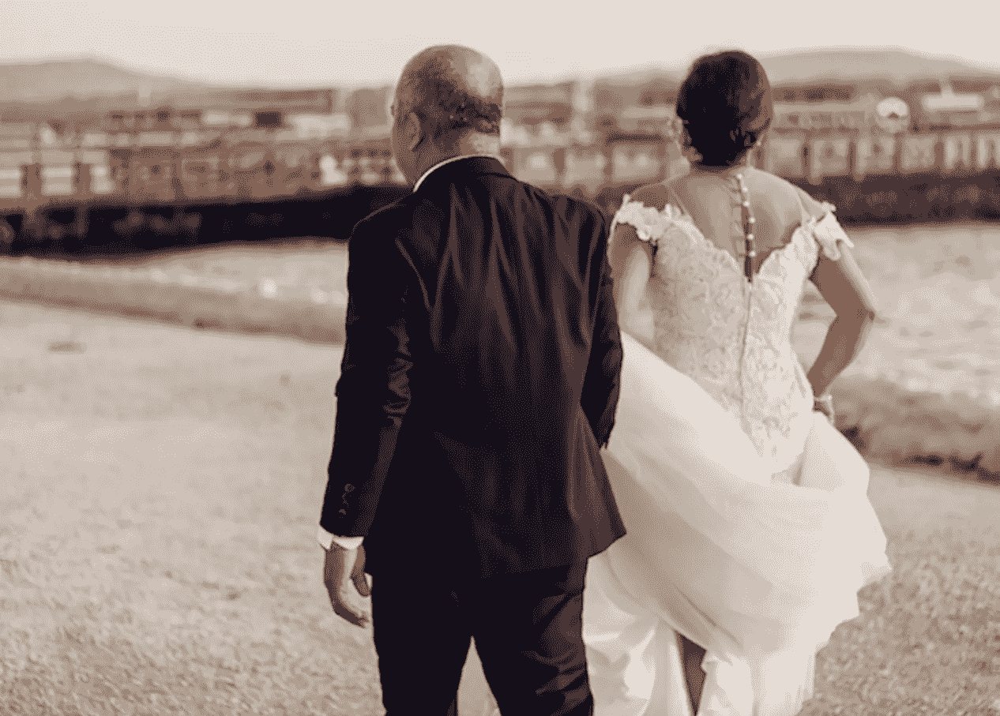

# 棒棒糖演奏的地方。

> 原文：<https://medium.datadriveninvestor.com/where-bon-bons-play-611a76da9940?source=collection_archive---------16----------------------->

## 罗伯特·科马克的短篇小说。

Photo by [Ralph Labay](https://unsplash.com/@ralphlby?utm_source=unsplash&utm_medium=referral&utm_content=creditCopyText) on [Unsplash](https://unsplash.com/s/photos/odd-couples?utm_source=unsplash&utm_medium=referral&utm_content=creditCopyText)

当一个男人为他的妻子打开车门时，要么是一辆新车，要么是一个新妻子菲利普王子

几周前有东西寄到了。我以为这是父亲寄来的生日卡——但更糟糕的是。他发来了一份来自*格鲁吉亚三角房地产委员会的清单。一间小屋被用红笔圈了起来。它看起来像我们家的老房子，只是我们的小屋没有石头壁炉。我马上就注意到了。我以为我父亲也会，因为他建了这个地方。那他为什么给我发这个清单？为什么他在下面用红色大字写道:“*你在我们眼皮底下出卖了它*！”*

我应该后退一点。我父母退休时，我从他们那里买了这栋别墅。我问他们想要什么，他们告诉了我。五年后，一个在多伦多买房子的机会出现了。卖掉小屋是筹集资金的唯一方法。我在继续之前咨询了我的父母。他们都同意这是唯一的办法。

次年，母亲去世。过了一段合理的时间，我父亲又开始约会，然后再婚。她叫梅根。换句话说，他一直很忙，除了几张明信片，我们没有保持联系。然后发生了这件事——我指的是小屋。我应该打电话给我父亲，告诉他他找错地方了。这会避免我现在要告诉你的故事。我想一切都是有联系的。我不知道是怎么回事，但确实如此。

> 我发现梅根站在前门旁边。没有人陪她走过红毯。她的家人不同意她嫁给年龄比她大一倍的人。

我父亲和梅根现在住在汉诺威。我最后一次见到他们是在他们的婚礼上。当我到达时，所有的客人都在里面。我发现梅根站在前门旁边。没有人陪她走过红毯。她的家人不同意她嫁给年龄比她大一倍的人。

所以我陪她走过红毯。一周后，我收到他们度蜜月的希尔顿黑德酒店寄来的明信片:

*儿，*

在过去的一周里，我有时间考虑一些事情。首先，我很感激你在婚礼上所做的。你想得很周到，但坦率地说，为时已晚。你妈妈快死的时候，我给你打了很多电话。你可以不被要求就自己下来。这是一件苦差事吗？我希望我快死的时候你能更体贴一点。你老人家

最困扰我的是家务这个词。我把信给我的未婚夫斯蒂芬妮看了。她用手指夹着它，把她的长发向后推。

“哇，”她说，把脚蜷在沙发上。

> 我永远也不会知道这是怎么回事。我总是在那里，总是有空。

我告诉了她我母亲的死讯。这是一种长期的疾病。我曾经日夜接到电话。他们住在汉密尔顿以西，大约一小时路程。“她要走了，”我父亲会说。我想跑下去，但她还在坚持。她坚持了六个月。我永远也不会知道这和音乐有什么关系。我总是在那里，总是有空。

“那你父亲是怎么认识梅根的？”斯蒂芬妮问道。

“她参加了我母亲的葬礼，”我说。"格里塔是她的姨妈。"

“格里塔是？”

“我妈妈最好的朋友。”

“你爸爸娶了你妈妈最好朋友的侄女？”

“是啊。”

"格里塔参加婚礼了吗？"

“不，”我说。“她不再和我父亲说话了。”

“不知道为什么，”斯蒂芬妮说。她手里翻着我父亲的信，也许在寻找背面的什么，也许是道歉。

> 让她陷入疯狂还为时过早。“从那以后，你没有和你父亲说过话？”她问。

“这期间我在哪里？”她问。我告诉她我们那时才开始约会。太快了。“从那以后，你没有和你父亲说过话？”她问。

“告诉他什么？”

“首先是小屋，”她说。

她在看我父亲寄来的清单，地段大小，面积。斯蒂芬妮正在办理她的房地产执照。“这个地方要大得多，”她说。“你真的应该和他谈谈。”

“他们还在安顿下来，”我说。

“听起来你在躲着他。”

几天后的晚上，我们正在吃晚饭，这时电话响了。斯蒂芬妮查看了来电显示。“说曹操，曹操到，”她说。她把电话递给了我。我一接电话，父亲就开始说话。

“所以你回家了，”他说。"我想我会得到你的那台机器。"

“我们一直很忙，”我说。

“忙得没时间给你老头子打电话？“我们”是什么意思？”

“我订婚了。”

“我甚至不知道你在约会。她有名字吗？”

“斯蒂芬妮，”我说。

"我能见到我未来的儿媳妇吗？"

"这是我们的第一次机会"

"你和斯蒂芬妮周六打算做什么？"

“周六？”我说，看着斯蒂芬妮。

她正在清洗她的老花镜。

“他要我们带什么？”她问。

“你要我们带什么？”我问他。

“只有你们自己，”他说。

> 斯蒂芬妮开着窗户坐着，头发像海鸥一样上下飘动。她一度伸手握住我的手。

那个星期六的早上，我们上路了，开车经过一片新绿的田野，阳光明媚，远处飘着小朵的云。白色的海鸥在拖拉机后面时隐时现。斯蒂芬妮开着窗户坐着，头发像海鸥一样上下飘动。她一度伸手握住我的手。

"今天别让他找到你，好吗？"她说。

我告诉她我会尽力而为。

“我们找一家面包店吧，”她说。“他们喜欢蓝莓派吗？”

“我父亲有。我不知道梅根。”

我们在一个小型露天市场停下来，买了一个蓝莓派。天还是热的。斯蒂芬妮把它放在腿上，双手交叉放在上面。十分钟后，我们开车穿过汉诺威市中心。我父亲告诉我房子在克拉克街附近。他不是很清楚。我们最终找到了。这是一个小平房，有一个车库，由一条有盖的走道连接着。车库的门开着。我父亲把我母亲的画挂在那里的墙上。他站在一个小活梯上。

梅根从房子的侧门出现。

“我的上帝，”斯蒂芬妮说，“她比你年轻。”

> 我的父亲走过来，站在她身边，银色的头发，Kortron 裤子，双光眼镜在一根绳子上。

梅根穿着短裤、短袜和运动鞋站在那里。她的头发被剪成了小跟班。她没有化妆。我的父亲走过来，站在她身边，银色的头发，Kortron 裤子，双光眼镜在一根绳子上。

我们下了车，走向他们。

“这么说你是我的意中人，”父亲对斯蒂芬妮说。“这是我的新娘，梅根。我的生命之光。”

“很高兴见到你，”斯蒂芬妮说。“我们带了馅饼。”

她把它递给了梅根。

“谢谢，”梅根说。“还是暖的。”

他们带我们参观了房子，给我们看了每个房间。其中一间空房里有一张艺术桌，上面放着各种各样的钢笔和刷子。这是梅根的工作室。布告栏上贴着漫画和卡通。在她的学生台灯上方，有一个画着一只带着婴儿的鹳鸟。

标题说，一个婴儿？给我的？

斯蒂芬妮轻轻推了我一下。我轻轻推了推她的背。

在外面的餐厅里，桌子上摆放着精美的瓷器。“我们现在几乎不用这种东西了，”我父亲说。“梅根，这一带的游客不多，是吗？我们陪伴自己。”

> “我们家有几个艺术家，不是吗，孩子？他告诉你他妈妈是个艺术家了吗，斯蒂芬妮？也很棒。外面那些画都是她的。”

梅根去把砂锅从烤箱里拿出来。她把它拿到桌子上，放在我父亲面前。她一坐下，我父亲就开始讲述她的漫画。“她是个天才，我会告诉全世界，”他说。“我们家有几个艺术家，不是吗，孩子？他告诉你他妈妈是个艺术家了吗，斯蒂芬妮？也很棒。外面那些画都是她的。”

“我没怎么看，”斯蒂芬妮说。

“我们一会儿出去，”他说。"梅根现在是我的艺术家了，是吗，梅根？"

梅根告诉他，他们只是愚蠢的漫画。

“他们对我来说足够好了，”他说。“梅根也模仿别人。做你的秀兰·邓波儿，亲爱的，这是我最喜欢的。”

“他们不想听到这些，”她说。

“他们当然知道。”

“这只是我做的一件有趣的事，”她向我们解释道。

"你想听她的秀兰·邓波儿吗，斯蒂芬妮？"我父亲问。

“如果梅根愿意，”斯蒂芬妮回答道。

“真的，没什么大不了的，”梅根说。

“这当然是件大事，”他说。

“我们先吃饭吧，”她说。

我们吃了砂锅菜，然后我父亲又想起了那些印象。“说吧，梅根，”他说。“我们在这里都是一家人。否则一旦桑尼男孩把斯蒂芬妮变成了一个诚实的女人，我们就成了。”

“我先洗碗，”梅根说。

“我能帮上忙吗？”斯蒂芬妮说。

“我很好，”梅根回答。

> 几分钟后，梅根带着这种睁大眼睛的表情从摆动的门回来了。她双手放在背后行屈膝礼。

她把盘子拿到了厨房。我们听到它们在水槽里发出哗啦声，然后是水流声。几分钟后，梅根带着这种睁大眼睛的表情从摆动的门回来了。她双手放在背后行屈膝礼。

“今天我很高兴来到这里，”她说。“你们真是太好了。”

然后她开始用小女孩的声音唱歌:

在好船上，去糖果店
是一次甜蜜的旅行，在薄荷湾阳光明媚的海滩上玩棒棒糖

“我怎么跟你说的？”我父亲笑了。

梅根又行了一个屈膝礼。

“我不太好，”梅根说。

“我认为你是，”我父亲说。“你觉得呢，斯蒂芬妮？”

“非常可爱，”斯蒂芬妮说。

“我现在闭嘴，”梅根说。

她开始坐下，然后突然又站了起来。

“我忘了派，”她说。“每个人都想吃冰淇淋吗？”

“他们当然知道，”我父亲说。“谁不喜欢冰淇淋？”

我们吃了馅饼和冰淇淋，然后把咖啡带到客厅。地毯上有几盒照片。梅根盘腿坐在他们旁边。

“梅根保存了我们所有的旧照片，”父亲对我说。“她是一名正式的档案员。梅根甚至在封面上放了日期。”

“你想看一些图片吗？”梅根问。

“他们当然知道，”我父亲说。

梅根打开一个盒子，拿出其中一本相册。

> 他指着我小时候的照片。我的父母给了我一个巧克力布丁胡子。

“坐在我旁边，斯蒂芬妮，”我父亲说。“让我们看看我们有什么你想要的。”他打开相册。“给你。”他指着我小时候的照片。我的父母给了我一个巧克力布丁胡子。

然后他翻了一页。

“这是他的母亲，”他说。“那是他长得帅的地方。”

他不停地翻动书页，直到翻到其中一页。

“那是我们过去避暑的地方，”他说。“从零开始建造。你收到我发给你的清单了吗？”他问我。“三十万。他们现在问的就是这个。他告诉你了吗，斯蒂芬妮？带我们去唱歌。”

他向她眨眼。我放下咖啡杯。

“你告诉她你付出了什么？”他说。

“我付了你要的钱，”我说。

“在猪的耳朵里，”他转向斯蒂芬妮说。“七万，斯蒂芬妮。从我们眼皮底下偷走了它。如果它值一便士的话，它就值 150 英镑。他是做什么的？再卖一罐。”

“我没有把它卖了，”我说。

“也许我们应该看看其他的照片，”梅根说。

“七万，”我父亲继续说道。“当你连自己的儿子都不相信的时候，这个世界会变成什么样子，嗯？希望他对你好一点，斯蒂芬妮。”他又向她眨了眨眼。“不像他家老头子，这是肯定的。”

梅根把手放在我父亲的腿上。

“什么？”他问。

> “去吗？”我父亲说。“你刚到。”

我看了看手表。

“我们该走了，”我对斯蒂芬妮说。

“去吗？”我父亲说。“你刚到。”

“斯蒂芬妮正在准备她的房地产考试，”我说。

“你还没看过我们蜜月时的照片呢，”父亲回答道。

“我们改天再来。”

斯蒂芬妮和我站了起来。

“这顿午餐太棒了，”她对梅根说。

“谢谢你大老远跑来，”梅根说。

斯蒂芬妮说:“我们开车不够多。”

“随时欢迎你，斯蒂芬妮，”我父亲说。"即使你不在这里和傻瓜在一起."

他们跟着我们来到有顶棚的走道。

“让我们知道你的婚礼什么时候举行，”我父亲说。“不要离开太久。你知道，我不再年轻了。”

我们上了车，倒车出了车道。我父亲和梅根站在台阶上，他搂着她的腰。他们挥手了。

> “没那么糟，”她说，但之后我们就沉默了。

回家的路上，斯蒂芬妮拉着我的手。我们开车经过同样的田野，同样的山谷。它们现在看起来不那么绿了。

“没那么糟，”她说，但之后我们就沉默了。

那天晚上在床上，在关灯之前，斯蒂芬妮问:“bon-bon 到底是什么？”

“一颗糖，”我说。

“我从来没有过。

“你没有错过太多。”

“你要打电话感谢他们吗？”

“我们感谢他们，”我说。

“你总是发个短信或者打个电话。”

“明天我去办张卡什么的。”

“别忘了。”

一周后，一个包裹到了。里面是一本相册，并附有一封信:

*儿子:*

*谢谢你周六能来。你在的时候我应该给你这个。我想我的头脑已经不如从前了。幸运的是，梅根的所有官能都完好无损。那个女孩是个天使。我真的很幸运。不管怎样，我想你和斯蒂芬妮会想保留这张专辑。给你的孩子看的东西——如果你愿意的话。你老人家*

我们翻页时，一幅漫画掉了出来。照片上我父亲和梅根站在一艘船上。桅杆是一个冰淇淋蛋卷。在顶端，写着:*穿越薄荷湾*。

> 甲板上有一个婴儿篮子，上面有一个粉红色的大蝴蝶结。

我父亲在下面写了些东西:

看来我们都很幸运，小家伙。斯蒂芬妮会成为一个漂亮的母亲——如果梅根不抢先一步的话！

甲板上有一个婴儿篮子，上面有一个粉红色的大蝴蝶结。

“他是认真的吗？”斯蒂芬妮说。

"他在戏弄我们。"

“你确定？”

"这个人 70 多岁了。"

"嗯，她不是。"

“他在虚张声势。”

但是我们一直看着那个带着粉红色蝴蝶结的婴儿篮子，我父亲在船尾向我们挥手。他咧着嘴笑，一种夸张的笑。

好像一切都已经决定了。

也许是的。那笑容似乎越来越大。

罗伯特·科马克是讽刺作家、小说家和博客作者。他的第一部小说[“你可以把马牵到水边(但你不能让它潜水)”](http://robertcormack.net/)在网上和大多数主要书店都有售。查看[天马出版社](http://skyhorsepublishing.com/)或[西蒙和舒斯特](http://simonandschuster.ca/)了解更多细节。

