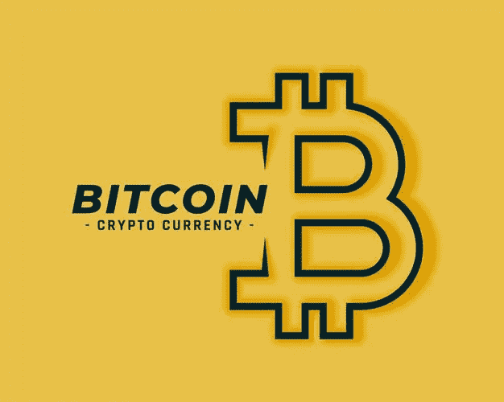

# 第一枚比特币从何而来？

> 原文：<https://medium.datadriveninvestor.com/where-did-the-first-bitcoin-come-from-74384df2afa?source=collection_archive---------0----------------------->

Bitcoin cryptocurrency

围绕这一新技术的意识和媒体每年都在持续增长。加密货币和比特币已经存在了 10 年，而且还在不断增加，但我们大多数人对它了解多少呢？

**问题很多；**

*这一切是如何开始的？*

*最早的人是如何得到比特币的？*

*他们是如何储存比特币的？*

*怎么变成今天这个样子？*

下面回答的问题；

# **获得第一枚比特币**

> 用户可以通过网络转移比特币，主要是互联网，但也可以使用其他网络。电脑、手机和平板电脑都可以运行比特币操作协议，因此访问-掌握比特币非常容易

一开始，没有加密交换网站、移动应用程序或交易场所，也没有容易获取比特币等加密货币的地方。从那以后，在这 10 年里，有了很大的发展。但是是谁开始的呢？

比特币网络是由一个不知名的人用中本聪这个名字创建的。没有人知道这是谁，即使每年都有更多的人站出来声称自己是著名的创造者。

从比特币的最初发行开始，该系统就遵循着与最初发行时相同的原则。这些都没有改变。

要获得比特币，用户必须要么；

1.  安排与其他人进行比特币交易
2.  挖掘它

在加密交易之前安排交易需要使用在线论坛、拍卖或寻找买家。价格将被决定或设置为很少或没有价值。在 2009/2010 年期间，有确切显示这些交易的记录；

> 2010 年 3 月，用户 SmokeTooMuch 以 50 美元的价格拍卖了 1 万 BTC。但是没有找到买家。— *比特币和数字货币如何挑战全球经济秩序*。纽约:圣马丁出版社。第 79 页。

在比特币最开始的时候，人们会交换比特币，或者出于好玩而赠送比特币，以测试系统并了解系统的工作原理。

有人甚至在 2010 年点了一份 1 万比特币的披萨。

很神奇吧？

**相关文章** : [区块链到底是什么？100 字以内的答案](/what-exactly-is-the-blockchain-100-words-or-fewer-answers-e308e2fbda86)

# 人们最初是怎么得到比特币的？

**采矿**

对于比特币来说，产生更多的唯一方法是挖掘它们。比特币协议要求计算机在网络上处理比特币交易时找到数学问题的解决方案。比特币网络上的任何人都可以利用自己的计算能力，帮助验证和记录系统中的交易。为了帮助这一点，系统通过给他们全新的比特币来奖励这些用户。然后将其添加到网络上可用的全部比特币中。

矿工充当中间人，处理网络上的所有交易，包括比特币的转账和一般会计。显示用户 A 已经给用户 b 发送了比特币，系统和程序通过一个名为 mining 的奖励系统来执行这项工作。

> 比特币的创造者中本聪是第一个矿工。收取 50 BTC 的帮助运行网络。

如前所述，一开始，许多人使用该系统来测试和了解它是如何工作的，这导致更多的比特币被挖掘出来，并被释放到市场上。随着时间的推移，人数增加了，并且随着现在全世界采矿的人的增加而继续增加。产生越来越多的比特币，直到所有的比特币都进入市场。

# 最初人们是如何存储比特币的？

在最初的几年里，程序和用户界面都是基于在你自己的计算机上直接运行协议。最初，有两个程序可用；

1.  比特币 GUI
2.  Bitcoind

这两个程序都直接允许用户操作比特币协议内部的全部功能。它们包括:

1.  区块链交易
2.  交易交易所
3.  钱包服务

用户将能够看到系统中的所有交易，以及直接访问他们的钱包，他们将完全维护自己。每个人都完全管理自己的钱包，包括文件存储和私钥。

曾经有过一些用户扔掉电脑的故事，比特币文件中存储了几千个比特币。没有这些文件，就无法恢复。

# 比特币是怎么走到今天的？

多年来，采用和开发已经使这项技术从它卑微的开端中脱颖而出。最初，比特币是一个主要在个人电脑上运行的笨重软件，需要大量的努力，并且用户系统非常不友好。

2021 年，数百万用户已经使用并帮助开发了比特币和区块链的整个生态系统。我们有神奇的移动设备，可以在应用程序中展示比特币，还有更简单的工具来访问、转移和存储我们的资产，正在进行的开发来自世界各地。如果我们丢失了手机上的 BTC 钱包应用程序，我们仍然可以恢复存储中的资产，使用我们的私钥和短语重新进入我们的帐户。平板电脑、手机和电脑的使用极大地增加了这项技术发展至今的原因。

我们希望这些信息能有所帮助，我们强烈推荐阅读《掌握比特币》以及所有其他围绕区块链和加密货币的书籍。

请记住，知识就是力量，在这个数字时代，领先于新技术只会是一件好事。

图片鸣谢:[https://www.freepik.com/vectors/technology'](https://www.freepik.com/vectors/technology')>星线打造的科技向量——[www.freepik.com](http://www.freepik.com)