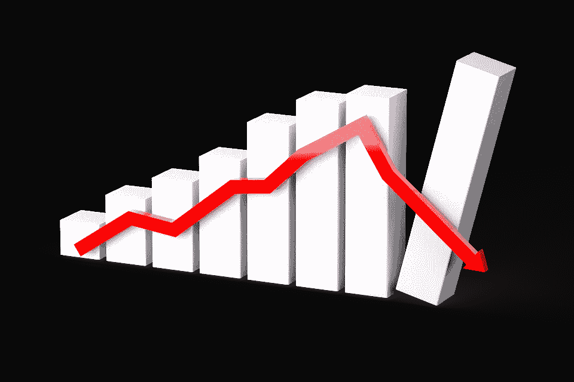
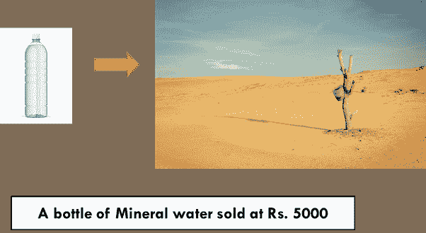
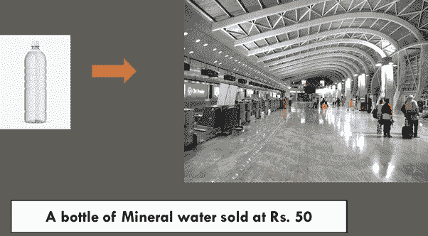
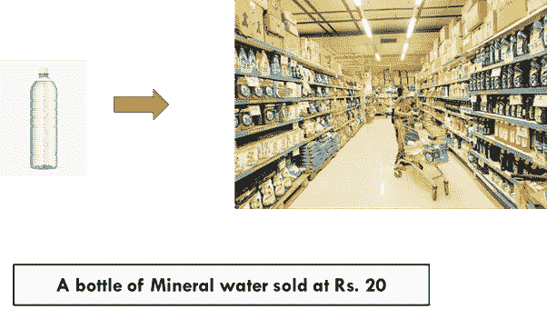
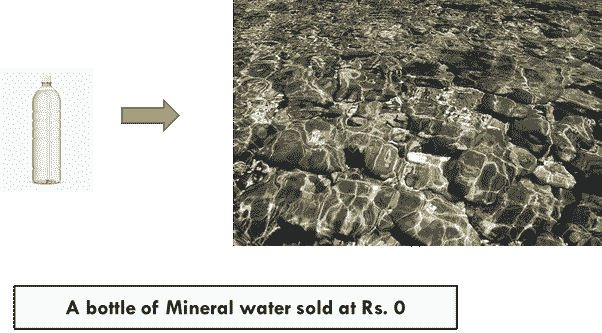
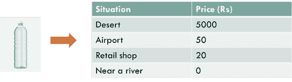

# 股市崩盘时，你的钱去了哪里？

> 原文：<https://medium.datadriveninvestor.com/where-does-your-money-go-when-stock-market-collapses-55af906348e4?source=collection_archive---------2----------------------->

## 为外行解码。

你有没有想过在股市崩盘时，你的钱消失在哪里？或者当股价下跌时，谁会得到这笔钱？

Image source: [pixabay](https://pixabay.com/illustrations/graph-diagram-recession-3078540/)

让我们找出这里的一切。

首先，让我们了解一些基本的东西。

任何东西的“价格”实际上更多的是一种感知。是的，你没看错，商品的“价格”受感兴趣的人对它的看法的影响。

让我用这四个案例来解释一下，

**1】沙漠中的瓶装矿泉水:**

在一个寸草不生的沙漠里，除了沙子什么都没有，一滴水也没有，你会花多少钱买一瓶瓶装矿泉水？卢比 50?卢比 500?或者甚至可以是 Rs。5000!所以，这里的价格是说卢比。5000.

**2】机场的瓶装矿泉水:**

在机场，所有东西都以高价出售。一个普通的矿泉水瓶很容易就可以卖到卢比的价格。这里 50。所以，这里的价格是 50 卢比

**3】从正规零售商处购买的瓶装矿泉水:**

同样一瓶矿泉水很容易在卢比买到。从零售店买 20 块。所以，这里的价格是卢比。20.

**4】河边的瓶装矿:**

如果你试图在河边卖一个矿泉水瓶子，那里的水像这样干净，可以饮用，你甚至不会有一个顾客。当你有这么多免费的水时，花钱买水是没有意义的。所以，这里的价格是 0 卢比。

你看，在所有这四种情况下，我们都在试图评估同一种东西的价格:**‘一瓶瓶装矿泉水’。**

来自 Rs。5000 卢比跌到了。50 然后到 Rs。20 和最后的 Rs。0.在所有的情况下，瓶子从未改变，但价格确实随着因素和环境的变化而变化。

 [## 利用股市相关性的最佳方式|数据驱动的投资者

### 当阿尔弗雷德·温斯洛·琼斯开创了世界上第一个“对冲”基金(后来“d”被去掉了)时，他让其他投资者大吃一惊…

www.datadriveninvestor.com](https://www.datadriveninvestor.com/2020/02/02/the-best-way-to-use-stock-market-correlations/) 

如果我问你，如果价格从卢比下跌，钱去了哪里。5000 卢比。50?或者来自 Rs。50 卢比。20?或者来自 Rs。20 卢比。0?

这个问题的答案是它没有去任何地方。只是由于周围的因素，人们对价格的看法发生了变化。因此，价格波动在这里只是一个概念，因为基础商品是一样的:瓶装矿泉水。

所以，总结起来我们可以说:

1.  如果我们改变影响商品“需求”和“供给”的因素，商品的价格就会发生变化。
2.  价格波动是名义上的。简而言之，人们在不同的情况下以不同的方式感知同样的商品，因此价格必然会变化。没有人会损失一分钱，除非有人真的以更高的价格买入，以更低的价格卖出。

如果股市崩盘，也会发生同样的情况。

例如，几天前 ABC 公司的股票交易价格为 400 卢比。很少有进展将股价拉低到 200 卢比以下。现在你看，如果我以 400 卢比的价格持有一股 ABC 公司的股票，现在价格是 200 卢比，那么我不会亏钱，除非我在恐慌中卖掉股票，并实际上记录损失。

价格只是这里的一个概念。原以为 ABC 公司价值 400 卢比的人，几天后给了它 200 卢比的价值。这是因为 ABC 公司的因素发生了变化，就像我们把它从沙漠变成零售店时一瓶矿泉水的因素发生了变化一样。

事情就是这样。人们对股票的看法每天、每分钟、甚至每秒都在变化，这让我感到惊讶！

同样的故事也适用于你所居住的房子的价值。比方说，今天你住的房子的市场价值是卢比。30 万卢比。由于一些新的发展，比如说在你的房子前面修建一条新的道路，你的房子的价格已经上升到卢比。50 万卢比。

现在，你只是名义上通过 200 万卢比变得富有。因此，只有当我们出售房屋并通过以 500 万卢比的价格出售房屋来兑现机会时，价格波动才会有影响。

**访问专家视图—** [**订阅 DDI 英特尔**](https://datadriveninvestor.com/ddi-intel)