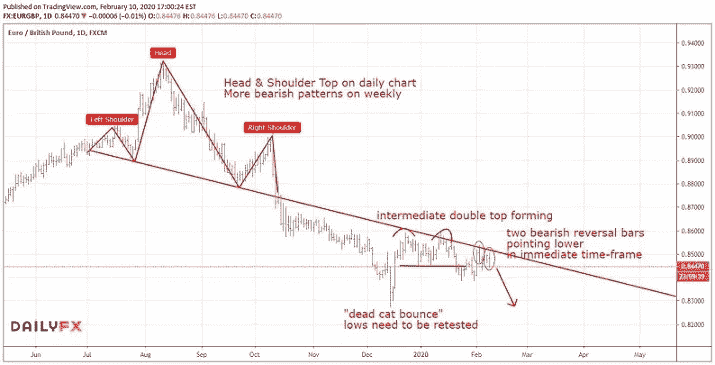

# 欧元下一步将走向何方？

> 原文：<https://medium.datadriveninvestor.com/where-is-eurgbp-headed-next-dcff398cdd33?source=collection_archive---------19----------------------->

**本周一周交易:*做空欧元英镑***

在上周的本周交易中，我分享了我对 GBPUSD 潜在机会的想法和图表分析。最后，我们没有看到这对组合突破前一周的高点(这是我的进场点)，所以这笔交易没有被触发。

事实上，美元看起来再次准备测试其最近的高点，并继续其长期牛市…暂时如此。虽然我预计美元将在短期内走高，但我不认为这种情况会持续下去，因为它会遇到严重的长期阻力区，而在历史上，美元很难取得进展。如果我们开始看到美元在这些点再次转向的迹象，这可能会创造一个巨大的风险/回报机会。

 [## 总部位于瑞士的 ETP 进入加密交易市场|数据驱动的投资者

### 虽然金融市场几乎没有沉闷的时刻，特别是在引入…

www.datadriveninvestor.com](https://www.datadriveninvestor.com/2019/03/10/swiss-based-etp-enters-the-crypto-trading-market/) 

一如既往，我会努力通过这个博客让你知道我的想法。

然而，现在我看到了英镑的一个不同的机会——这次是兑欧元。

在长期图表中，这对货币看起来非常悲观(不利于欧元兑英镑)，我预计这对货币会大幅下跌。最近的趋势也更低，我们在下面的图表中看到几个模式，为这种情况的继续指明了方向。此外，近期的价格走势表明，短期内价格将进一步走低。

因此，我会在任何低于近期低点的价位做空。

*你想学习如何从市场中持续获利吗？* [*点击此处*](https://mangrovetrading.krtra.com/c/PSHU6tx5FCrK/kOJV) *，我们将通过一系列免费培训视频带您一步步了解我们的整个交易策略。*

*—*

请注意，一如既往，这不是投资建议，您应该在做出任何投资决定之前咨询您的财务顾问。我不是财务顾问，提供这些信息只是为了提供信息和教育目的。