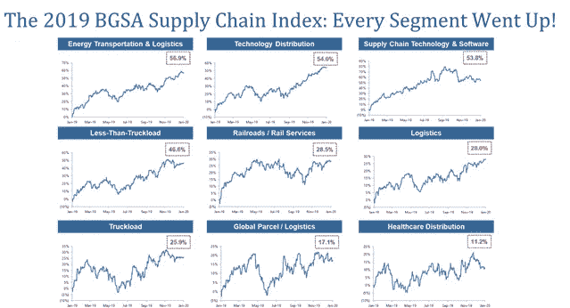
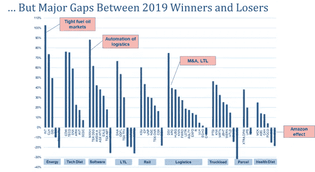
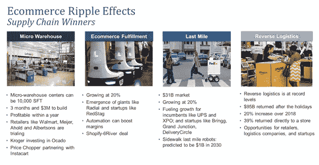

# 物流何去何从？

> 原文：<https://medium.datadriveninvestor.com/where-is-logistics-headed-6918f7967e08?source=collection_archive---------4----------------------->

## 首席执行官在棕榈滩 BGSA 供应链会议上的重要见解

*BGSA’s Benjamin Gordon speaks with over 200 logistics CEOs at BGSA Supply Chain 2020*

任何人都称之为物流界的“T2 达沃斯”每年 1 月，200 多名供应链首席执行官都会来到棕榈滩，在一个只有受邀者才能参加的活动上讨论战略和交易。14 年来， [BGSA 供应链大会](http://www.bgsaconference.com)一直是最优秀和最聪明的人汇聚的地方。该活动不接受媒体采访，这使得首席执行官们可以非常坦率地发表讲话。

那么今年我们学到了什么？

让我们从金融市场开始吧。正如[本杰明·格拉哈姆所说](https://news.morningstar.com/classroom2/course.asp?docId=142901&page=7)，“从短期来看，市场是一台投票机，但从长期来看，它是一台称重机。

 [## 物联网解决方案如何改变供应链中的机遇|数据驱动型投资者

### 物联网(IoT)可能开始时规模很小，但它正在成为世界经济中的一个重要因素。事实上…

www.datadriveninvestor.com](https://www.datadriveninvestor.com/2018/11/14/how-iot-solutions-are-shifting-opportunities-in-the-supply-chain/) 

2019 年是供应链公共市场的胜利之年。事实上， [BGSA 供应链指数](https://bgstrategicadvisors.com/)在 2019 年增长了 26%，该指数跟踪了该行业所有领域的 9 个细分市场和 63 家公司。此外，所有九个部分都产生了正回报。

Source: BGSA Holdings

也就是说，赢家和输家之间的差价很大。

某些利基类别，如能源运输，技术分销和供应链软件，飙升 57%，54%和 47%。分别由 World Fuel Services(上涨 103%，因收购 UVAir fuel 而加速)、Tech Data(上涨 76%)和 Manhattan Associates(上涨 88%)领涨。

另一方面，货运衰退打击了卡车运输行业，该行业经历了创纪录的破产，包括 NEMF 和青瓷。该类别仍然表现良好，回报率为 26%，由 PAM 和 Knight-Swift 领涨(分别上涨 46%和 43%)。然而，总数字掩盖了从 2 月到 6 月 30%的下降，以及下半年的复苏，因为市场期待更光明的 2020 年。

同样，包裹部门增长了 17%。联邦快递从 1 月到 4 月增长了 16%，然后下降了 20%，主要是因为“有意识地与亚马逊脱钩”。

事实上，如下所述，个人赢家和输家之间的差距是惊人的。

Source: BGSA Holdings

展望未来，在新的一年里我们应该期待看到什么？

一方面，许多分析师注意到地平线上的乌云。这里有九个特别的例子。它们包括:

*   市场价格是否过高？上市公司的 BGSA 指数达到创纪录的 12.4 倍息税折旧及摊销前利润。这一水平是可持续的，还是我们即将面临暴跌？
*   **我们正面临经济衰退吗？经过创纪录的 10 年扩张后，经济学家预测 2020 年出现衰退的可能性为 33%。**
*   **货运衰退怎么办？**卡车运输放缓已经在 2019 年开始。会扩散吗？ACT 和 Cowen 预测北美卡车产量将缩减 35%。会产生什么样的连锁反应？
*   总统选举会造成混乱吗？似乎 2016 年的选举周期从未结束。特朗普弹劾案会如何演变？我们最终会是桑德斯总统、沃伦总统，还是另一种变化？
*   **加税怎么办？**在民主党国会的情况下，2017 年的减税政策有逆转的风险。所有民主党总统候选人都发誓要征收新税。如果伊丽莎白·沃伦、伯尼·桑德斯或乔·拜登入主白宫，我们会看到 6%的沃伦财富税吗？资本利得和普通所得税增加怎么办？我们将如何支付“全民医保”在 10 年内预计将花费的 32 万亿美元？
*   **对华贸易战会升级吗？**美国对中国的出口已经下降了约 200 亿美元，导致 GDP 下降了约 1%。这对货运代理的影响是毁灭性的。这场战争会在 2020 年升级吗
*   **政府监管:** **加州发生的事…** 很少会留在加州。AB5 立法会导致其他州将独立承包商重新归类为雇员吗？这是否会终结目前这种业主经营的卡车运输模式？
*   更多的货运公司破产？ 2019 年是一场“卡车运输大屠杀”超过 800 家航空公司宣布破产，包括 NEMF 和青瓷。超过 24，000 辆卡车因此停运。这比 2018 年增加了近 10 倍，当时有 2800 辆卡车消失。最坏的情况已经过去，还是这场卡车大屠杀会继续下去？
*   **亚马逊会给行业带来什么？**亚马逊主导了 2019 年的新闻周期。无论是扩张到交付 35 亿个自己的包裹，还是与联邦快递(FedEx)在“有意识的解耦”方面进行斗争，还是申请新物流技术的专利，亚马逊都处于物流中断的中心。亚马逊会成为物流第一吗？他们下一个会取代谁？更广泛地说，技术会自动化、取代和颠覆传统的供应链服务公司吗？

尽管有这些阴云，我们对 2020 年持乐观态度。为什么？

首先，我们认为电子商务的增长正在产生连锁反应，推动供应链几个关键领域的增长。电子商务在 2020 年增长了近 20%，超过 6000 亿美元的日常收入。赢家包括微型仓库、电子商务履行公司、最后一英里供应商和逆向物流，如下所述。

Source: BGSA Holdings

其次，一些利基市场能够在这些竞争激烈的市场中蓬勃发展。冷藏就是一个很好的例子。增长缓慢的巨头 Americold 的 EBITDA 估值是如何达到 27 倍的？2008 年的初创公司天堂物流(Lineage Logistics)是如何成长为拥有 20 亿立方英尺的全球最大冷藏仓库公司的？就 Americold 而言，鉴于其房地产所有权和抗周期食品行业的敞口，市场已将它们视为衰退对冲工具。就天堂而言，包括 Emergent Cold(9 亿美元)和 Preferred Freezer(超过 10 亿美元)在内的一系列收购已经将它们的价值推至最高。Lineage 和 Americold 现在共控制了 63%的冷链市场。

第三，科技公司继续蓬勃发展。数百家公司正在供应链技术领域的不同领域寻求增长，包括数字货运管理、物联网和资产跟踪、区块链、最后一英里、无人机、仓库自动化、自动卡车运输、车队管理、分析等。

第四，资本市场继续支持供应链。今天，我们统计了全球物流技术生态系统中的 53 家独角兽，包括滴滴出行、Grab、DoorDash、Rivian、Flexport、护航、优步和许多其他公司。如果在 2010 年向供应链技术投入 300 亿美元，我们相信在 2020 年还会投入 600 亿美元。

也就是说，我们看到少数赢家获得了更大份额的可用资本。例如，在海事技术领域，2019 年是资本投入创纪录的一年。风险投资从 1.9 亿美元增加到 11.44 亿美元。然而，超过 90%的资金被软银投入到了 Flexport 的 10 亿美元投资中。如果排除这笔交易，总融资额实际下降了 24%，至 1.44 亿美元。同样，我们预计 21 世纪 20 年代将是资本从早期创新押注转向后期规模投资的十年。

总之，供应链市场可能竞争异常激烈，但它也比以往任何时候都充满了更多的机会。

航空界有一句话:CAVU。它代表“天花板和能见度不受限制”

当我们看到地平线上的乌云时，物流的未来依然光明。

值得注意的是，在 BGSA 供应链会议上接受调查的首席执行官中，有 60%预计今年的增长将超过 10%。虽然 2020 年可能是充满不确定性的一年，但对于我们行业的许多公司来说，它仍然充满机遇。

我们期待光明的一年！

[本杰明·戈登](http://www.benjamingordon.me)、[剑桥资本](http://www.cambridgecapital.com) CEO，投资物流和科技公司。戈登是公认的行业专家，他建立了四家供应链公司。他还是 [BGSA 控股](http://www.BGstrategicadvisors.com)的创始人、[供应链](http://www.medium.com/supply-chains)的编辑，以及[财富](https://fortune.com/author/benjamin-gordon/)、[供应链大脑](https://www.supplychainbrain.com/authors/7209-benjamin-gordon-scb-contributor)和[数据驱动投资者](https://www.datadriveninvestor.com/author/benjamin-gordon/)的出版作者。在 LinkedIn[和 Twitter](https://www.linkedin.com/in/bengordon18/) 上关注他。