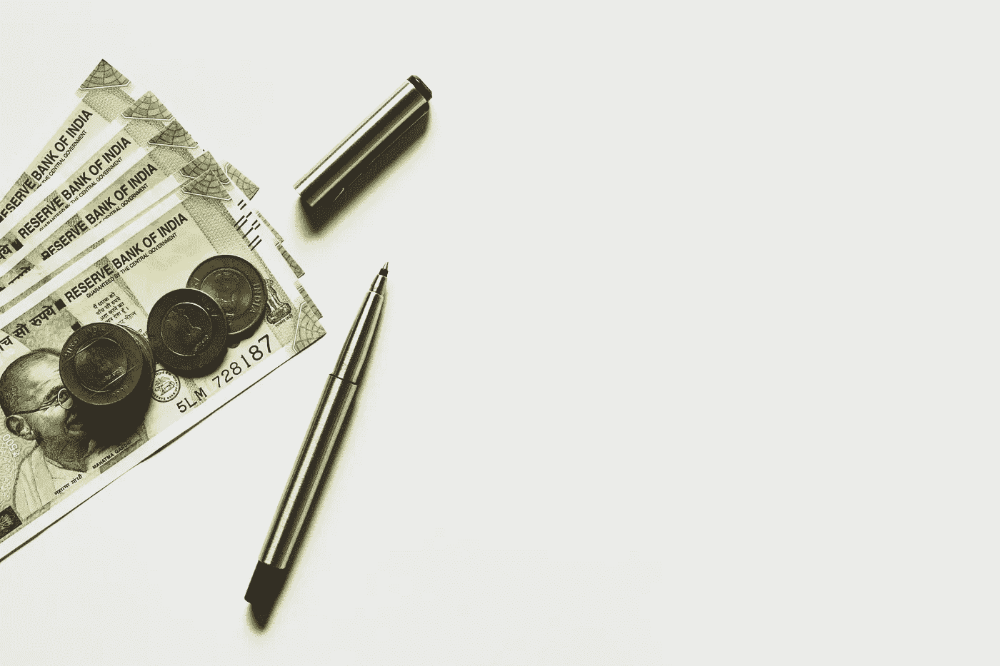

# 应该从哪里开始投资？

> 原文：<https://medium.datadriveninvestor.com/where-should-you-start-to-invest-5feccca85501?source=collection_archive---------28----------------------->

你正在寻找投资的东西吗？你认为最好的主意是投资股票、加密货币还是房地产？你完全错了！

## 如果你真的想开始投资，你需要从投资自己开始！您可以从以下方面着手:

*   发展新技能。提高技能并不总是意味着投资高等教育，尽管这当然是一种选择，也可能是一种必要的选择，取决于你的职业领域。投资于你的知识和技能可以采取多种形式。
*   **学习一门新语言**。通过学习一门新的语言，你将提高你的沟通技巧和理解他人的能力。通过完成国际交易，你将有可能在职业生涯中成长。此外，通过学习一门新语言，你将提高记忆力、解决问题的能力和批判性思维能力，增强注意力，培养一心多用的能力。
*   **阅读书籍或电子书。阅读是投资自己的绝佳方式。这也是一个相对便宜的活动，甚至经常可以不花一分钱。随着 Kindle、iPad 和 Nook 的出现，找到好的阅读材料变得更加容易。经常阅读有巨大的好处。它刺激你的想象力，提高你的词汇量，增加你的一般知识，帮助你放松，让你挖掘伟大思想家的思想，帮助你解决问题，它可以非常有趣。**
*   学习市场如何运作。在投资之前，你应该了解市场是如何运作的，以便为你的未来投资找到最好的交易，并将亏损的风险降到最低。
*   尽可能多地旅行。通过独自旅行，你会创造出惊人的沟通和适应能力，这将有助于你未来的决定。这会给你带来任何金钱都买不到的美好回忆…
*   扩展你的思维。学习新事物并保持思维活跃，即使是以简单的方式，也有助于提高和保持你的思维能力。
*   **关心自己的身体。你的身体就像一台润滑良好的机器。如果你像保养一辆昂贵的汽车一样保养它，它将会有惊人的性能，并且可以使用很长时间。**
*   **戒掉毒友。拥有好朋友是生活的一个重要方面。但是有积极影响的朋友更重要。选择朋友时要有辨别力，摆脱那些消极的、问题重重的、没有动力的、不关心改善自己的朋友。在很大程度上，你是你所处环境的产物，这包括你结交的朋友。找到和你有共同价值观的朋友。**

# 最后的想法

投资于你自己真的会改变你的生活、你的幸福，以及你茁壮成长并尽你所能表现的能力。你对自己、对自己的思想和身体的投资程度，不仅决定了你与外界互动的方式，也反映了你对自己的看法。

 [## 投资区块链前要问的三个简单问题(也是一个困难的问题)|数据…

### 现在是了解区块链的最佳时机。不同货币之间的增长率，比如…

www.datadriveninvestor.com](https://www.datadriveninvestor.com/2020/03/12/three-simple-questions-and-one-difficult-one-to-ask-before-investing-in-a-blockchain/) 

你的未来很大程度上取决于你现在投资自己的意愿和能力。