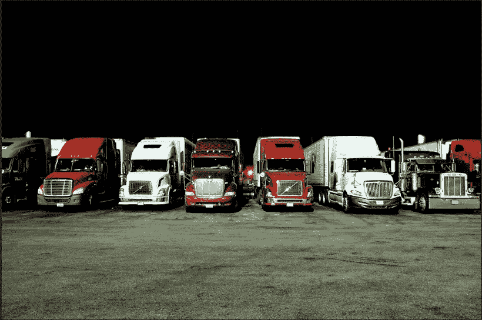

# 我们的卡车司机将何去何从？

> 原文：<https://medium.datadriveninvestor.com/where-will-our-truckers-go-42ec20f1b31f?source=collection_archive---------25----------------------->

在 2016 年选举期间，一位身价远低于 10 亿美元、主要依靠草根支持获得资金的企业家出人意料地获得了民主党提名。我通常对政治不感兴趣，但我对杨安泽的崛起非常着迷——尤其是因为他在一个拥挤的领域比知名民主党人走得更远。我想不通的是:他聪明、平和、热情，有着深思熟虑的想法和与众不同的政策和策略。这是当今政坛的典型污点。我推断，他创造有意义和现实的政策以保护高风险工作免受第四次工业革命(人工智能和自动化)影响的独特平台引起了许多人的共鸣。最危险的工作之一，也是杨反复提到的一个工作，是卡车运输，这是目前 29 个州的第一职业:*“超过 300 万美国人从事卡车司机工作，94%是男性，平均年龄 49 岁，平均教育程度高中或大学一年。此外，还有数百个社区和超过 700 万名工人为卡车司机提供服务，包括在卡车停靠站工作、装卸货物和维修车辆”(Yang 2020)。*

虽然杨的总统竞选已经结束，但很明显，如此庞大的劳动力似乎在一夜之间被消灭的前景已经引起了共鸣。我将研究一旦像联邦快递、UPS 和亚马逊这样的大公司采用自动化卡车运输技术，就会出现的负面外部性的利弊和潜在解决方案。

 [## 人工智能和监督资本主义|数据驱动的投资者

### 大科技，总是现在:人工智能推动的大科技，已经使购物，搜索，在你的…

www.datadriveninvestor.com](https://www.datadriveninvestor.com/2020/03/04/on-artificial-intelligence-and-surveillance-capitalism/) 

正如我在以前的文章中所写的，那些当前业务严重依赖卡车司机的大公司(如 UPS、联邦快递和亚马逊)从节约成本和提高生产率的角度来看，都有巨大的动力来采用自动化卡车运输技术。根据摩根士丹利汽车行业首席分析师 Ravi Shanker 的说法，“仅美国经济一项，自动驾驶汽车就可以每年节省 1.3 万亿美元，全球节省额估计超过 5.6 万亿美元”(摩根士丹利)。这种节约包括直接成本、卡车司机的工资和福利，以及与人为错误(如事故)相关的间接成本。

> *1.3 万亿美元相当于美国国内生产总值的 8%，有效地将这些资本重新分配给前瞻性投资将导致进一步增长和社会价值的显著增加(摩根士丹利)。*

在第三次工业革命期间(大约 20 世纪 70-90 年代)，计算机能够自动化许多手工操作，如秘书、银行出纳员(因为自动取款机)和簿记员。尽管在短期内出现了混乱，但在过去的半个世纪里，对计算机及其辅助产业的持续投资带来了巨大的社会收益。类似地，与自动驾驶汽车引入的第一次迭代相关的短期成本节约将被分配并再投资于整体生产率的提高。

我们正在接近这样一个点，人工智能和技术已经足够成熟，可以让车辆行驶可预测和预定的路径，比如卡车路线。一旦引入这些技术，成熟的技术将导致资本流入更大的收益，比如无人驾驶 Ubers 能够在复杂的城市中接送乘客。从 A 点(自动刹车和停车)到 B 点(自动卡车路线)将比从 B 点到 C 点(充满自动驾驶、客运车辆的道路)需要长得多的时间。

虽然与第三次和第四次工业革命相关的短期位移可能相似，但它们不具有可比性。在信息时代，许多被“取代”的专业服务是完全不同的，与其说是职业，不如说是具有可转移技能的工作。然而，卡车运输是一种完全不同的动物。正如文章开头所提到的，卡车司机的平均年龄是 49 岁，他们中的大多数人从高中毕业后就一直在工作。

> 一旦自动化冲击这个行业，不仅替代将会迅速而迅速，受影响的人的工作前景也将是严峻的，因为技能组合在很大程度上是不可转移的。

此外，卡车运输是一个相对有利可图的职业，平均工资(300 万专业人员)约为每年 6 万美元。服务行业中很少有职业会提供这种类型的补偿，所以如果有机会提供给失业的卡车司机，这将要求他们接受大幅减薪。这种复合效应将对经济产生重大影响，主要是在依赖于卡车运输业的中西部地区。

尽管围绕就业保护的政治言论正在流行，但企业实施自动化、取代相当大一部分劳动力的经济激励太大了，不能不做。但问题是，为了阻止这一趋势，应该做些什么？由于当必要的技术准备就绪时，这种巨变会发生得多么迅速，杨主张实施一项政策，以充分帮助延长过渡期。他提议“对自动驾驶卡车的利润征税，为被取代工作的司机提供遣散费。据估计，自动化货运每年可节省 1680 亿美元的成本和提高效率，这足以为卡车司机支付可观的费用，并且每年仍可节省数百亿美元。”虽然这是有帮助的，并且很可能使卡车司机在相当长的一段时间内保持他们习惯的生活水平，但过渡期结束后他们将做什么的问题仍然存在。

我最近去了趟美国西部。在从 SLC 到犹他州南部国家公园的 4 小时车程中，大部分高速公路穿过整个经济依赖于卡车司机的小镇。有许多餐馆、加油站和当地商店(我们旁边有很多 18 轮车)依赖于为这些工人服务。由于中西部经济的大部分都是类似的，自动化卡车不仅会直接对卡车司机产生负面影响，还会间接影响 700 万服务工人，这些工人每天都严重依赖这些工人。尽管 1.3 万亿美元的储蓄显然会在长期内转化为巨大的收益，但对相当大一部分经济的短期影响将是巨大的。

花几十年的时间驾驶和打造卡车运输职业，而没有发展其他技能，这使卡车司机在市场上寻找职业时处于明显的劣势，因为驾驶技能很快就会过时。这个问题的核心是，大多数卡车司机被这个职业所吸引，因为你可以通过一套专业技能过上好日子，而不必去上学。如果没有一定程度的高等教育，很少有工作能提供同样的报酬。我听到的许多提议都不切实际，包括资助一个教卡车司机如何编码的项目。这并不是说我认为他们不能胜任，我只是认为，如果许多人选择这个职业是因为他们不想继续接受高中以上的教育，他们就会很少或根本没有发展这种技能的愿望。我的希望是，随着技术人员继续改进技术以更准确地模仿人类行为，过渡期将会看到对货运经验专业知识的需求，并且大部分错位将成为重新分配。即将到来的经济衰退肯定会成为 2020 年大选的焦点。尽管所有行业的就业数字都需要得到解决，但为受到第四次工业革命威胁的职业创造可持续就业的解决方案必须成为下一届政府的核心组成部分。

[https://www.yang2020.com/policies/trucking-czar/](https://www.yang2020.com/policies/trucking-czar/)

[https://www . morganstanley . com/articles/autonomous-cars-the-future-is-now](https://www.morganstanley.com/articles/autonomous-cars-the-future-is-now)

 [## 美国卡车司机的工资

### 最推荐认证要求该认证的岗位自 2018 年以来增加了 16.37%。卡车司机…

www.indeed.com](https://www.indeed.com/career/truck-driver/salaries)