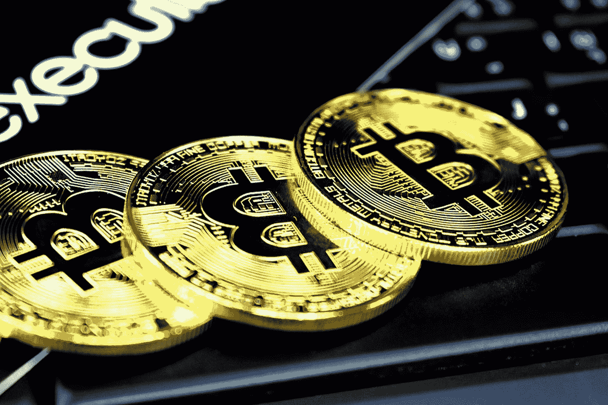

# 未来几年比特币价格最终会在哪里？

> 原文：<https://medium.datadriveninvestor.com/where-will-the-bitcoin-price-end-up-in-the-coming-years-9e574fcb10b0?source=collection_archive---------8----------------------->

# 这些顶级投资者认为比特币(BTC)的价格为 50，000 美元

未来几年比特币价格最终会在哪里？这是一个不仅投资者而且分析师都关心的问题。他们中的一些人预计未来几年价格将达到 5 万美元，市值将达到 1 万亿美元。

Photo by [Clifford Photography](https://unsplash.com/@cliffordgatewood?utm_source=medium&utm_medium=referral) on [Unsplash](https://unsplash.com?utm_source=medium&utm_medium=referral)

文克莱沃斯双胞胎是价值数十亿美元的投资者，自 2019 年以来一直在重复类似的论点。他们假设比特币最终会被归类为黄金 2.0。

许多预测认为 BTC 价格在 50，000 美元到 100，000 美元之间，这将最终占据黄金市场的很大份额。对许多投资者来说，很明显，比特币将不可避免地与黄金竞争，黄金被认为是一种成熟的价值储存手段。

Placeholder 的合伙人 Chris Burniske 说
“为什么比特币超过 5 万美元？正如 2019 年 5 月所讨论的那样，如果 BTC 在这个周期的波动性是上一个周期的一半，我们预计它的净值将超过 5 万美元和 1 万亿美元。对于这种宏观资产来说，1 万亿美元已经是很长时间了。”

 [## 比特币今年将价值 2 万美元的四个原因

### 由卢卡斯·维斯弗莱克在首都

medium.com](https://medium.com/the-capital/four-reasons-why-bitcoin-will-be-worth-20-000-this-year-5cfd969232e3) 

慢慢地，比特币作为价值储存手段和抵御通胀的“避风港”的看法正在改善，BTC 如何与黄金共存变得越来越清晰。
文克莱沃斯双胞胎在 2019 年接受美国消费者新闻与商业频道 Seema Mody 采访时说过类似的话。对他们来说，比特币被严重低估，市值应该达到 7 万亿美元。

 [## 比特币是货币吗？或者钱到底是什么？

### 你在这篇文章中学到了很少有人知道，但每个人都应该知道的东西。

medium.com](https://medium.com/the-capital/is-bitcoin-money-or-what-is-money-anyway-65812fba67ec) 

这对双胞胎也因拥有超过 10 亿美元的加密货币而闻名，他们一直在谈论人们如何越来越适应比特币，并获得越来越多的信任。

我的论文是比特币黄金是 2.0。在它的市值达到 7 万亿美元(相当于黄金的规模)之前，它是一种被严重低估的资产。

我想人们现在已经意识到了这一点。当人们一遍又一遍地听到黄金 2.0 时，他们对比特币的感觉更舒服。它是一种价值储存手段，它的属性比黄金更好，它在这里存在的时间越长，就越难称之为一种时尚，这里就有更多要说的了。如果 BTC 的市值达到 7 万亿美元，正如文克莱沃斯双胞胎预测的那样，这将推动价格上涨到 333，000 美元以上。

Ark Invest 的新数据显示，目前黄金的市值为 9 万亿美元。

方舟投资公司(Ark Invest)的分析师王济民表示，如果黄金市场份额中只有 15%被收回，比特币的估值可能会升至 8000 亿美元，价格将达到 38095 美元。

> 在一个有 10，000 种加密货币的世界里，比特币拒绝消亡。

或许它独特的技术和信仰网络的结合赋予了它持久的价值。多少钱？我们将其分为三种方式，1 万亿美元并不算过分:“未来几年比特币增长道路的关键因素是该行业的基础设施是继续快速增长还是停滞不前。

知名投资者预计，从中长期来看，比特币市场将出现重要发展。

我在每月一期的 [**简讯中分享了更多私密的想法，你可以在这里**](https://mailchi.mp/bf8f8e8ed697/keep-in-touch-with-lukas) 查看。请在评论中告诉我，并在各种社交媒体平台上加入我:

[**推特**](https://twitter.com/WiesfleckerL)●[**insta gram**](https://www.instagram.com/lukaswiesflecker/)●[**脸书**](https://www.facebook.com/lukaswiesfleckerr)●[**Snapchat**](https://www.snapchat.com/add/luggooo)**●[**LinkedIn**](https://www.linkedin.com/in/lukas-wiesflecker-1b11251a5/)**

**无论你做什么，都要带着爱和激情去做！**