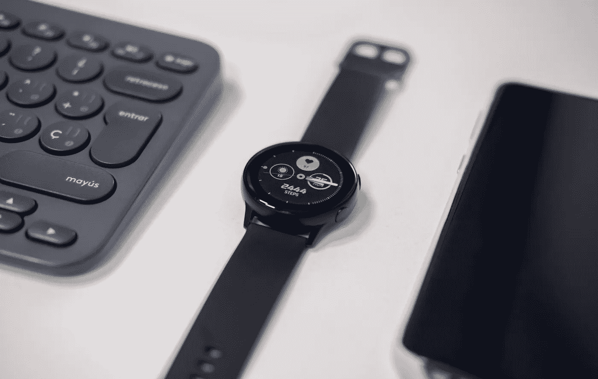

# 你会把时间花在哪里？

> 原文：<https://medium.datadriveninvestor.com/where-would-you-spend-your-time-220e84ae57ec?source=collection_archive---------25----------------------->

## 如果你只有两个小时的上网时间

Photo by [Emiliano Cicero](https://unsplash.com/@emilianocicero?utm_source=unsplash&utm_medium=referral&utm_content=creditCopyText) on [Unsplash](https://unsplash.com/s/photos/time-phone?utm_source=unsplash&utm_medium=referral&utm_content=creditCopyText)

我认为这是每个人都需要问自己的问题，尤其是当他们有两种感觉的时候:

a)他们从来没有足够的时间去做他们想做的事情

b)只要他们在线，他们的时间就会神奇地消失

那么，为什么我们要花这么多时间在互联网上呢？

有没有想过？

这是免费的。

你唯一需要支付的是你的宽带或移动数据连接。

正确吗？

> 但是，当然，你在为科技巨头支付更有价值的东西:**你的注意力**

你在网上看到的每一个帖子，每一条推文，每一个广告，每一封电子邮件——它们都是为了吸引你，让你不停地滚动，让你迷失在注意力分散的兔子洞里。

难怪你在 Instagram 上看完“5 分钟”后会发现一眨眼就过去了 1 个小时。

这就是为什么，大约 3 个月前，我开始清理我所有的社交媒体频道。

在脸书，我安装了一个 Chrome 扩展，它会彻底清除我的新闻订阅。然后，我逐渐只添加回我想在 feed 中看到的人/页面。

在 Instagram 和 Twitter 上，我开始削减我关注的账户数量。在推特上，我把它降到了 150 以下，也就是邓巴的数字。在 Instagram 上，它仍然是一项正在进行的工作，尽管我已经设法将它从 1000 多人减少到大约 300 人。在 Linkedin 上，我开始浏览我的关系列表，删除我从未交往过的人。

回到假设的问题:

**如果你一天只有两个小时上网，你会做什么？**

看邮件？

在 Instagram 中滚动？

查看 Whatsapp 消息？

发一串推文？

请记住，我们在一天的技术工作后感到如此疲惫的原因是因为我们倾向于过度使用。

**一个简单的练习**

这里有一个想法:明天(或者今天)，告诉自己你只有两个小时可以上网。

1.  按照我上面描述的方法，从修剪你的任何一个社交媒体渠道开始。我建议从你最常使用的社交媒体渠道开始。

2.列出你需要做的事情(如果你的工作需要你在线)。

3.列出线下要做的事情。

现在，决定你将如何度过你的时间。

**我如何度过我的时间**

以我为例，我把我的上网时间分开(而且是 2 个多小时；实话实说)分为两个部分:内容创建和参与。

一天的前半段时间(大约两个小时)是我为我的社交媒体渠道写文章，或者在 Medium/Linkedin 上撰写文章，或者撰写时事通讯或博客文章的时间。

下午的后半段时间(同样，大约两个小时)是我检查内容的参与度、回答问题、回复评论以及为未来的内容创作做笔记的时候。

**一致的内容创作如何帮助**

当你练习日常内容创作的艺术时，会有一种难以置信的富足感，没有验证的压力或在网上浪费时间。

首先，你每天都处于创作过程的最高潮，就像你每天锻炼的肌肉一样。

另一方面，你正与被称为目标受众的参与群体保持联系，你的思维保持开放，接受他们分享的想法和他们提出的问题。

**结论:**

如果你远离随意滚动的空间，并与持续创作的理念保持一致，你实际上可以让你花在网上的时间变得有效和富有成效。

开始吧，告诉我你在练习结束时的感受。