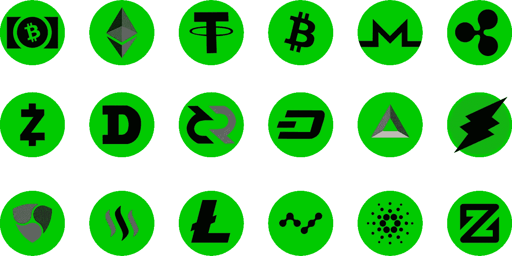
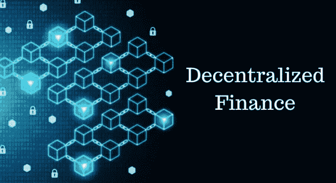

# 加密货币和区块链哪个用例给你印象最深？

> 原文：<https://medium.datadriveninvestor.com/which-cryptocurrency-and-blockchain-use-case-impress-you-most-7644dc173455?source=collection_archive---------13----------------------->

如果你来到这里不是希望通过买卖由复杂的计算协议生成的奇怪代币来快速致富；然后你会意识到区块链技术实际上是一场技术革命，也是一场金融革命。毫无疑问，区块链上运行的加密硬币和代币比为其提供动力的技术更受欢迎。不正常，但这里牵涉到钱。事实上，“加密货币”比区块链技术更容易理解。

加密货币的普及速度超过区块链技术本身并不奇怪。区块链是一项非常复杂的技术，理解“金融自由的工具”比理解“具有分布式权限的不可变数据存储”更合理；lol。然而，很少一部分人真正为理解区块链技术及其实际工作方式付出了切实的努力。

不管怎样，一个在投资一个项目之前做研究的投资者至少会知道这个项目希望达到什么目的，以及为什么它值得他的钱…和时间。这样的投资者需要时间来理解项目的使命和他们在区块链上的建设。传统区块链或智能合约；每个项目都为他们的项目提供了一个用例，这个用例决定了他们的令牌的价值。一个印象深刻的投资者会把他的钱押在这个项目上，并希望它能实现。

加密空间包含了大量区块链项目，这些项目都有有趣的用例，你只需花一点力气就能找到几个。我将提到几个提示；

**储值**:进来吧比特币！实际上大多数加密货币爱好者。从字面上看，每种加密货币都是价值储存手段。加密货币非常灵活，可以存储在钱包中，可以发送给任何拥有类似基础设施的人。这些特点使其从一开始就成为金融机构的主体。比特币支持“价值储存”的理念，将其作为加密货币的一个用例，自那以来，比特币引发了与数字化黄金的激烈竞争，它轻松应对了这场竞争。年轻一代越来越偏爱比特币，认为它是一种价值储存手段，也是一个比黄金更好的概念。尽管存在直言不讳的波动性，但它赢得了投资者的心，最近有一波机构将部分储备储存在比特币中。

[source](https://pixabay.com/photos/cryptocurrency-gold-bar-concept-3423267/)

杰克·多西的 square capital 宣布他们已经向比特币投资了 5000 万美元。多尔西一直公开表示他对“阿尔法”加密货币的热爱，他将比特币描述为“经济赋权的工具”。在类似但不太受欢迎的新闻中；Mode Global Holdings 将其现金储备的 10%投资于比特币，这相当于约 815，000 美元(兑换时约为 66.7 BTC)。Mode Global Holdings 因此成为英国首家将比特币作为投资策略一部分的上市公司。

据传闻，罗斯柴尔德投资公司的投资组合中也有超过 230 个比特币。事实是，投资比特币的公司实际上比记录的数量要多得多。投资者在比特币上的命运与日俱增，尽管加密货币具有显著的波动性，但他们不再“害怕”将资金转移到比特币上。这个数字甚至有望变得更大。作为价值储存手段已经成为比特币以及其他一些类似加密货币的最大使用案例。

**首次公开募股(IPO)** :许多主网加密货币项目的生存都要归功于以太坊区块链。作为第一个引入智能合约并使项目能够在以太坊区块链生成令牌的区块链项目，它已经帮助数百个新的加密货币项目的诞生。新加密货币项目的融资变得更加容易。新项目可以很容易地生成代表其项目价值的代币，并允许投资者购买一部分代币作为新项目的股份。这取代了股份的概念。许多其他区块链项目也采用了这种技术，并将其发展得更好。此功能甚至可以在核心区块链场景之外使用。主流项目可以采用智能合约令牌作为证券和股票。

**去中心化金融(DEFI)** :去中心化金融包含了区块链和加密货币项目的每一次尝试，旨在为现实生活的金融活动创造一个去中心化的替代品。分散式金融系统由构建在区块链之上的应用程序组成，该应用程序方便了无需许可的金融服务，并提供了运行金融活动的无缝选项。DeFi 希望将区块链技术的核心优点引入金融系统。比特币区块链引入了“分散支付手段”的概念，这种支付手段运行在分布式账本系统区块链上。因此，标志着分散化金融体系的开始。

[Source](https://thefinancialtechnology.com/fintech/what-is-decentralized-finance-defi/)

DeFi 项目正在扩大金融系统的范围，将支付模式从“便携式方式”转变为在母区块链上独立运行的智能合约应用程序，并使用区块链资源提供高级金融服务，如保险、贷款、财富管理和一系列其他金融管理服务，并展示所需的区块链功能，如不变性、安全性、隐私性、速度和互操作性。

在分散式金融项目的众多诱人特征中，“高产农业”已经成为分散式金融系统中最令人兴奋的前景。利用 DeFi 协议每年产生高达初始投资 10%的利息回报以及一些其他好处的想法肯定会给任何投资者留下深刻印象。由于这个原因，DeFi 为主流投资者提供了一个诱人的机会，让他们可以进入加密领域——这是最近 DeFi 项目蓬勃发展的主要原因。

 [## 面向开发者的区块链；API 提供商的重要性|数据驱动的投资者

### 在过去的几年里，区块链突然成为这个领域最热门的新技术。每一个…

www.datadriveninvestor.com](https://www.datadriveninvestor.com/2020/11/25/blockchain-for-developers-the-importance-of-api-providers/) 

**人工智能(AI)** :著名的分散式人工智能解决方案正在与密码领域以外的公司合作，在区块链的帮助下开发人工智能产品和解决方案。由人工智能领域非常受欢迎和尊重的名字 Ben Goertzel 领导的 SingularityNet 正在人工智能领域取得惊人的突破，并将抵消该学科，并将区块链技术和人工智能之间的点连接起来——这是一个价值数十亿美元的概念。

[Source](https://coincentral.com/singularitynet-beginner-guide/)

Ocean project 正在构建一个令牌化的服务层，该服务层通过一组可用性和完整性的确定性证明来公开数据、存储、计算和算法，以作为可验证的服务协议。该协议为人工智能解锁数据，Ocean 正在区块链建立人工智能基础设施的市场。因此，它提供了一种分散的、可扩展的选择。

**电子商务**:加密货币正在快速渗透主流系统。大多数主流部门在加密领域都有适当的代表。电商与此无异。在加密空间之外，加密货币在众多知名商店中被接受为支付手段。加密货币的灵活性和普遍性使其成为一种便携式支付手段。有了附加的价值，它们可以很容易地用于在线支付。更安全、更快捷的信用卡替代品。加密货币项目也在区块链建设市场。Origin protocol 正在建立一个区块链驱动的商业平台。它正在建立一个平台，连接区块链的买家和卖家，并允许加密货币被用作支付媒介。它希望简化电子商务，提供一个去中心化的商业平台。

加密货币和区块链用例随着每个新的独特的项目而增长。几乎不可能列出一份完整的写作过程清单。这是一个非常广阔的空间，投资者投资于不同的项目。您可以亲自说出更多加密货币的使用案例，其中哪一个给您留下了最深刻的印象？

## 获得专家视图— [订阅 DDI 英特尔](https://datadriveninvestor.com/ddi-intel)