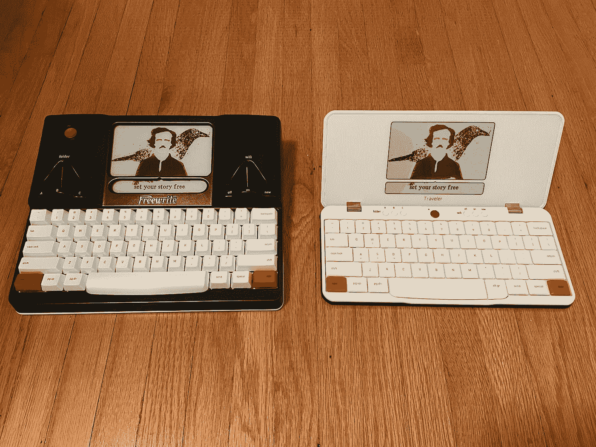
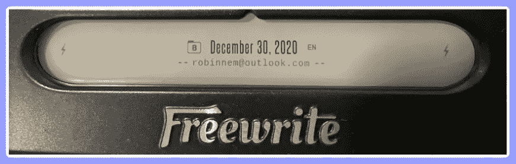
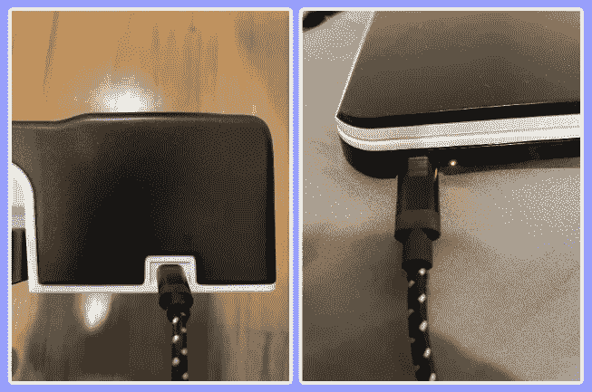
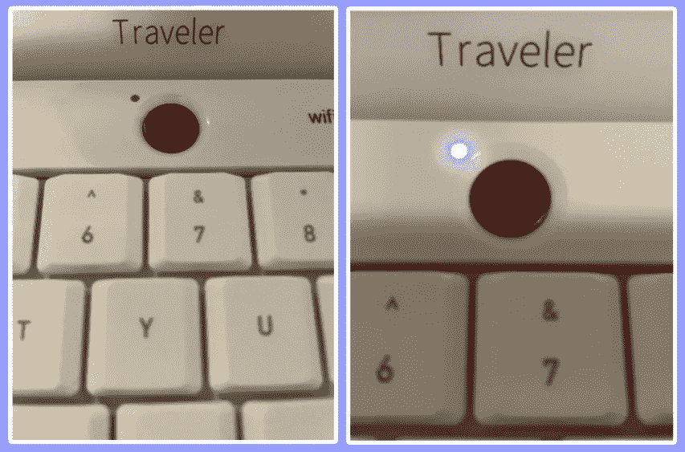
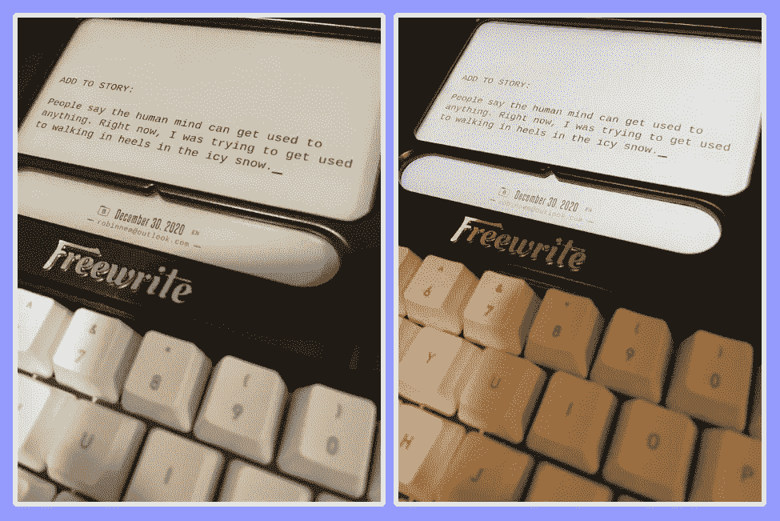
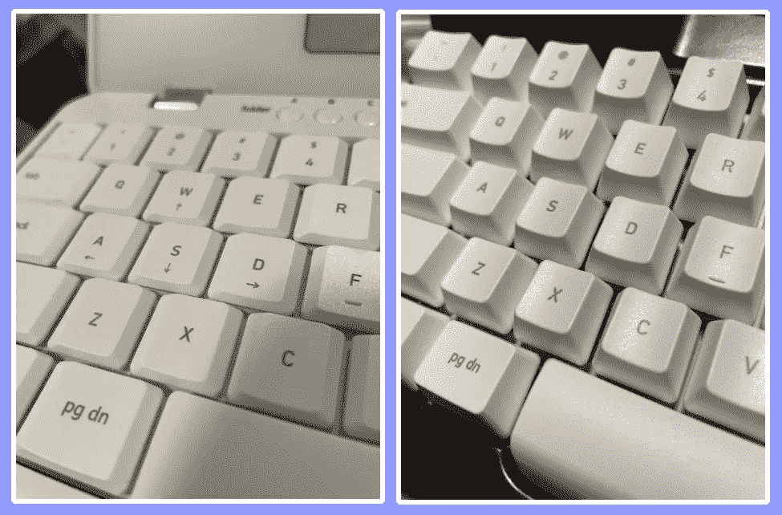
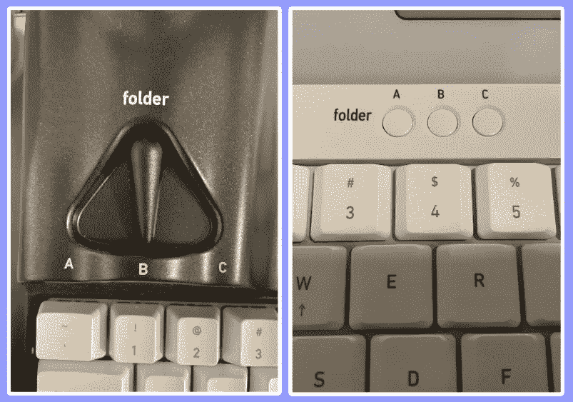
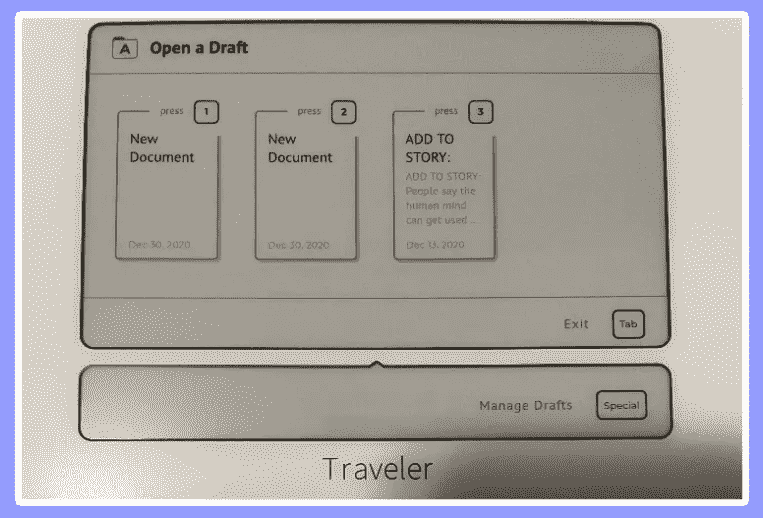
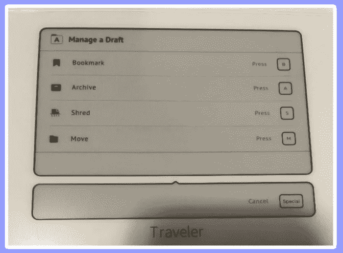
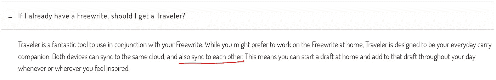

# 哪种免费软件设备真正适合您？

> 原文：<https://medium.datadriveninvestor.com/which-freewrite-device-is-actually-right-for-you-a1b6be09e6d7?source=collection_archive---------8----------------------->

## 这不仅仅是可移植性的问题，还有软件的问题

The Freewrite 2nd Gen (left) and the Freewrite Traveler (right) with Astrohaus’ Edgar Allan Poe screensaver; (photos taken by author)

[*看看现代的 AlphaSmart*](https://getfreewrite.com/?rstr=12007) *吧，在这篇文章的最后，你会发现如何获得 5%的折扣。*

注:如果您已经得出结论，认为 Freewrite 设备适合您的写作需求，但您不确定应该选择哪一款，那么您来对地方了。然而，如果你还在考虑免费软件对你来说是否值得，看看我以前关于这个主题的帖子: [***免费软件设备真的适合你吗？它可能会帮助你确定你是否是那种会受益于无分心设备的作家。***](https://robinnemesszeghy.medium.com/are-freewrite-devices-actually-right-for-you-e96c76f645a5)

现在 Astrohaus 有两种不同的设备可供买家购买:最初的 **Freewrite(第二代)**和新发布的 **Freewrite Traveler** ，该公司在其网站上发布了一篇[博客文章](https://getfreewrite.com/blogs/writing-success/freewrite-2nd-gen-vs-freewrite-traveler)和一个[测验](https://getfreewrite.com/pages/which-freewrite-is-right-for-you)，内容是关于哪种 Freewrite 设备最适合您的个人用户需求。

## Astrohaus 的博客帖子:

 [## 自由写手第二代与自由写手旅行者

### 随着最近 Freewrite Traveler 的推出，Astrohaus 现在提供了两种不受干扰的写作工具..的…

getfreewrite.com](https://getfreewrite.com/blogs/writing-success/freewrite-2nd-gen-vs-freewrite-traveler) 

## Astrohaus 的测验:

 [## 哪个免费软件适合你？

### 参加我们的个性化测验，了解哪种无干扰书写设备适合您。Freewrite 是第二代吗…

getfreewrite.com](https://getfreewrite.com/pages/which-freewrite-is-right-for-you) 

我很欣赏他们这样做，因为这两种设备的价格都很高，不是每个人都能负担得起这两种——即使是一种——这些时髦的写作助手。

但是通读 Astrohaus 的设备比较，我觉得他们忽略了一些重要的区别，潜在的购买者在花几百美元购买这些设备之前了解一下*会从中受益。首先，他们忽略了两种设备之间一些关键的软件区别和限制。*

这也带来了一个问题，这些设备是否适合你作为一个作家(查看我的帖子 [***)免费设备真的适合你吗？***](https://robinnemesszeghy.medium.com/are-freewrite-devices-actually-right-for-you-e96c76f645a5) )。

## TL；博士；医生

*   Astrohaus 现在有两款设备可用: **Freewrite(第二代)**和新发布的 **Freewrite Traveler**
*   Astrohaus 写了他们两个现有设备的比较(这里是[这里是](https://getfreewrite.com/blogs/writing-success/freewrite-2nd-gen-vs-freewrite-traveler)和[这里是](https://getfreewrite.com/pages/which-freewrite-is-right-for-you))
*   这些比较忽略了一些关键的软件差异

# 原始免费软件(第二代)与免费软件旅行者

现在是这篇文章的核心部分。关于两个当前可用的免费写设备之间的差异，我认为这里要注意的重要事情是 Astrohaus 在他们的比较总结中忽略了不仅仅是便携性方面(也就是两个设备的可见硬件和品牌)。经常被忽视的是，这两款设备也有*软件差异*。这些差异的部分原因是由硬件限制造成的，但软件差异与尺寸、构建质量和重量的差异同样重要。

我们已经知道一个比另一个更便携。当我们看这两款设备时，我们可以看到这一点。在这一节中，我将概述两种设备在软件上的*差异*和经常被忽视的硬件差异*。所有其他的差异已经在之前的比较总结中涵盖了(再次，请参见 Astrohaus 的博客帖子和关于这些差异的测验:即大小、构建质量、重量、键等方面的差异。).*

## 硬件差异

## 第二代 Freewrite 上没有充电指示灯

这一个是相当不言自明的。当设备关闭时，没有迹象表明它正在充电。判断该设备是否正在充电的唯一方法是打开它，检查显示屏两端的一对闪电。但是如果你的设备关机，没有硬件显示它正在充电。

You have to turn on the device and look for the lightning bolts to know whether or not your device is charging; (photo taken by author)

Astrohaus 为旅行者增加了充电指示灯。

Freewrite 2nd Gen (left) does not have a charging indicator light vs. Freewrite Traveler (right) does; (photos taken by author)

该公司甚至还为旅行者添加了一个 ON 指示灯(最初的 Freewrite 2 代也没有)。我个人认为这没有充电指示灯重要，因为你可以通过电子墨水屏幕本身来判断设备是否打开。但这仍然是一个很好的补充，尽管不是所有用户都这么认为。用户一直抱怨光线太亮，尤其是在晚上使用该设备时。所以这也是需要注意的。

The Freewrite Traveler ON indicator light is located beside the device’s red power button; (photos taken by author)

## 旅行者没有前灯

现在这里有一个旅行者没有的东西:一盏前灯。如果你打算在晚上写作，这是需要注意的。

The Freewrite 2nd Gen has the ability to toggle a front light ON and OFF; (photos taken by author)

## 软件差异

## 第二代 Freewrite 上没有光标或箭头热键

没错。如果您使用的是原来的免费编写设备，则无法在文档中左右或上下移动。你可以“向上翻页”和“向下翻页”来查看你写的内容，但是光标会停留在最后。

The Freewrite Traveler (left) has cursor arrow hotkeys, while the Freewrite 2nd Gen (right) does not; (photos taken by author)

旅行者有热键可以通过单词或字符移动光标，但这两种操作都很痛苦，尤其是通过字符移动。通过字符移动变得更糟，因为它使用与改变语言相同的快捷键。因此，如果你在你的设备上添加了多语言键盘，每次你想把光标逐字符移动到文档中的任何其他位置时，你都会不可避免地改变语言。Astrohaus 团队说他们希望在以后的更新中改变这一点，我也希望他们这样做。

 [## React Native 如何提高移动应用开发者的生产力？数据驱动的投资者

### React Native 是一个有益的框架，可以帮助您使用 JavaScript 设计应用程序。这种结构包括…

www.datadriveninvestor.com](https://www.datadriveninvestor.com/2020/11/30/how-react-native-improves-the-productivity-of-mobile-app-developers/) 

## 第二代 Freewrite 上没有文档查看器

这是两种设备之间软件差异的一个例子，这是由于第二代 Freewrite 的硬件限制造成的。由于最初的 Freewrite 有用于文档开关的转盘，而不是 Traveler 那样的按钮，因此您不能长按进入文档查看器模式。

While the Traveler has buttons (right) that you can long press to access the document viewer, the Freewrite 2nd Gen has dials (left), so it doesn’t have a document viewer at all; (photos taken by author)

因此，最初的 Freewrite 无法像旅行者那样查看所有现有文档。

Document viewer on the Freewrite Traveler, this doesn’t exist on the Freewrite 2nd Gen; (photo taken by author)

这导致了下一个重要的区别:删除文档的能力。

## 无法在第二代 Freewrite 上操作或删除文档

尽管这是没有文档查看器的结果，但我认为这应该有自己的部分。Freewrite Traveler 允许您在文档查看器中操作文档。它允许你将文档加入书签、存档、粉碎和移动。

Document viewer on the Freewrite Traveler allows the user to manipulate and delete documents directly on the device, this doesn’t exist on the Freewrite 2nd Gen; (photo taken by author)

因为最初的 Freewrite 不具备以这种方式查看文档的能力，所以它不具备操作甚至删除文档的能力。值得注意的是，这两款免费软件都没有“选择所有文本”功能，因为没有 CTRL 键。所以目前，在原来的免费书写设备上删除文档的唯一方法是手动退格。是的，你没看错。

幸运的是，一旦你将文件同步到云端，你仍然可以在邮箱上粉碎它，然后它也会从设备上消失。但还是。这意味着你必须将设备连接到云才能删除设备上的文件。我认为这值得注意。

## 第二代 Freewrite 没有导入功能潜力

虽然 Freewrite 第二代和 Traveler 都没有能力*成功地*将文本从其他设备导入到设备上(我说成功，因为有一种黑客方法可以通过谷歌文档做到这一点，但[会对你的文档造成严重破坏](https://support.getfreewrite.com/article/72-freewrite-guide-using-dropbox-or-google-drive)，所以我不建议这么做)，但 Traveler 的当前软件仍然允许*潜在的*从其前身(Freewrite 第二代)接收传入的文档。然而，它的前身却没有这种潜力。这将我们带到了最后一个重要但尚未解决的问题，即这两款设备的同步功能。

## **额外好处:两台设备实际上无法相互同步* *

这是许多人提出的一个问题，因为 Astrohaus 没有将这个问题恰当地传达给他们的潜在客户和现有客户。在他们网站的 [FAQ](https://getfreewrite.com/pages/faq) 中，他们提到两个设备可以同步。这有点误导，因为这并不完全正确。

Screenshot taken from the Freewrite website FAQ section ([https://getfreewrite.com/pages/faq](https://getfreewrite.com/pages/faq))

目前，这两个设备不能以任何方式相互同步[最后更新时间:2020 年 12 月 30 日]。当许多论坛发帖者问及此功能时，Astrohaus 已经提到类似这样的功能将包含在即将到来的更新中，在撰写本文时[2020 年 12 月 30 日]尚未发布。事实上，他们已经写了两个设备以现在时态相互同步，而不是指定公司*最终将发布一个更新，允许某种形式的设备间同步*，这是足够奇怪的。但他们没有解释的另一件重要事情是，这个功能不会像你想象的那样工作。

Astrohaus 的首席执行官兼联合创始人亚当·李布在一个现场问答视频中提到，他向观众展示了如何开始使用新的旅行者设备，为了防止重复的草稿，他们可以让设备相互同步的唯一方法是让一个设备将文档推送到另一个设备，然后删除第一个设备上的原始草稿。

换句话说，不存在两个设备可以容纳相同文档的情况。

此外，根据 Adam 的说法，由于*软件限制*，Freewrite 第二代永远不会成为所述文档的接受者。

综上所述，以下是两款设备的同步能力:

> 免费书写(第二代)→邮箱
> 
> 免费旅行者→邮箱
> 
> 自由写手(第二代)→自由写手旅行者

换句话说，Freewrite 第二代不能向后兼容接受传入的文档。它只能导出文档(到邮箱或旅行者)。

在我看来，我不认为这有资格作为两个设备能够同步到对方，但也许这只是我。

## TL；博士；医生

**免费写入设备之间的硬件差异:**

*   第二代 Freewrite 上没有充电指示灯或按钮灯亮
*   第二代 Freewrite 上的刻度盘和旋钮与 Traveler 上的按钮
*   旅行者没有前灯

【Freewrite 设备之间的软件差异:

*   第二代 Freewrite 上没有光标或箭头热键
*   第二代 Freewrite 上没有文档查看器
*   无法在第二代 Freewrite 上操作或删除文档
*   第二代 Freewrite 没有导入功能

*** *奖励:设备间不同步****

## 任何免费书写设备均可享受 5%的优惠

*如果您已经准备好订购，请随时使用我的折扣代码 ROBIN23，享受任何免费 write 设备的 5%折扣！*

**:**

* [## Freewrite:不受干扰的写作工具

### Freewrite 是一款专门为任何写作者设计的绘图设备，没有浏览器的干扰或诱惑…

getfreewrite.com](https://getfreewrite.com/?rstr=12007) 

**免费写设备上的其他文章:**

 [## 免费书写设备真的适合你吗？

### 你真的会从不受干扰中受益吗？

medium.datadriveninvestor.com](/are-freewrite-devices-actually-right-for-you-e96c76f645a5)  [## Astrohaus 全新的免分心书写工具 Freewrite Alpha 是现代的 AlphaSmart

### 看看现代的 AlphaSmart(滚动到这篇文章的末尾可以享受 5%的优惠):

medium.datadriveninvestor.com](/astrohaus-brand-new-distraction-free-writing-device-the-freewrite-alpha-is-the-modern-alphasmart-5ebfa085a4c4) 

**访问专家视图—** [**订阅 DDI 英特尔**](https://datadriveninvestor.com/ddi-intel)

## 成为会员:

如果你想无限制地阅读像这篇文章这样的文章，并支持我和你所阅读的其他作家，注册成为会员吧。如果你使用 [*我的推荐链接*](https://robinnemesszeghy.medium.com/membership) *，你的一部分会费会直接支持我。你可以在这个平台上看到我所有的故事。*

*感谢您阅读并支持我的工作！**